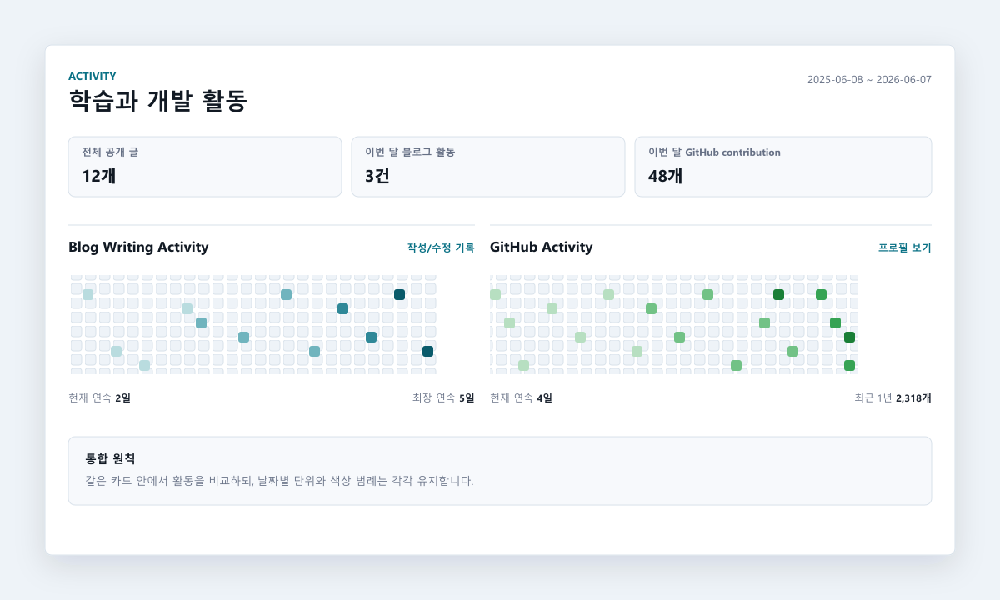

# Activity 섹션 통합 검토

## 1. 현재 구조 분석

메인 페이지는 Hero 아래에 `ActivitySection.astro`가 하나의 Activity 섹션을 렌더링한다.

- 블로그 활동은 Astro Content Collections의 공개 글을 기준으로 계산한다.
- 블로그 활동일은 `updated ?? date` 기준이다.
- GitHub 활동은 빌드 전에 생성된 `public/data/github-contributions.json`을 직접 렌더링한다.
- 데스크톱에서는 Blog와 GitHub 패널을 2열로 배치하고, 모바일에서는 세로로 쌓는다.
- 두 잔디는 서로 독립된 주 단위 grid이며 날짜별 `title`, `aria-label`을 유지한다.
- GitHub 데이터는 외부 SVG 이미지가 아니므로 블로그 잔디와 동일한 수준으로 스타일을 통합할 수 있다.

## 2. 기존 문제점

- Writing Activity와 GitHub Activity가 큰 카드로 연속 배치되어 메인 페이지가 길어진다.
- 제목, 설명, 통계, 범례가 각각 반복되어 시각적 밀도가 높다.
- 사용자가 블로그와 GitHub 활동을 한눈에 비교하기 어렵다.
- 모바일에서는 두 개의 가로 스크롤 heatmap을 연속해서 지나야 최근 글에 도달한다.

## 3. 검토한 통합안

### A안: 하나의 Activity 카드 안에 2열 배치

데스크톱에서는 Blog Writing과 GitHub Contributions를 좌우 2열로 배치하고, 모바일에서는 세로로 쌓는다.

장점:

- 두 활동을 동시에 비교할 수 있다.
- 공통 제목, 기간, 범례 설명을 합쳐 반복을 줄일 수 있다.
- 현재의 직접 렌더링 heatmap과 CSS 변수를 대부분 재사용할 수 있다.
- 탭 조작 없이 모든 핵심 정보가 보인다.

단점:

- 1180px 이하에서는 각 heatmap의 가로 스크롤이 필요할 수 있다.
- 통계 지표를 모두 유지하면 카드 내부 밀도가 높아질 수 있다.

### B안: Activity 카드 + 탭 전환

상단에 Blog/GitHub 탭을 두고 선택된 heatmap 하나만 표시한다.

장점:

- 메인 페이지 높이를 가장 크게 줄일 수 있다.
- 모바일에서 한 번에 하나의 heatmap만 보여 사용하기 편하다.
- 각 활동의 기존 통계와 설명을 비교적 온전히 유지할 수 있다.

단점:

- 다른 활동을 확인하려면 추가 조작이 필요하다.
- 탭 상태, 키보드 탐색, `aria-selected`, focus 관리용 클라이언트 스크립트가 필요하다.
- 정적 HTML만으로 두 활동을 한눈에 비교할 수 없다.

### C안: 블로그 잔디 중심 + GitHub 요약 축소

블로그 heatmap은 유지하고 GitHub는 이번 달 contribution, 현재 streak, 프로필 링크만 작은 요약 영역으로 표시한다.

장점:

- 개인 기술 블로그라는 목적에 가장 집중한다.
- 메인 페이지 길이와 렌더링 요소 수를 크게 줄인다.
- 모바일 화면이 가장 단순하다.

단점:

- GitHub 날짜별 활동과 hover 정보를 메인에서 확인할 수 없다.
- 직접 렌더링 JSON 구조의 장점을 충분히 활용하지 못한다.

## 4. 적용안

**A안: 단일 Activity 섹션 안의 2열 배치**를 적용했다.

두 잔디는 같은 cell 구조와 접근성 속성을 사용한다. 데스크톱에서는 비교가 쉽고, 모바일에서는 두 패널을 세로로 쌓아 기존 동작을 유지한다. 공통 헤더 아래에는 전체 글 수, 이번 달 블로그 활동, 이번 달 GitHub contribution을 요약하고 각 패널 내부 통계는 3개로 정리했다.

권장 정보 구조:

- 공통 헤더: `Activity`, Asia/Seoul 기준 올해 1월 1일부터 오늘까지의 범위
- 공통 요약: 전체 글, 이번 달 블로그 활동, 이번 달 GitHub contribution
- 왼쪽: Blog Writing Activity heatmap, 현재/최장 streak
- 오른쪽: GitHub Activity heatmap, 현재 streak, 프로필 링크
- 모바일: 동일한 카드 안에서 Blog, GitHub 순서의 세로 스택

## 5. 구현 파일

- `src/pages/index.astro`
- `src/components/home/ActivitySection.astro`
- `src/styles/home.css`

기존 `BlogGrass.astro`와 `GitHubGrass.astro`는 통합 컴포넌트로 대체했다. 통계 계산 유틸인 `src/utils/blogStats.ts`, `src/utils/githubStats.ts`는 데이터 계약을 유지해 재사용한다.

## 6. 구현 원칙

- 두 heatmap을 하나의 heatmap으로 합산하지 않는다. 블로그 활동과 GitHub contribution의 단위가 달라 농도 의미가 불명확해진다.
- 각 cell의 `title`, `aria-label`과 텍스트 통계 요약을 유지한다.
- 데스크톱 2열에서 heatmap 최소 폭 때문에 카드 전체가 넘치지 않도록 각 패널 내부에만 가로 스크롤을 둔다.
- 블로그와 GitHub의 색상 계열을 구분하되, 색상만으로 정보를 전달하지 않는다.
- GitHub JSON 생성 실패 시 현재 fallback 안내를 유지한다.

## 7. 적용 결과

Activity 통합 UI를 실제 홈 화면에 적용했다. `docs/images/activity-section-concept.png`는 구현 방향을 정할 때 사용한 참고 목업으로 유지한다.

- 공통 Activity 헤더와 올해 1월 1일부터 오늘까지의 범위를 한 번만 표시한다.
- Blog와 GitHub heatmap은 독립적으로 렌더링해 각 활동의 농도 의미를 보존한다.
- 각 날짜 cell의 hover 설명과 스크린 리더용 레이블을 유지한다.
- 좁은 화면에서는 패널을 세로로 쌓고 각 heatmap 영역에서만 가로 스크롤한다.
- GitHub 데이터가 비어 있으면 fallback 안내와 GitHub 프로필 링크를 계속 제공한다.
