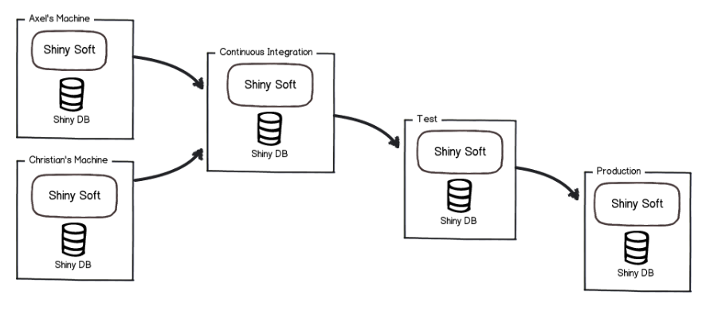
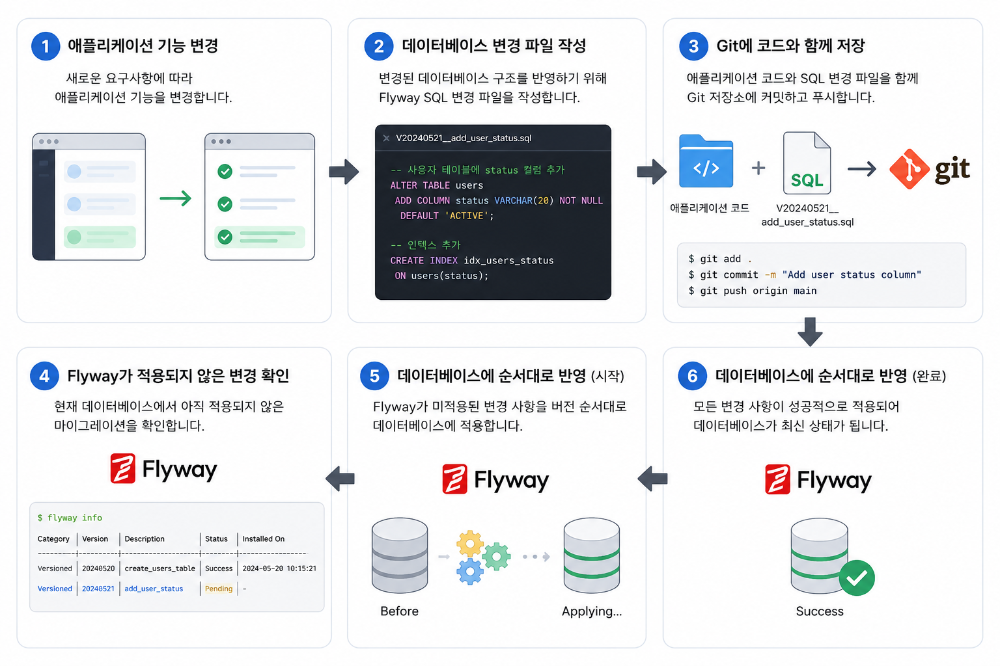
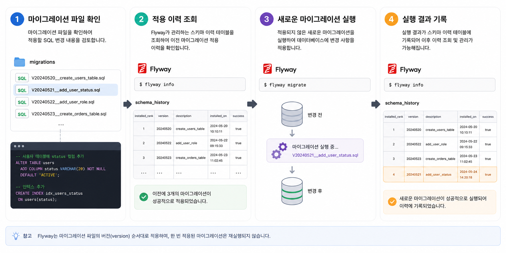
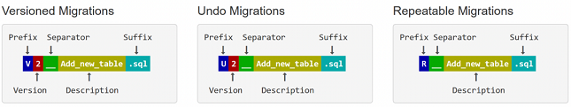
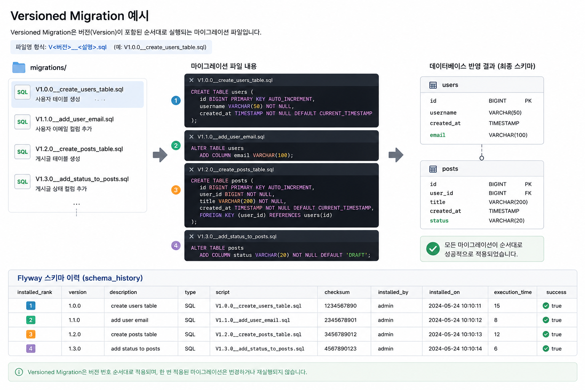
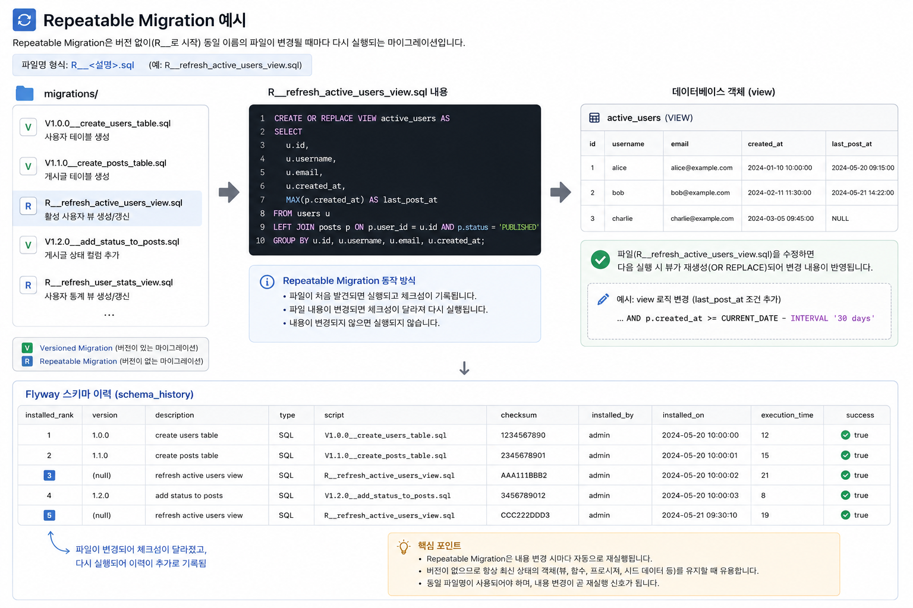
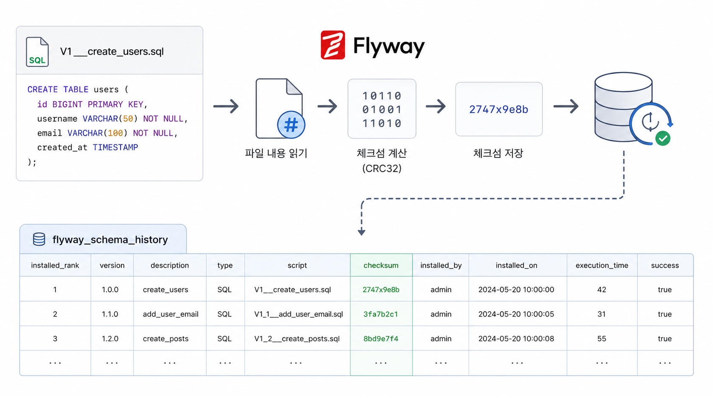

## 1. Flyway는 왜 필요할까?

애플리케이션의 기능이 변경되면 데이터베이스 구조도 함께 변경된다. 새로운 테이블이나 컬럼을 추가하기도 하고, 기존 컬럼의 타입이나 제약 조건을 변경하기도 한다.

개발자 한 명이 자신의 로컬 데이터베이스를 직접 수정하는 것은 어렵지 않다. 하지만 여러 개발자가 함께 작업하고 개발, 테스트, 운영 환경이 나뉘기 시작하면 데이터베이스 변경을 수동으로 관리하기 어려워진다.

누군가는 변경 SQL을 실행했지만 다른 개발자는 실행하지 않았을 수 있고, 개발 서버에는 적용했지만 운영 서버에는 누락될 수도 있다. **실행 순서가 달라져 환경마다 데이터베이스 구조가 달라지는 문제도 발생**할 수 있다.

애플리케이션 코드는 Git을 통해 변경 이력을 관리하지만, 데이터베이스에서 직접 실행한 SQL은 별도로 기록하지 않으면 변경 이력이 남지 않는다. Flyway는 **데이터베이스 변경 내용을 파일로 관리하고, 정해진 순서에 따라 각 환경에 동일하게 적용하기 위해 사용**한다.

## 2. Flyway란 무엇일까?



Flyway는 데이터베이스의 스키마 변경을 관리하는 **데이터베이스 마이그레이션 도구**다.

데이터베이스 마이그레이션이란 데이터베이스의 구조나 데이터를 현재 상태에서 새로운 상태로 변경하는 작업을 의미한다. 테이블 생성, 컬럼 추가, 인덱스 생성, 제약 조건 변경 등이 마이그레이션에 포함된다.

Flyway를 사용하면 데이터베이스 변경 내용을 SQL 파일로 작성하고 애플리케이션 코드와 함께 버전 관리할 수 있다.



Flyway는 데이터베이스를 Git처럼 직접 관리하는 도구는 아니다. 대신 어떤 **데이터베이스 변경이 어떤 순서로 적용되었는지를 기록**하고, **아직 적용되지 않은 변경만 실행**한다.

## 3. Flyway는 어떻게 동작할까?

Flyway는 애플리케이션에 포함된 마이그레이션 파일과 데이터베이스의 적용 이력을 비교한다.

데이터베이스에 적용되지 않은 새로운 마이그레이션이 있다면 버전 순서에 따라 실행하고, 실행 결과를 `flyway_schema_history` 테이블에 저장한다.



`flyway_schema_history`에는 적용된 버전, 파일명, 실행 시간, 성공 여부, 체크섬 등의 정보가 저장된다. 따라서 어떤 변경이 데이터베이스에 적용되었는지 확인할 수 있다.

> [!note] 확인 명령어 및 결과
> ```sql title="flyway_schema_history.sql" showLineNumbers {2}
> SELECT *
> FROM flyway_schema_history
> ORDER BY installed_rank;
> ```
> 

애플리케이션을 다시 실행하더라도 이미 적용된 마이그레이션은 다시 실행하지 않는다. 새롭게 추가된 마이그레이션만 실행한다.

## 4. 마이그레이션 파일의 명명 규칙

Flyway가 마이그레이션 파일을 인식하려면 정해진 명명 규칙에 맞게 파일을 작성해야 한다.

Versioned Migration의 기본 형식은 다음과 같다.



각 부분의 의미는 다음과 같다.

<!-- table-caption: Flyway 마이그레이션 파일명 구성 -->

| 구성                    | 의미                            |
| --------------------- | ----------------------------- |
| `V`                   | Versioned Migration을 나타내는 접두사 |
| `1`, `2`, `3`         | 마이그레이션의 실행 순서를 나타내는 버전        |
| `__`                  | 버전과 설명을 구분하는 두 개의 밑줄          |
| `create_member_table` | 마이그레이션이 수행하는 작업에 대한 설명        |
| `.sql`                | SQL 마이그레이션 파일 확장자             |

특히 버전과 설명 사이에는 밑줄을 두 개 사용해야 한다.

```text
V1__create_member_table.sql  올바른 형식
V1_create_member_table.sql   잘못된 형식
```

버전은 반드시 순차적인 정수만 사용할 필요는 없다. 기능을 추가하거나 기존 마이그레이션 사이의 변경을 구분하기 위해 다음과 같이 작성할 수도 있다.

```text
V1__create_member_table.sql
V2__create_post_table.sql
V2_1__add_post_index.sql
V3__create_comment_table.sql
```

다만 여러 개발자가 함께 작업하는 프로젝트에서는 버전 충돌을 방지하기 위해 하나의 규칙을 정해 사용하는 것이 좋다. 단순한 증가 번호나 날짜와 시간을 조합한 번호 등을 사용할 수 있지만, 프로젝트 안에서는 동일한 방식을 유지해야 한다.

Repeatable Migration은 버전을 작성하지 않고 `R` 접두사를 사용한다.

```text
R__<설명>.sql
```

예시는 다음과 같다.

```text
R__create_member_summary_view.sql
R__refresh_statistics_view.sql
```

마이그레이션의 설명에는 해당 파일이 어떤 작업을 수행하는지 알 수 있는 이름을 사용하는 것이 좋다.

```text
V4__update_table.sql              의미가 불분명한 이름
V4__add_nickname_to_member.sql    작업을 알 수 있는 이름
```

테이블 생성은 `create`, 컬럼 추가는 `add`, 컬럼 변경은 `alter` 또는 `change`, 인덱스 생성은 `create_index`처럼 일관된 동사를 사용할 수 있다.

```text
V1__create_member_table.sql
V2__add_nickname_to_member.sql
V3__create_index_on_member_email.sql
V4__change_member_status_length.sql
```

파일명에는 공백보다 밑줄을 사용하는 것이 좋다. 또한 대소문자와 버전 표현 방식도 프로젝트 전체에서 통일해야 한다.

한 번 적용된 마이그레이션은 파일 내용뿐만 아니라 파일명도 함부로 변경하지 않아야 한다. Flyway의 적용 이력에는 실행한 파일명이 기록되기 때문에 이미 적용된 파일의 이름을 바꾸면 실제 적용 이력과 프로젝트의 파일이 서로 달라질 수 있다.

Flyway 명명 규칙의 핵심은 다음과 같다.

```text
Versioned Migration
V<버전>__<설명>.sql

Repeatable Migration
R__<설명>.sql
```

파일명만 보고도 변경 목적을 알 수 있도록 작성하고, 팀에서 버전과 설명 작성 방식을 통일하는 것이 좋다.

## 5. 마이그레이션은 어떻게 관리할까?

Flyway 마이그레이션은 대표적으로 `Versioned Migration`과 `Repeatable Migration`으로 구분할 수 있다.



[Versioned Migration](https://documentation.red-gate.com/flyway/flyway-concepts/migrations/versioned-migrations)은 **각각 고유한 버전을 가지며 한 번만 실행**된다. 테이블 생성, 컬럼 추가, 인덱스 생성처럼 순서가 중요한 데이터베이스 변경에 사용한다.



[Repeatable Migration](https://documentation.red-gate.com/flyway/flyway-concepts/migrations/repeatable-migrations?utm_source=chatgpt.com)은 **고정된 버전이 없으며 파일 내용이 변경될 때 다시 실행**된다. View, Function, Stored Procedure처럼 동일한 객체를 최신 정의로 다시 생성해야 할 때 사용할 수 있다.

일반적인 애플리케이션에서는 Versioned Migration을 중심으로 데이터베이스 변경을 관리한다.

엔티티가 변경되었다고 해서 항상 마이그레이션을 추가해야 하는 것은 아니다. 해당 변경이 **실제 데이터베이스 구조에 영향을 줄 때**만 새로운 마이그레이션이 필요하다.

예를 들어 엔티티에 영속 필드를 추가하거나 컬럼 타입, 제약 조건, 연관관계가 변경되면 데이터베이스 변경이 필요하다. 반대로 비즈니스 메서드, 생성자, Getter, DTO 변경처럼 데이터베이스 구조와 관계없는 수정에는 마이그레이션이 필요하지 않다.

## 6. 적용된 마이그레이션은 왜 수정하면 안 될까?



Flyway는 마이그레이션 파일이 실행될 때 **파일 내용을 기반으로 체크섬을 계산하고 적용 이력에 저장**한다.

이미 적용된 마이그레이션 파일을 나중에 수정하면 현재 파일의 체크섬과 데이터베이스에 기록된 체크섬이 달라진다. Flyway는 이를 감지하여 검증 오류를 발생시킨다.

이 검증은 데이터베이스마다 서로 다른 구조가 만들어지는 것을 방지한다.

### 6.1 문제 경험

```java
Migration checksum mismatch for migration version 1

Applied to database : -838055220
Resolved locally    : 1153225404
```

위 오류는 이미 데이터베이스에 적용된 마이그레이션 파일 내용을 수정했기 때문에 발생했다. 데이터베이스에 저장된 기존 체크섬이 `-838055220`인데 현재 파일의 체크섬은 `1153225404` 이다.

두 값이 다르기 때문에 Flyway는 **이미 적용된 마이그레이션이 변경되었다고 판단**하고 애플리케이션 실행을 중단했다.

## 7. Hibernate의 스키마 자동 생성과 무엇이 다를까?

JPA를 학습할 때는 Hibernate가 엔티티를 기준으로 테이블을 자동 생성하거나 변경하도록 설정하기도 한다.

이 방식은 빠르게 개발 환경을 구성할 수 있다는 장점이 있지만, 어떤 데이터베이스 변경이 실행되었는지 SQL 파일로 남지 않는다. 또한 운영 데이터가 존재하는 환경에서는 컬럼 변경이나 제약 조건 추가처럼 주의가 필요한 작업을 세밀하게 관리하기 어렵다.

Flyway를 사용하면 개발자가 **데이터베이스 변경 내용을 직접 작성하고 검토할 수 있으며, 변경 순서와 적용 이력도 관리**할 수 있다.

실무에서는 일반적으로 Flyway가 데이터베이스 구조를 변경하고, Hibernate는 엔티티와 실제 데이터베이스 구조가 일치하는지를 검증하는 역할로 구분한다.

Flyway를 사용한다면 Hibernate의 자동 변경 기능과 SQL 초기화 기능을 함께 사용하여 데이터베이스 구조를 여러 방식으로 관리하지 않는 것이 좋다.

> [!note] `ddl-auto:validate`
> 
> `validate`는 Hibernate가 데이터베이스 스키마를 직접 생성하거나 변경하지 않고, 엔티티 매핑과 실제 데이터베이스 구조가 일치하는지만 검사하는 설정이다.
>
> 엔티티에는 필드가 존재하지만 데이터베이스에는 해당 컬럼이 없거나, 컬럼 타입이 호환하지 않으면 애플리케이션 시작 과정에서 오류가 발생한다. 이를 통해 Flyway 마이그레이션이 누락되었거나 엔티티와 데이터베이스 구조가 서로 다른 상태를 빠르게 확인할 수 있다.
>
> 따라서 Flyway가 스키마 변경을 담당하고 Hibernate가 `validate`로 결과를 검증하도록 역할을 나누는 방식이 자주 사용된다.

## 8. 참고 자료

- https://www.nextree.io/flyway-sayong-jung-majuhan-munjewa-haegyeol-gwajeong/
- http://documentation.red-gate.com/fd/redgate-flyway-documentation-138346877.html
- https://ttaehee.github.io/spring/spring-framework/spring-boot/flyway/
- https://tecoble.techcourse.co.kr/post/2021-10-23-flyway/
