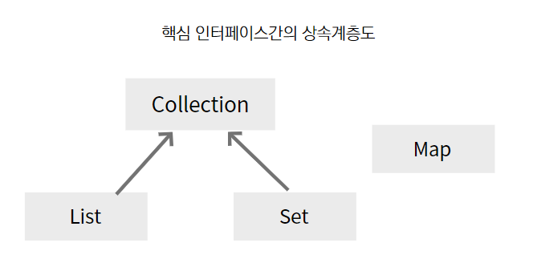

# 들어가기 전

알고리즘 공부를 다시 준비하면서, 먼저 자료구조의 기초부터 다시 정리해 보려고 한다.

자료구조와 알고리즘은 따로 떨어져 있는 개념이 아니라 서로 밀접하게 연결되어 있다. 문제를 해결하기 위해 어떤 자료를 어떻게 저장하고 관리할지 결정하는 것이 자료구조라면, 그 자료를 바탕으로 문제를 해결하는 절차가 알고리즘이라고 볼 수 있다.

따라서 알고리즘을 제대로 공부하기 위해서는 배열, 리스트, 스택, 큐와 같은 기본 자료구조에 대한 이해가 먼저 필요하다고 생각한다.

이번 글에서는 아래 참고 글을 바탕으로 자료구조의 기본 개념을 정리하고, 내가 이해한 내용을 덧붙여가며 다시 학습해 보려고 한다.

참고 글:
-  https://st-lab.tistory.com/142
-  [자바의 정석](https://www.yes24.com/product/goods/147977536)

# 자료구조의 분류

자료구조는 크게 **선형 구조(Linear Data Structure)** 와 **비선형 자료구조(Nonlinear Data Structure)** 로 나눌 수 있다.

**선형 구조(Linear Data Structure)** 는 데이터가 일렬로 연결된 형태라고 보면 된다. 대표적으로 **리스트(List)**와 **큐(Queue)**, **덱(Deque)**이 있다.

**비선형 자료구조는(Nonlinear Data Structure)**는 선형 구조의 반대로, 일렬로 나열된 것이 아닌, 각 요소가 여러 개의 요소와 연결된 형태를 생각하면 된다. 대표적으로 그래프(Graph)와 트리(Tree)가 있다.

# Java Collections FrameWork

컬렉션 프레임워크는 **데이터 군(群)을 저장하는 클래스들을 표준화한 설계**를 뜻한다. 즉, 데이터 일정 타입의 데이터들이 모여 쉽게 가공할 수 있도록 지워하는 자료구조의 뼈대라는 의미이다.

JDK 1.2 이전까지는 `Vector`, `Hashtable`, `Properties`와 같은 컬렉션 클래스, 다수의 데이터를 저장할 수 있는 클래스들을 서로 다른 각자의 방식으로 처리해야 했으나, JDk 1.2부터 컬렉션 프레임워크가 등장하면서 다양한 종류의 컬렉션 클래스가 추가되고 모든 컬렉션 클래스를 표준화된 방식으로 다룰 수 있도록 체계화되었다.

Collection은 크게 3가지 인터페이스로 나뉘어있다. 크게 List(리스트), Queue(큐), Set(집합)으로 나뉘어 있다. 그리고 **인터페이스 List와 Set의 공통된 부분을 다시 뽑아서 새로운 인터페이스인 Collection을 추가로 정의**하였다.
 

