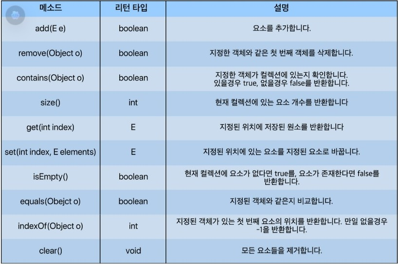
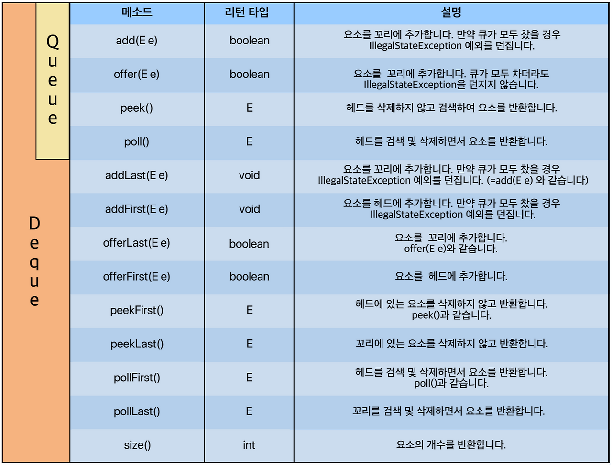
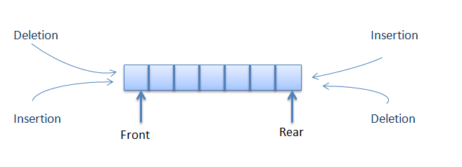
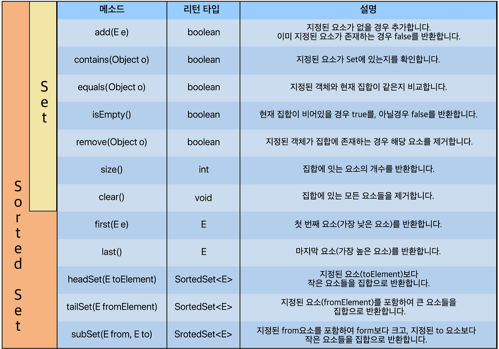

## 들어가기 전

알고리즘 공부를 다시 준비하면서, 먼저 자료구조의 기초부터 다시 정리해 보려고 한다.

자료구조와 알고리즘은 따로 떨어져 있는 개념이 아니라 서로 밀접하게 연결되어 있다. 문제를 해결하기 위해 어떤 자료를 어떻게 저장하고 관리할지 결정하는 것이 자료구조라면, 그 자료를 바탕으로 문제를 해결하는 절차가 알고리즘이라고 볼 수 있다.

따라서 알고리즘을 제대로 공부하기 위해서는 배열, 리스트, 스택, 큐와 같은 기본 자료구조에 대한 이해가 먼저 필요하다고 생각한다.

이번 글에서는 아래 참고 글을 바탕으로 자료구조의 기본 개념을 정리하고, 내가 이해한 내용을 덧붙여가며 다시 학습해 보려고 한다.

참고 글:
- https://st-lab.tistory.com/142
- [자바의 정석](https://www.yes24.com/product/goods/147977536)

## 자료구조의 분류

자료구조는 크게 **선형 구조(Linear Data Structure)** 와 **비선형 구조(Nonlinear Data Structure)** 로 나눌 수 있다.

**선형 구조(Linear Data Structure)** 는 데이터가 일렬로 연결된 형태라고 보면 된다. 대표적으로 **리스트(List)**, **큐(Queue)**, **덱(Deque)**이 있다.

**비선형 구조(Nonlinear Data Structure)** 는 선형 구조의 반대로, 데이터가 일렬로 나열된 것이 아니라 각 요소가 여러 개의 요소와 연결될 수 있는 형태를 의미한다. 대표적으로 그래프(Graph)와 트리(Tree)가 있다.

## 자바 컬렉션 프레임워크(Java Collections Framework)

컬렉션 프레임워크는 **데이터 군(群)을 저장하는 클래스들을 표준화한 설계**를 뜻한다. 즉, 일정한 타입의 데이터를 모아 저장하고 쉽게 가공할 수 있도록 지원하는 **자료구조의 뼈대**라고 볼 수 있다.

JDK 1.2 이전까지는 `Vector`, `Hashtable`, `Properties`와 같은 컬렉션 클래스들을 서로 다른 방식으로 사용해야 했다. 하지만 JDK 1.2부터 컬렉션 프레임워크가 등장하면서 다양한 컬렉션 클래스가 추가되었고, 모든 컬렉션 클래스를 표준화된 방식으로 다룰 수 있도록 체계화되었다.


컬렉션 프레임워크는 크게 `List`, `Queue`, `Set` 인터페이스로 나눌 수 있다. 그리고 `List`와 `Set`의 공통된 부분을 다시 뽑아서 상위 인터페이스인 `Collection`을 정의하였다.

> [!note] Map은 Collection이 아닌 이유
>
> `Map`은 컬렉션처럼 순회할 수 있지만, 본질은 "요소의 모음"이 아니라 **키와 값의 매핑 구조**이기 때문에 `Collection`을 상속하지 않는다.
>
> `Collection` 인터페이스의 상위에는 `Iterable`이 있다. 객체의 데이터를 모두 순회하려면 사용자가 각 자료구조의 순회 방법을 알아야 하거나, `get()` 같은 메서드를 통해 데이터를 하나씩 꺼내야 한다.
>
> 하지만 `Map`은 구조상 키(key)에 대응되는 값(value)을 저장한다는 특징이 있다. 따라서 반복자로 순회할 때 `key`를 기준으로 할지, `value`를 기준으로 할지, 또는 `key-value` 쌍을 기준으로 할지 문제가 발생한다.

## List [리스트]

`List` 인터페이스는 대표적인 선형 자료구조로, 주로 순서가 있는 데이터를 목록 형태로 다루기 위해 만들어진 인터페이스이다.

예를 들어 배열은 다음과 같이 사용할 수 있다.

```java
int[] array = new int[10];
```

하지만 배열은 한 번 크기를 정하면 그 크기를 초과해서 사용할 수 없다.

이러한 단점을 보완하여 `List`를 구현한 클래스들은 **동적 크기**를 가지며 배열처럼 사용할 수 있도록 만들어졌다.

쉽게 말해 **배열의 기능 + 동적 크기 할당**이 합쳐져 있다고 보면 된다.

## List 인터페이스를 구현하는 클래스

1. **ArrayList**
2. **LinkedList**
3. **Vector** (+ `Vector`를 상속받은 `Stack`)



### ArrayList

- `Object[]` 배열을 사용하며, 내부 구현을 통해 크기를 동적으로 관리한다.
- 최상위 타입인 `Object[]` 배열을 사용하기 때문에 요소 접근 성능이 좋다.
- 하지만 중간에 요소를 삽입하거나 삭제하는 경우, 그 뒤의 요소들을 한 칸씩 밀거나 당겨야 하므로 비효율적일 수 있다.

### List 구현체 LinkedList

- 데이터(item)와 주소를 가진 `Node` 객체를 서로 연결하는 방식이다.
  - 데이터와 주소로 이루어진 객체를 `Node`라고 한다.
  - 각 `Node`는 이전 노드와 다음 노드를 연결하는 방식으로 구성된다.
  - 즉, **객체끼리 연결한 방식**이다.
- 특정 요소를 검색할 때는 찾으려는 노드가 나올 때까지 연결된 노드들을 순차적으로 방문해야 하므로 검색 성능이 떨어질 수 있다.
- 하지만 노드를 삽입하거나 삭제하는 경우에는 연결 정보만 변경하면 되므로 효율적이다.

### Vector

- `Object[]` 배열을 사용하며 요소 접근에서 빠른 성능을 보인다.
- `Vector`는 컬렉션 프레임워크가 도입되기 전부터 지원하던 클래스이다.
- 항상 **동기화**를 지원한다.
  - 여러 스레드가 동시에 데이터에 접근할 경우 순차적으로 처리하도록 한다.
- 멀티 스레드 환경에서는 안전하지만, 단일 스레드 환경에서도 동기화를 수행하기 때문에 `ArrayList`에 비해 성능이 약간 느릴 수 있다.

### Stack

- 데이터를 순서대로 쌓아 올리는 후입선출(LIFO: Last In First Out) 형태의 자료구조이다.
- `Stack`은 `Vector` 클래스를 상속받는다.
- Java에서 지원하는 `Stack` 클래스의 메서드들도 대부분 `Vector`에 있는 메서드를 이용하여 구현되어 있어 구조적으로 크게 다르지 않다.

### List 객체 생성 방법

```java
ArrayList<T> list = new ArrayList<>();
LinkedList<T> linkedList = new LinkedList<>();
Vector<T> vector = new Vector<>();
Stack<T> stack = new Stack<>();

List<T> list1 = new ArrayList<>();
List<T> list2 = new LinkedList<>();
List<T> list3 = new Vector<>();
List<T> list4 = new Stack<>();

Vector<T> vector1 = new Stack<>();
```

`T`는 특정 타입이 아니라, **타입이 들어갈 자리**를 의미한다. 실제 사용할 때는 `Integer`, `String`, `Member` 같은 구체적인 타입으로 지정한다.

## Queue [큐]

`Queue` 인터페이스는 선형 자료구조 중 하나로, 주로 **선입선출(FIFO: First In First Out)** 구조를 표현하기 위해 만들어진 인터페이스이다.

예를 들어 10, 20, 30 순서로 데이터를 넣고(`offer`), 데이터를 꺼낼 때(`poll`) 넣은 순서 그대로 10, 20, 30이 나오는 구조이다.

가장 앞쪽에 있는 위치(10)를 head(헤드), 가장 뒤쪽에 있는 위치(30)를 tail(꼬리)라고 부른다.

컬렉션 프레임워크 구조를 보면 `Queue`를 상속하는 `Deque` 인터페이스도 있다. `Queue`는 한쪽 방향으로 삽입과 삭제가 이루어지는 구조이지만, `Deque`는 Double-Ended Queue의 약자로 양쪽에서 삽입과 삭제가 가능한 자료구조이다.

즉, `Deque`는 head와 tail 양쪽 모두에 접근할 수 있는 양방향 큐이다.

## Queue/Deque 인터페이스를 구현하는 클래스

1. **LinkedList**
2. **ArrayDeque**
3. **PriorityQueue**



### Queue/Deque 구현체 LinkedList

왜 여기서 `LinkedList`가 또 등장하는지 의문이 들 수 있다. 아래 그림을 보면 `LinkedList`는 `List`와 `Deque`를 모두 구현하고 있다. 그리고 `Deque` 인터페이스는 `Queue` 인터페이스를 상속받는다.


`ArrayList`와 `LinkedList`의 차이점은 `Object[]` 배열로 관리하느냐, `Node` 객체를 연결하여 관리하느냐의 차이였다.

마찬가지로 `Deque` 또는 `Queue`를 `Node` 객체로 연결해서 관리하고 싶다면 `LinkedList`를 사용하면 된다.

### ArrayDeque



- 스택과 큐의 기능을 모두 사용할 수 있는 자료구조이다.
- `ArrayList`처럼 내부적으로 배열을 사용하여 구현되어 있다.
- `Stack` 클래스보다 `ArrayDeque`를 사용하는 경우가 많다.

```java
Deque<Integer> stack = new ArrayDeque<>();

stack.push(10);
stack.push(20);

System.out.println(stack.pop()); // 20
```

### PriorityQueue

- `PriorityQueue`는 **데이터의 우선순위**를 기반으로 우선순위가 높은 데이터가 먼저 나오는 구조이다.
- 정렬 방식을 지정하지 않으면 기본적으로 **낮은 숫자가 높은 우선순위**를 갖는다.
- 주어진 데이터 중 최댓값 또는 최솟값을 꺼내올 때 유용하게 사용할 수 있다.
- 하지만 사용자가 정의한 객체를 타입으로 사용할 경우 반드시 `Comparator` 또는 `Comparable`을 통해 정렬 방식을 구현해야 한다.

### Queue/Deque 객체 생성 방법

```java
ArrayDeque<Integer> arrayDeque = new ArrayDeque<>();
PriorityQueue<T> priorityQueue = new PriorityQueue<>();

Deque<T> arrayDeque1 = new ArrayDeque<>();
Deque<T> linkedListDeque1 = new LinkedList<>();

Queue<T> arrayDeque2 = new ArrayDeque<>();
Queue<T> linkedListDeque2 = new LinkedList<>();
Queue<T> priorityQueue2 = new PriorityQueue<>();
```

## Set [셋 / 세트]

`Set`은 말 그대로 **집합**이다. `Set`의 가장 큰 특징은 두 가지이다.

1. **데이터를 중복해서 저장할 수 없다.**
2. **입력 순서대로의 저장 순서를 보장하지 않는다.**

> [!note] LinkedHashSet
>
> `LinkedHashSet`은 `Set`임에도 불구하고 **입력 순서대로의 저장 순서**를 보장한다. 그러나 데이터를 중복해서 저장할 수 없다는 점은 동일하다.

기본적으로 `List` 계열은 인덱스(index)로 관리하기 때문에 `add()` 같은 메서드를 사용하면 순서대로 저장된다.

`Queue` 계열 또한 우선순위 큐(`PriorityQueue`)를 제외하고는 기본적으로 입력한 순서대로 객체가 연결된다.

반면 `Set`은 일반적으로 입력받은 순서와 상관없이 데이터를 저장하기 때문에 입력 순서를 보장하지 않는다.

## Set/SortedSet 인터페이스를 구현하는 클래스

1. **HashSet**
2. **LinkedHashSet**
3. **TreeSet**



`Set` 인터페이스를 구현하는 클래스는 `HashSet`, `LinkedHashSet`, `TreeSet`이 있다. 이 중 `TreeSet`은 `Set` 인터페이스를 상속받은 `SortedSet` 인터페이스를 구현하고 있다.

### HashSet

- 가장 기본적인 `Set` 컬렉션 클래스이다.
- 입력 순서를 보장하지 않는다.
- 데이터의 중복 저장을 허용하지 않는다.
- hash에 의해 데이터의 위치를 특정시켜 해당 데이터를 빠르게 색인(search) 할 수 있게 한다.
  - 즉, 중복을 허용하지 않는 `Set` + 해시를 이용한 빠른 검색 구조이다.
  - 삽입, 삭제, 색인 매우 빠른 컬렉션 중 하나이다.

HashSet은 직접 데이터를 저장하는 구조처럼 보이지만, 실제 내부에서는 HashMap을 사용한다.

```java
HashSet<String> set = new HashSet<>();
set.add("Java");

// 내부 동작
map.put("Java", PRESENT);
```

즉, `HashSet`에 저장하는 값은 `HashMap`의 `key`로 들어가고, `value`에는 특별한 의미 없는 더미 객체가 들어간다.

```java
private transient HashMap<E,Object> map;

private static final Object PRESENT = new Object();

public HashSet() {
    map = new HashMap<>();
}
```

### LinkedHashSet

- `LinkedHashSet`은 `HashSet`의 특징에 입력 순서 유지 기능이 추가된 컬렉션 클래스이다.
- `HashSet`처럼 **중복 데이터를 허용하지 않고**, 해시를 기반으로 데이터를 저장하기 때문에 삽입, 삭제, 검색 성능이 빠른 편이다. 
  - 하지만 `HashSet`과 달리 **데이터가 입력된 순서를 유지**한다는 특징이 있다.
- 내부적으로는 `LinkedHashMap`을 사용하며, 저장되는 데이터는 `LinkedHashMap`의 key로 관리된다. 
  - 또한 각 데이터의 연결 순서를 함께 관리하기 때문에 순회할 때 입력한 순서대로 데이터를 꺼낼 수 있다.

### TreeSet

- HashSet과 마찬가지로 입력 순서대로의 저장 순서를 보장하지 않으며 중복 데이터 또한 넣지 못한다.
- SortedSet 인터페이스의 구현체로, **데이터의 가중치에 따른 순서대로 정렬**됨을 보장한다.
- `TreeSet`은 중복되지 않으면서 특정 규칙에 의해 정렬된 형태의 집합을 사용하고 싶을 때 사용한다.

> [!note] SortedSet 인터페이스
> ```java
> public interface SortedSet<E> extends Set<E>
> ```
> `SortedSet`은 요소들에게 **전체 정렬 순서**를 제공하는 `Set`이다.
>
> 요소들음 다음 중 하나의 기준으로 정렬된다.
> 1. 요소 자체의 자연 정렬 순서(natural ordering)
> 2. `SortedSet`을 생성할 때 제공한 **Comparator**
> 
> `SortedSet`은 반복자(iterator)는 요소들을 **오름차순 순서**로 순회한다. 또한 정렬 순서를 활용할 수 있는 여러 추가 메서드들을 제공한다.

### Set 객체 생성 방법

```java
HashSet<Integer> hashset = new HashSet<>();
LinkedHashSet<T> linkedhashset = new LinkedHashSet<>();
TreeSet<T> treeset = new TreeSet<>();

SortedSet<T> sortedset1 = new TreeSet<>();

Set<T> hashset1 = new HashSet<>();
Set<T> linkedhashset1 = new LinkedHashSet<>();
Set<T> treeset1 = new TreeSet<>();
```


## 참고 자료

- https://st-lab.tistory.com/142
- https://docs.oracle.com/javase/8/docs/api/java/util/Collection.html
- https://docs.oracle.com/javase/8/docs/technotes/guides/collections/designfaq.html#a14
- ChatGPT
