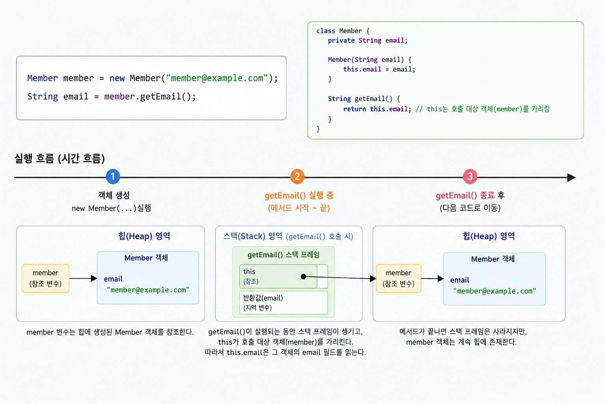

## 1. 들어가기 전

이전 글에서는 접근 제한자를 사용해 클래스와 멤버를 어느 범위까지 공개할지 살펴봤다. `private`은 클래스 내부에서만 접근하도록 제한하고, `public`은 외부 코드에도 사용할 수 있도록 공개한다.

접근 제한자는 **누가 해당 멤버에 접근할 수 있는지**를 결정하지만, 멤버가 특정 객체에 속하는지 클래스 자체에 속하는지까지 결정하지는 않는다. 값에 다시 대입할 수 있는지, 하위 클래스가 메서드를 재정의할 수 있는지도 접근 제한자와는 별개의 문제다.

자바는 이러한 성질을 표현하기 위해 `static`과 `final`을 제공한다.

* `static`은 필드나 메서드가 특정 객체가 아니라 클래스에 속하도록 한다.
* `final`은 선언 위치에 따라 변수의 재할당, 메서드의 오버라이딩 또는 클래스의 상속을 제한한다.

두 키워드는 서로 다른 문제를 해결한다. `static`이 붙었다고 값이 변경되지 않는 것은 아니며, `final`이 붙었다고 여러 객체가 같은 값을 공유하는 것도 아니다. `static final`처럼 함께 사용할 때도 각각의 의미를 구분해야 한다.

## 2. static은 무엇일까?

일반적인 필드와 메서드는 객체를 기준으로 사용한다. 객체를 생성할 때마다 각 객체에는 별도의 인스턴스 필드가 생기고, 인스턴스 메서드는 호출 대상 객체의 상태를 사용해 동작한다.

`static`을 선언하면 멤버는 개별 객체가 아니라 클래스에 속한다. `static` 필드는 클래스 변수 또는 정적 필드라고 부르며, `static` 메서드는 클래스 메서드 또는 정적 메서드라고 부른다.

### 2.1 static 필드

인스턴스 필드는 객체마다 별도로 존재하지만 `static` 필드는 클래스에 하나만 존재한다. 객체가 여러 개 만들어져도 같은 `static` 필드를 공유한다.

```java
public class Member {

    private static int memberCount;

    private final String email;

    public Member(String email) {
        this.email = email;
        memberCount++;
    }

   //getter
}
```

두 개의 객체를 생성해 필드의 차이를 확인해 보자.

```java
Member first = new Member("first@example.com");
Member second = new Member("second@example.com");

System.out.println(first.getEmail());
System.out.println(second.getEmail());
System.out.println(Member.getMemberCount());
```

실행 결과는 다음과 같다.

```text
first@example.com
second@example.com
2
```

`email`은 인스턴스 필드이므로 각 객체가 서로 다른 값을 가진다. 반면 `memberCount`는 `Member` 클래스에 속한 `static` 필드이므로 **모든 객체가 같은 값을 공유**한다.

정적 멤버는 다음과 같이 클래스 이름으로 접근하는 것이 좋다.

```java
int count = Member.getMemberCount();
```

자바 문법상 객체 참조를 사용해 정적 멤버에 접근할 수도 있다.

```java
int count = first.getMemberCount();
```

하지만 이 코드는 `getMemberCount()`가 `first` 객체에 속한 메서드처럼 보이게 한다. 실제로는 특정 객체와 관계없는 클래스 메서드이므로 `Member.getMemberCount()`처럼 클래스 이름으로 호출해야 의미가 분명하게 드러난다.

> [!warning] 공유되는 가변 상태
>
> `static` 필드가 변경 가능한 값이라면 여러 객체와 코드가 하나의 상태를 함께 변경한다.
>
> 예제의 `memberCount++`는 `static`의 공유 특성을 설명하기 위한 학습용 코드다. 여러 스레드가 동시에 실행되는 환경에서는 증가 연산이 안전하지 않을 수 있으므로 별도의 동시성 제어가 필요하다.
>
> `static`은 값을 자동으로 안전하게 공유해 주는 기능이 아니다.

### 2.2 static 메서드

인스턴스 메서드는 특정 객체를 대상으로 호출한다.

```java
Member member = new Member("member@example.com");
String email = member.getEmail();
```

`getEmail()`이 실행되는 동안에는 호출 대상인 `member` 객체가 존재한다. 메서드 안에서 `this`를 사용하면 이 객체를 가리킨다.



반면 **`static` 메서드는 특정 객체를 대상으로 호출하지 않는다.**

```java
public class EmailNormalizer {

    public static String normalize(String email) {
        return email.trim().toLowerCase();
    }
}
```

객체를 생성하지 않고 클래스 이름으로 호출할 수 있다.

```java
String email = EmailNormalizer.normalize(" MEMBER@EXAMPLE.COM ");
```

`static` 메서드에는 현재 객체가 없으므로 `this`와 `super`를 사용할 수 없다. 인스턴스 필드나 인스턴스 메서드에도 직접 접근할 수 없다.

```java
public class Member {

    private String email;
    private static int memberCount;

    public static void printInformation() {
        System.out.println(memberCount);

        // 컴파일 오류: 현재 객체가 존재하지 않는다.
        // System.out.println(email);
        // System.out.println(this.email);
    }
}
```

`memberCount`는 클래스에 속하므로 정적 메서드에서 직접 사용할 수 있다. 그러나 `email`은 각 객체마다 다른 값을 가지므로 어떤 객체의 이메일을 사용해야 하는지 정해지지 않는다.

**정적 메서드에서도 객체 참조를 명시적으로 전달받으면 해당 객체의 인스턴스 메서드를 호출할 수 있다.**

```java
public static void printEmail(Member member) {
    System.out.println(member.getEmail());
}
```

정적 메서드가 인스턴스 멤버를 전혀 사용할 수 없는 것은 아니다. **현재 객체가 자동으로 제공되지 않기 때문에 사용할 객체를 직접 지정해야 한다.**

정적 메서드는 다음과 같이 특정 객체의 상태에 의존하지 않는 동작에 적합하다.

* 입력값만으로 결과를 계산하는 메서드
* 객체를 생성해 반환하는 정적 팩토리 메서드
* 클래스 전체에서 사용하는 정적 필드를 관리하는 메서드
* 여러 위치에서 공통으로 사용하는 상태 없는 보조 메서드

객체를 생성하지 않아도 된다는 이유만으로 모든 메서드를 `static`으로 만드는 것은 좋지 않다. 객체의 상태에 따라 동작이 달라지거나 다른 구현으로 교체해야 하는 기능이라면 인스턴스 메서드와 객체 간의 협력으로 표현하는 편이 자연스럽다.

> [!note] static과 싱글톤은 다르다
>
> `static`은 멤버가 클래스에 속한다는 뜻이다. 클래스의 객체가 하나만 존재한다는 의미는 아니다.
>
> 하나의 클래스에 정적 메서드가 있더라도 객체를 여러 개 생성할 수 있다. 싱글톤은 객체의 생성 개수를 하나로 제한하는 별도의 설계 방식이다.

### 2.3 클래스 초기화와 static 초기화 블록

`static` 필드는 단순히 프로그램이 시작되는 순간 모두 생성되는 것이 아니다. 자바는 클래스를 처음으로 적극적으로 사용하는 시점에 해당 클래스를 초기화한다.

대표적으로 다음 동작은 클래스 초기화를 일으킬 수 있다.

* 클래스의 객체를 생성한다.
* 클래스에 선언된 `static` 메서드를 호출한다.
* 컴파일 타임 상수가 아닌 `static` 필드를 읽거나 변경한다.

클래스를 초기화할 때는 정적 필드 초기화식과 정적 초기화 블록을 실행한다. 상위 클래스가 있다면 상위 클래스를 먼저 초기화하며, 한 클래스 안에서는 소스 코드에 작성된 순서대로 실행한다.

```java
public class AppConfig {

    private static final String APPLICATION_NAME;

    private static int maxRetryCount = 3;

    static {
        APPLICATION_NAME = loadApplicationName();
        maxRetryCount += 2;
    }

    private static String loadApplicationName() {
        return "blog";
    }

    public static String getApplicationName() {
        return APPLICATION_NAME;
    }

    public static int getMaxRetryCount() {
        return maxRetryCount;
    }
}
```

`AppConfig`가 초기화되면 다음 순서로 값이 결정된다.

1. `maxRetryCount`에 `3`을 대입한다.
2. 정적 초기화 블록에서 `APPLICATION_NAME`에 값을 대입한다.
3. `maxRetryCount`에 `2`를 더해 `5`로 변경한다.

정적 초기화 블록은 단순한 대입식만으로 초기화하기 어려운 정적 필드를 설정할 때 사용할 수 있다. 초기화 과정이 복잡하지 않다면 필드 선언과 함께 값을 대입하는 편이 읽기 쉽다.

```java
private static final int MAX_RETRY_COUNT = 5;
```

`static`은 중첩 클래스에도 사용할 수 있다.

```java
public class Response {

    public static class Builder {
    }
}
```

정적 중첩 클래스는 바깥 클래스의 특정 객체와 연결되지 않는다. 따라서 바깥 클래스의 인스턴스 필드와 인스턴스 메서드에 직접 접근할 수 없다.

최상위 클래스에는 `static`을 선언할 수 없으며 생성자와 지역 변수에도 `static`을 사용할 수 없다.

```java
// 컴파일 오류: 최상위 클래스에는 static을 사용할 수 없다.
// static class Member {
// }
```

```java
public void execute() {
    // 컴파일 오류: 지역 변수에는 static을 사용할 수 없다.
    // static int count = 0;
}
```

> [!note] 지역 변수에 static을 사용할 수 없는 이유
>
> 지역 변수는 메서드나 블록이 실행되는 동안에만 사용하는 임시 변수이며, 클래스의 멤버가 아니다.
>
> 반면, `static`은 클래스에 속해 여러 객체와 메서드 호출해서 하나의 값을 공유하는 멤버로 사용하는 키워드다. 따라서 클래스 멤버가 아닌 지역 변수에는 `static`을 선언할 수 없다.

## 3. final은 무엇일까?

`final`은 선언 대상에 더 이상의 **변경이나 확장을 허용하지 않겠다는 의도**를 표현한다. 변수, 필드, 메서드와 클래스에 사용할 수 있으며 선언 위치에 따라 제한하는 대상이 달라진다.

| 선언 위치    | `final`의 의미           |
| -------- | --------------------- |
| 변수 또는 필드 | 한 번 할당한 뒤 다시 할당할 수 없다 |
| 메서드      | 하위 클래스에서 오버라이딩할 수 없다  |
| 클래스      | 다른 클래스가 상속할 수 없다      |

### 3.1 final 변수와 필드

일반 변수는 값을 여러 번 대입할 수 있다.

```java
int retryCount = 1;
retryCount = 2;
retryCount = 3;
```

`final` 변수에는 한 번만 값을 할당할 수 있다.

```java
final int maxRetryCount = 3;

// 컴파일 오류: final 변수에 다시 대입할 수 없다.
// maxRetryCount = 5;
```

`final` 필드도 선언과 동시에 초기화할 수 있다.

```java
public class RetryPolicy {

    private final int maxRetryCount = 3;
}
```

객체마다 서로 다른 값이 필요하다면 생성자에서 초기화할 수 있다.

```java
public class Member {

    private final String email;

    public Member(String email) {
        this.email = email;
    }

    public String getEmail() {
        return email;
    }
}
```

선언할 때 초기화하지 않은 `final` 변수를 **blank final**이라고 한다. **인스턴스 `final` 필드는 모든 생성자 실행이 끝나기 전까지 반드시 한 번 할당되어야 한다.**

```java
public class Member {

    private final String email;

    public Member() {
        // 컴파일 오류:
        // 생성자가 끝날 때 email이 초기화되지 않는다.
    }
}
```

여러 생성자가 있다면 모든 생성 경로에서 `final` 필드가 초기화되어야 한다.

```java
public class Member {

    private final String email;

    public Member(String email) {
        this.email = email;
    }

    public Member() {
        this("guest@example.com");
    }
}
```

정적 `final` 필드도 선언과 동시에 초기화하거나 정적 초기화 블록에서 할당할 수 있다.

```java
public class AppConfig {

    private static final String APPLICATION_NAME;

    static {
        APPLICATION_NAME = "blog";
    }
}
```

`final`은 지역 변수와 메서드 매개변수에도 사용할 수 있다.

```java
public static String normalize(final String email) {
    // 컴파일 오류: 매개변수에 다시 대입할 수 없다.
    // email = email.trim();

    return email.trim().toLowerCase();
}
```

매개변수를 `final`로 선언해도 호출한 쪽의 값이나 객체를 불변으로 만드는 것은 아니다. **해당 메서드 내부에서 매개변수 변수에 다른 값을 다시 대입하지 못하게 할 뿐이다.**

### 3.2 final 참조와 불변 객체의 차이

기본형 변수를 `final`로 선언하면 저장된 값을 변경할 수 없다.

```java
final int age = 20;

// 컴파일 오류
// age = 21;
```

참조형 변수를 `final`로 선언하면 **변수가 가리키는 객체를 다른 객체로 바꿀 수 없다.** 참조 대상 객체의 내부 상태까지 변경할 수 없게 되는 것은 아니다.

```java
import java.util.ArrayList;
import java.util.List;

List<String> firstList = new ArrayList<>();

final List<String> names = firstList;

names.add("Kim");
names.add("Lee");
```

`names`가 참조하는 `ArrayList`에 요소를 추가하는 것은 허용된다.

```java
// 컴파일 오류: 다른 List 객체를 다시 대입할 수 없다.
// names = new ArrayList<>();
```

`final`이 제한하는 대상은 `names` 변수의 재할당이다. `ArrayList` 객체 자체는 변경 가능한 객체이므로 요소를 추가하거나 제거할 수 있다.


따라서 `final` 필드를 사용했다고 해서 객체 전체가 자동으로 [불변 객체](https://m.blog.naver.com/seek316/223325763759)가 되는 것은 아니다.

```java
public class Members {

    private final List<String> names;

    public Members(List<String> names) {
        this.names = names;
    }
}
```

외부에서 전달한 리스트를 그대로 저장하면 외부 코드가 해당 리스트를 변경할 수 있다.

```java
List<String> names = new ArrayList<>();
names.add("Kim");

Members members = new Members(names);

names.add("Lee");
```

불변성을 확보하려면 참조 재할당을 막는 것뿐 아니라 참조 대상 객체가 외부에서 변경되지 않도록 복사하거나 변경할 수 없는 형태로 보관해야 한다.

```java
public class Members {

    private final List<String> names;

    public Members(List<String> names) {
        this.names = List.copyOf(names);
    }

    public List<String> getNames() {
        return names;
    }
}
```

[List.copyOf()](https://docs.oracle.com/en/java/javase/17/docs/api/java.base/java/util/List.html)가 반환하는 리스트에는 요소를 추가하거나 제거할 수 없다. 다만 리스트 안에 변경 가능한 객체가 들어 있다면 각 요소의 내부 상태까지 자동으로 불변이 되는 것은 아니다.

### 3.3 final 메서드와 클래스

메서드에 `final`을 선언하면 **하위 클래스에서 해당 메서드를 오버라이딩할 수 없다.**

```java
public class Account {

    public final void validate() {
        System.out.println("계좌 상태를 검사합니다.");
    }
}
```

다음 하위 클래스는 `validate()`를 다시 정의할 수 없다.

```java
public class SavingsAccount extends Account {

    // 컴파일 오류: final 메서드는 오버라이딩할 수 없다.
    // @Override
    // public void validate() {
    // }
}
```

특정 메서드의 동작이 클래스의 핵심 규칙이며 하위 클래스가 변경해서는 안 된다면 `final`을 사용할 수 있다. 다만 메서드를 확장하지 못하도록 제한할 이유가 명확할 때 사용해야 한다.

클래스에 `final`을 선언하면 해당 클래스를 상속할 수 없다.

```java
public final class Money {

    private final long amount;

    public Money(long amount) {
        this.amount = amount;
    }

    public long getAmount() {
        return amount;
    }
}
```

다음 코드는 컴파일되지 않는다.

```java
// 컴파일 오류: final 클래스는 상속할 수 없다.
// public class DiscountMoney extends Money {
// }
```

`final` 클래스는 구현이 완성되어 더 이상의 하위 타입을 허용하지 않거나, 상속으로 인해 클래스의 규칙이 변경되는 것을 막고 싶을 때 사용할 수 있다.

`abstract` 클래스는 하위 클래스가 구현을 완성해야 하고, `final` 클래스는 하위 클래스를 허용하지 않는다. 두 제한은 서로 충돌하므로 하나의 클래스를 `abstract final`로 선언할 수 없다.

생성자에는 `final`을 사용할 수 없다. 생성자는 상속되거나 오버라이딩되는 멤버가 아니므로 `final`로 제한할 대상이 없기 때문이다.

## 4. static final과 사용 시 주의점

`static`과 `final`은 함께 사용하는 경우가 많지만 두 키워드의 역할은 서로 다르다.

```java
public static final int MAX_RETRY_COUNT = 3;
```

각 키워드는 다음 의미를 가진다.

* `static`: `MAX_RETRY_COUNT`는 객체마다 생성되지 않고 클래스에 하나만 존재한다.
* `final`: 한 번 초기화된 참조나 값을 다시 할당할 수 없다.

| 선언                | 객체마다 값이 존재하는가? | 다시 할당할 수 있는가? |
| ----------------- | -------------- | ------------- |
| 인스턴스 필드           | O              | O             |
| `final` 인스턴스 필드   | O              | X             |
| `static` 필드       | X              | O             |
| `static final` 필드 | X              | X             |

### 4.1 클래스 상수와 컴파일 타임 상수

여러 객체가 함께 사용하며 실행 중 변경되지 않아야 하는 값은 일반적으로 `static final`로 선언한다.

```java
public class RetryPolicy {

    public static final int MAX_RETRY_COUNT = 3;
}
```

상수 이름은 관례에 따라 대문자로 작성하고 여러 단어는 밑줄로 구분한다.

```java
public static final int CONNECTION_TIMEOUT_SECONDS = 10;
```

Java Language Specification에서 사용하는 **constant variable**이라는 용어는 일반적인 상수 필드보다 범위가 엄격하다. 다음 조건을 모두 만족해야 한다.

* `final` 변수다.
* 타입이 기본형 또는 `String`이다.
* 컴파일 타임에 계산할 수 있는 상수 표현식으로 초기화한다.

```java
public static final int MAX_RETRY_COUNT = 3;
public static final String APPLICATION_NAME = "blog";
```

다음 필드도 `static final`이지만 명세에서 정의하는 컴파일 타임 상수는 아니다.

```java
public static final Integer DEFAULT_PORT = Integer.valueOf(8080);
public static final Object LOCK = new Object();
```

`Integer`와 `Object`는 기본형이나 `String`이 아니며, 메서드 호출과 객체 생성은 해당 조건의 상수 표현식이 아니다.

컴파일 타임 상수는 사용하는 클래스의 바이트코드에 값이 포함될 수 있다. 외부 라이브러리가 공개한 상수 값을 변경했더라도 그 상수를 사용하는 코드를 다시 컴파일하지 않으면 이전 값이 남을 수 있다.

```java
public static final int DEFAULT_TIMEOUT = 10;
```

배포된 라이브러리에서 값을 `20`으로 바꾸는 경우 라이브러리만 다시 컴파일해서 교체하는 것으로 충분하지 않을 수 있다. 이 값을 사용한 코드도 다시 컴파일해야 변경된 값을 반영할 수 있다.

자주 변경될 수 있는 설정값을 `public static final` 컴파일 타임 상수로 배포할 때는 이러한 특성을 고려해야 한다.

### 4.2 static final 참조도 변경 가능한 객체를 가리킬 수 있다

`static final` 참조 변수도 참조 대상 객체의 변경까지 막지는 않는다.

```java
import java.util.ArrayList;
import java.util.List;

public class MemberRegistry {

    private static final List<String> MEMBERS = new ArrayList<>();

    public static void add(String name) {
        MEMBERS.add(name);
    }
}
```

`MEMBERS`에 다른 리스트를 다시 대입할 수는 없지만 기존 리스트에 요소를 추가하는 것은 가능하다.

```java
// 컴파일 오류: 참조 재할당
// MEMBERS = new ArrayList<>();

MEMBERS.add("Kim");
```

이 리스트는 클래스 전체에서 공유되는 가변 상태다. 여러 코드가 값을 변경하면 변경 시점과 원인을 추적하기 어려워지고, 멀티스레드 환경에서는 동시성 문제도 발생할 수 있다.

변경할 필요가 없는 목록이라면 변경할 수 없는 컬렉션을 사용할 수 있다.

```java
import java.util.List;

public class SupportedCategories {

    private static final List<String> VALUES =
            List.of("JAVA", "SPRING");

    public static List<String> values() {
        return VALUES;
    }
}
```

`VALUES`의 참조를 변경할 수 없고, `List.of()`가 만든 리스트에는 요소를 추가하거나 제거할 수도 없다.

### 4.3 어떤 키워드를 선택해야 할까?

필드나 메서드에 `static`을 사용할지는 해당 값과 동작이 특정 객체에 속하는지를 기준으로 판단해야 한다.

객체마다 서로 다른 상태라면 인스턴스 필드가 적합하다.

```java
public class Member {

    private final String email;
}
```

모든 객체가 공유해야 하는 상태라면 `static` 필드를 검토할 수 있다.

```java
private static int memberCount;
```

객체 상태에 의존하지 않고 입력값만으로 동작한다면 정적 메서드를 사용할 수 있다.

```java
public static String normalize(String value) {
    return value.trim().toLowerCase();
}
```

초기화 이후 다른 값을 다시 대입해서는 안 된다면 `final`을 사용한다.

```java
private final String email;
```

클래스 전체에서 공유하며 변경되지 않는 값이라면 `static final`이 적합하다.

```java
private static final int MAX_RETRY_COUNT = 3;
```

다만 `static`을 객체 생성을 피하기 위한 수단으로만 사용해서는 안 된다. 정적 멤버는 클래스 수준의 의존성과 공유 상태를 만들기 때문에 객체 간의 관계가 코드에 드러나지 않을 수 있다.

`final`도 무조건 붙인다고 객체가 불변이 되는 것은 아니다. 변수의 재할당을 막는 것과 객체 내부 상태의 변경을 막는 것은 구분해야 한다.

## 5. 참고 자료

* [Java Language Specification 26 - Types, Values, and Variables](https://docs.oracle.com/en/java/javase/26/docs/specs/jls/jls-4.html#jls-4.12.4)
* [Java Language Specification 26 - Classes](https://docs.oracle.com/en/java/javase/26/docs/specs/jls/jls-8.html)
* [Java Language Specification 26 - Initialization of Classes and Interfaces](https://docs.oracle.com/en/java/javase/26/docs/specs/jls/jls-12.html#jls-12.4)
* [Java Language Specification 26 - Binary Compatibility](https://docs.oracle.com/en/java/javase/26/docs/specs/jls/jls-13.html#jls-13.4.9)
* [Oracle Java Tutorials - Understanding Class Members](https://docs.oracle.com/javase/tutorial/java/javaOO/classvars.html)
* https://tecoble.techcourse.co.kr/post/2020-05-18-immutable-object/
* https://jojoldu.tistory.com/412
