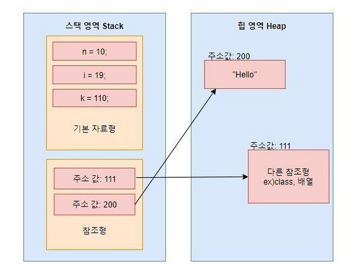
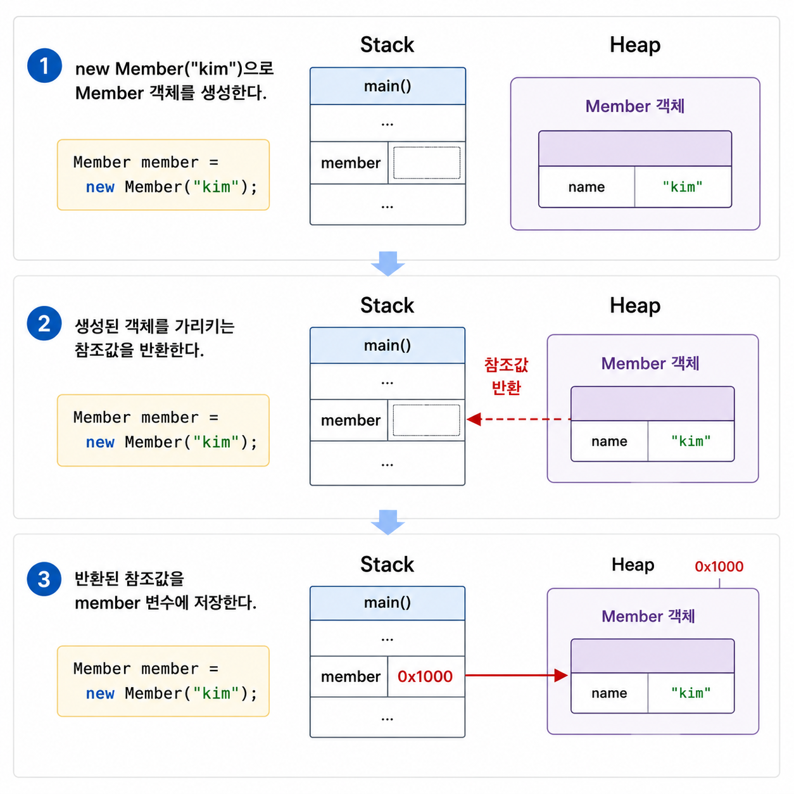
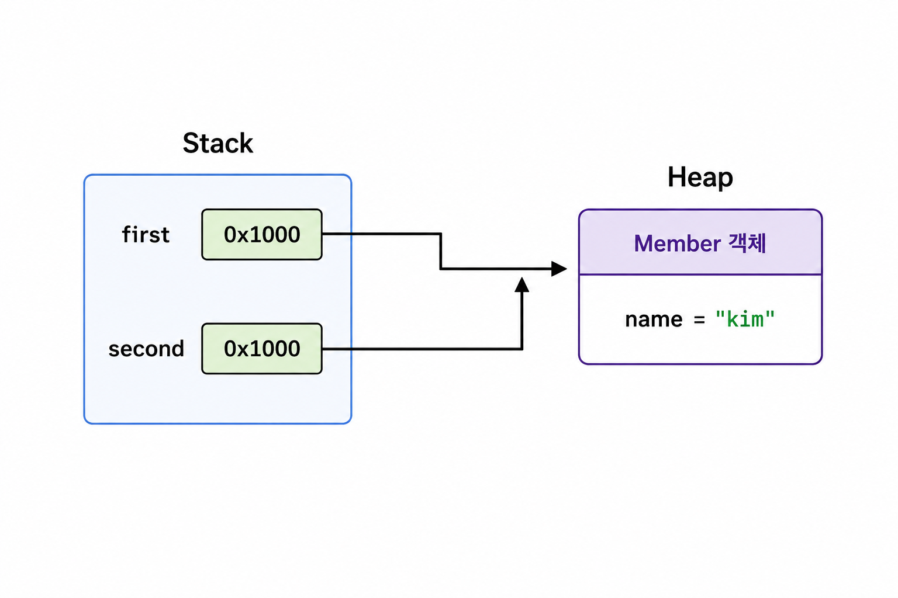
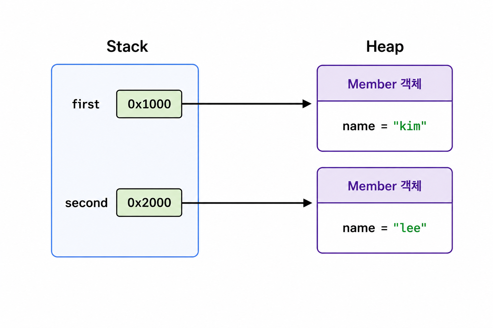
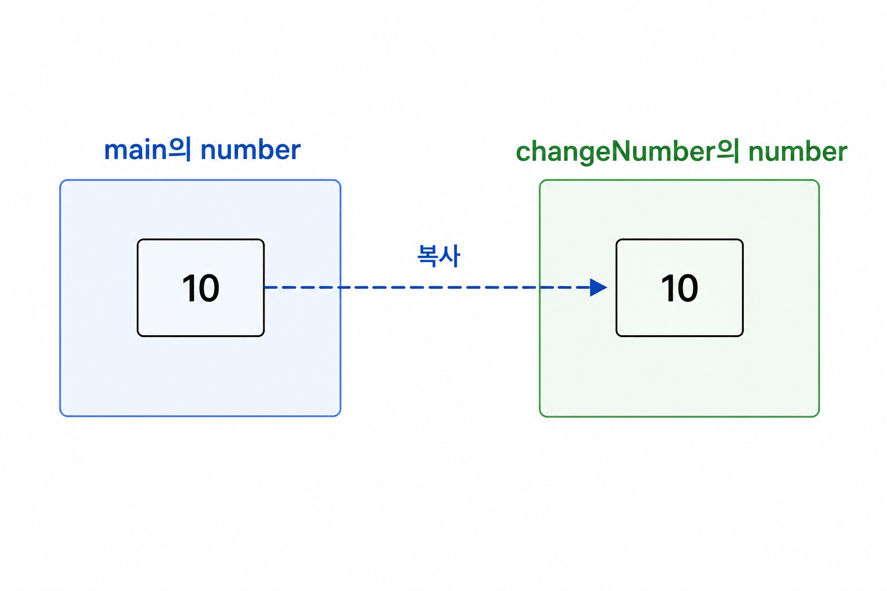
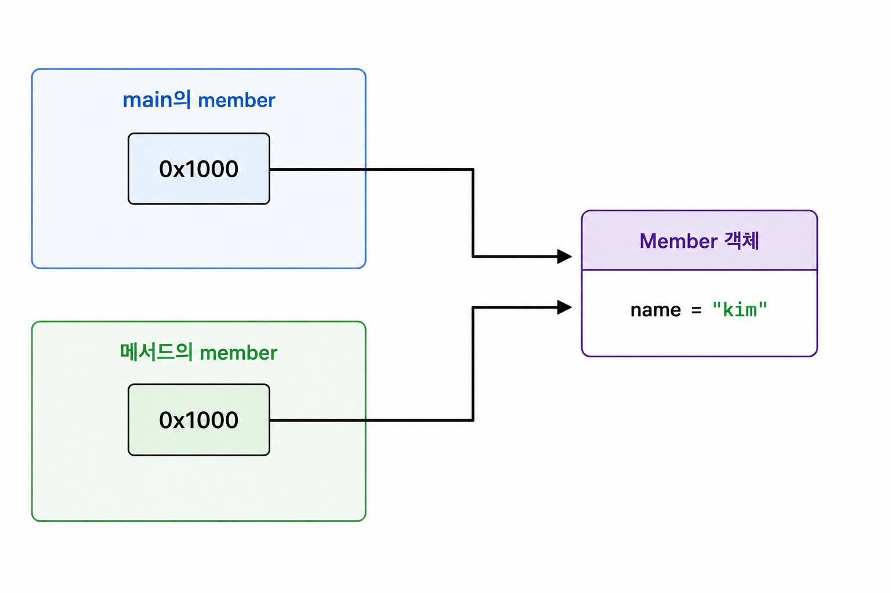
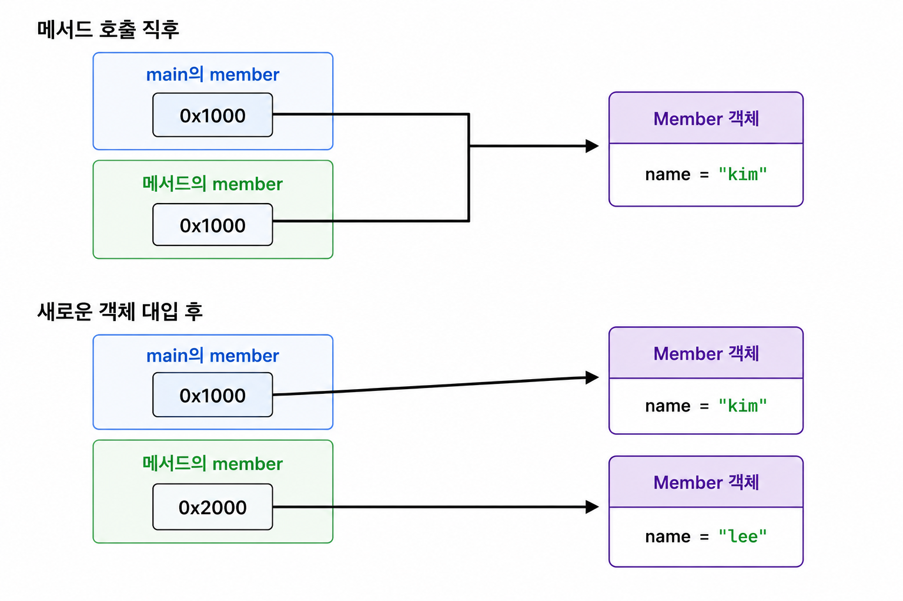
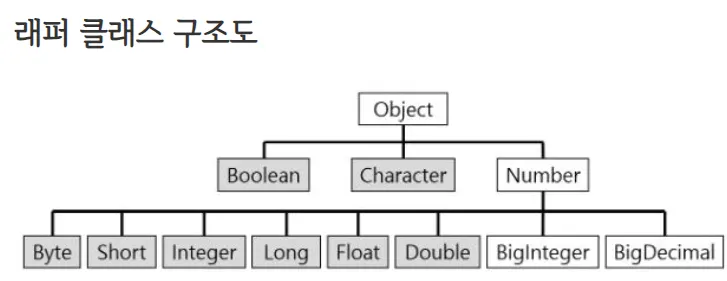

## 1. 들어가기 전

자바 코드를 작성하다 보면 다음과 같이 다양한 타입의 변수를 선언한다.

```java
int age = 20; 
boolean active = true; 

String name = "kim"; 
Member member = new Member("kim");
```

모두 `타입 변수명 = 값`의 형태로 선언하지만, 변수에 저장되는 값의 성격은 서로 다르다. `int`와 `boolean` 같은 변수에는 실제 데이터 값이 저장되고, `String`과 `Member` 같은 변수에는 객체를 가리키는 참조값이 저장된다.

이 차이를 제대로 이해하지 못하면 다음과 같은 부분에서 혼란이 생긴다.

- `==`와 `equals()`는 무엇이 다른가?
- 객체 변수를 다른 변수에 대입하면 객체도 복사되는가?
- 메서드에 객체를 전달하면 원본 객체가 변경되는 이유는 무엇인가?
- `String`은 기본형인가?
- `Integer`와 `int`는 무엇이 다른가?
- 참조형 변수에는 왜 `null`을 저장할 수 있는가?
- JPA Entity의 식별자는 왜 long보다 Long을 많이 사용하는가?

기본형과 참조형은 단순히 자료형을 분류하는 문법이 아니다. 자바에서 변수가 값을 저장하고, 객체를 다루며, 메서드에 데이터를 전달하는 방식을 이해하기 위한 출발점이다.

## 2. 자바의 타입은 어떻게 나뉠까?

자바의 타입은 크게 **기본형(Primitive Type)** 과 **참조형(Reference Type)** 으로 나뉜다.

| 구분 | 변수에 저장되는 값 | 대표적인 타입 |
|---|---|---|
| 기본형 | 실제 데이터 값 | `byte`, `short`, `int`, `long`, `float`, `double`, `char`, `boolean` |
| 참조형 | 객체를 가리키는 참조값 또는 `null` | 클래스, 인터페이스, 배열, 타입 변수 |


```java
int age = 20; 
Member member = new Member("kim");
```

`age` 변수에는 정수 값 `20`이 직접 저장된다.

반면 `member` 변수에는 `Member` 객체 자체가 저장되는 것이 아니다. **생성된 객체를 가리키는 참조값이 저장**된다.

참조값은 JVM이 메모리에서 특정 객체를 찾아 접근할 수 있도록 사용하는 값이다. 개념을 쉽게 설명하기 위해 주소라고 표현하기도 하지만, 자바 개발자가 직접 메모리 주소를 읽거나 수정할 수 있는 포인터와는 다르다.  
(JVM 나중에 설명)



```text
기본형 변수 = 기본형 값 저장
참조형 변수 = 객체를 가리키는 참조값 저장 
```

> [!note] 기본형은 Stack, 참조형은 Heap에 저장될까?
>
> 기본형은 무조건 Stack에 저장되고 참조형은 무조건 Heap에 저장된다고 구분하는 것은 정확하지 않다. 지역 변수는 일반적으로 메서드의 Stack Frame에서 관리되고, `new`로 생성한 객체는 일반적으로 Heap에서 관리된다.
> 그러나 필드로 선언된 기본형 값은 객체의 일부로 관리되며, [JVM의 JIT 컴파일러가 객체 할당을 최적화](https://mangkyu.tistory.com/343)할 수도 있다.
>
> ```java
> public class Member {
>
>    private int age;       // 기본형 인스턴스 필드
>    private Address address; // 참조형 인스턴스 필드
> }
> ```
> 따라서 기본형과 참조형을 구분할 때는 물리적인 메모리 위치보다 **변수에 어떤 종류의 값이 저장되는가**를 먼저 이해해야 한다.


## 3. 기본형은 실제 값을 저장한다

기본형 타입에는 크게 논리형 (`boolean`),  문자형 (`char`),  정수형 (`byte`, `short`, `int`, `long`),  실수형 (`float`, `double`) 으로 나뉜다.

| 분류 | 타입 | 크기 | 표현 범위 또는 특징 | 필드 기본값 |
|---|---|---:|---|---|
| 정수형 | `byte` | 8비트 | -128부터 127 | `0` |
| 정수형 | `short` | 16비트 | -32,768부터 32,767 | `0` |
| 정수형 | `int` | 32비트 | -2,147,483,648부터 2,147,483,647 | `0` |
| 정수형 | `long` | 64비트 | 매우 큰 범위의 정수 | `0L` |
| 실수형 | `float` | 32비트 | 단정밀도 부동소수점 | `0.0f` |
| 실수형 | `double` | 64비트 | 배정밀도 부동소수점 | `0.0d` |
| 문자형 | `char` | 16비트 | UTF-16 코드 단위 | `'\u0000'` |
| 논리형 | `boolean` | 명세상 크기 미정 | `true` 또는 `false` | `false` |

기본형 특징은 다음과 같다.
- 자바에서 제공하는 기본형은 `byte`, `short`, `int`, `long`, `float`, `double`, `char`, `boolean`의 8가지다.
- 타입 이름은 모두 **소문자**로 작성한다.
- 기본형 변수에는 객체를 가리키는 참조값이 아니라 **실제 데이터 값이 저장**된다.
- 기본형은 객체가 아니므로 `null`을 저장할 수 없다.
- 필드와 배열 요소는 타입별 기본값으로 자동 초기화된다.
- 지역 변수는 자동으로 초기화되지 않으므로 사용하기 전에 값을 직접 할당해야 한다.

## 4. 참조형은 객체를 가리키는 참조값을 사용한다

참조형에는 클래스, 인터페이스, 배열, 타입 변수 등이 포함된다.

```java
String name = "kim"; 
Member member = new Member("kim"); 
List<String> names = new ArrayList<>(); 
int[] numbers = new int[3];
```

위 예제에서 `String`, `Member`, `List<String>`, `int[]`는 모두 참조형이다. 배열의 요소가 기본형이더라도 배열 자체는 객체이므로 배열 변수는 참조값을 저장한다.

### 4.1 객체 생성과 참조값

```java
Member member = new Member("kim");
```



`member` 변수 안에는 `Member` 객체의 필드 값이 직접 들어 있는 것이 아니다. **객체에 접근할 수 있는 참조값**이 들어 있다.

```java
member.changeName("lee");
```

`member`에 저장된 참조값을 따라가 실제 객체를 찾은 뒤, 해당 객체의 `changeName()` 메서드를 호출한다.

### 4.2 참조형 변수를 대입하면 객체가 복사될까?

참조형 변수를 다른 변수에 대입하면 객체가 복사되는 것이 아니라 **참조값이 복사된다.**

```java
Member first = new Member("kim");
Member second = first;
```

두 변수의 상태를 그림으로 표현하면 다음과 같다.



`first`와 `second`에는 같은 참조값이 저장되어 있으므로 두 변수 모두 같은 객체를 가리킨다.

```java
second.changeName("lee");

System.out.println(first.getName()); // lee 
System.out.println(second.getName()); // lee
```

`second`를 통해 객체의 이름을 변경했지만 `first`로 조회한 값도 변경된다. 두 변수가 같은 객체를 가리키고 있기 때문이다.

반면 `second`에 새로운 객체의 참조값을 대입하면 두 변수는 서로 다른 객체를 가리키게 된다.

```java
Member first = new Member("kim"); 
Member second = first; 

second = new Member("lee");
```



### 4.3 참조형과 null

참조형 변수에는 객체를 가리키지 않는다는 의미로 `null`을 저장할 수 있다.  
(위에서 말했지만 기본형에는 null을 저장할 수 없다.)

```java
Member member = null;
```

`null`이 저장된 변수를 통해 객체의 필드나 메서드에 접근하면 `NullPointerException`이 발생한다.

기본형에서 값의 부재를 표현해야 한다면 기본형에 대응하는 [래퍼 클래스](https://medium.com/@s23051/%EB%9E%98%ED%8D%BC-%ED%81%B4%EB%9E%98%EC%8A%A4%EB%9E%80-wrapper-class-cc5aa6f7cdd1)를 사용할 수 있다.  
(래퍼 클래스는 아래에서 자세히 설명한다.)

### 4.4 final 참조 변수의 객체는 변경될 수 있다

참조형 변수에 `final`을 붙이면 참조값을 다시 대입할 수 없다.

```java
final Member member = new Member("kim"); 

// 컴파일 오류 
member = new Member("lee");
```

그러나 `final`은 **변수가 가리키는 객체 자체를 불변으로 만드는 것이 아니다.**

```java
final Member member = new Member("kim");

member.changeName("lee");

System.out.println(member.getName()); // lee
```

`member` **변수가 다른 객체를 가리키도록 변경할 수 없을 뿐, 현재 가리키는 객체의 상태는 변경될 수 있다.**

객체를 불변으로 만들려면 필드를 `final`로 선언하고 상태 변경 메서드를 제공하지 않는 등의 별도 설계가 필요하다.

### 4.5 ==와 equals()의 차이

기본형에서 `==`는 **두 값**이 같은지 비교한다.

```java
int first = 10;
int second = 10;

System.out.println(first == second); // true
```

참조형에서 `==`는 **두 변수가 같은 객체를 가리키는지** 비교한다.

```java
Member first = new Member("kim");
Member second = new Member("kim");

System.out.println(first == second); // false
```

**두 객체의 필드 값이 같더라도 서로 별도로 생성된 객체이므로 참조값은 다르다.** 

객체가 가진 논리적인 값을 비교하려면 [equals()](https://github.com/peeljunKim/effective-java/discussions/61)를 사용해야 한다.

```java
String first = new String("java"); 
String second = new String("java"); 

System.out.println(first == second); // false 
System.out.println(first.equals(second)); // true
```

`String`은 문자열의 내용이 같으면 `true`를 반환하도록 `equals()`가 구현되어 있다.

직접 만든 클래스는 비교 기준에 따라 `equals()`를 재정의해야 한다. `equals()`를 재정의하지 않으면 `Object`의 기본 구현을 사용하기 때문에 사실상 객체의 동일성을 비교한다.

`null` 가능성이 있는 값을 비교할 때는 `Objects.equals()`를 사용할 수 있다.

```java
String first = null;
String second = "java";

System.out.println(Objects.equals(first, second)); // false
```

`Objects.equals()`는 비교 대상 중 하나 또는 둘 다 `null`이어도 `NullPointerException`을 발생시키지 않는다.  
(`Objects.equals()`는 내부적으로 `null` 여부를 먼저 확인하기 때문이다.)

```java
public static boolean equals(Object a, Object b) {
    return a == b || (a != null && a.equals(b));
}
```

## 5. 자바는 항상 값을 복사해서 전달한다

자바의 메서드 호출은 기본형과 참조형 모두 **값에 의한 전달(Pass by Value)** 방식이다. 메서드를 호출할 때 인자의 값이 매개변수에 복사된다.

즉, **자바에서 변수에 값을 대입하는 것은 항상 값을 복사해서 대입**한다.

차이는 **복사되는 값의 종류**다.

```text
기본형 변수 → 기본형 값이 복사된다.
참조형 변수 → 참조값이 복사된다.
```

### 5.1 기본형을 전달하는 경우

```java
public class ParameterExample {

    public static void main(String[] args) {
        int number = 10;

        changeNumber(number);

        System.out.println(number); // 10
    }

    private static void changeNumber(int number) {
        number = 20;
    }
}
```

`changeNumber(number)`를 호출하면 `main()`의 `number`에 저장된 값 `10`이 매개변수에 복사된다.



메서드 내부에서 변경하는 것은 값을 복사받은 매개변수 자체다.

`main()`의 지역 변수와 `changeNumber()`의 매개변수는 서로 다른 변수이므로 호출한 쪽의 값은 변경되지 않는다.

### 5.2 참조형을 전달하는 경우

```java
public class ParameterExample {

    public static void main(String[] args) {
        Member member = new Member("kim");

        changeName(member);

        System.out.println(member.getName()); // lee
    }

    private static void changeName(Member member) {
        member.changeName("lee");
    }
}
```

참조형 변수를 전달할 때는 객체가 복사되는 것이 아니라 **변수에 저장된 참조값이 복사**된다.



호출한 쪽의 변수와 메서드의 **매개변수는 서로 다른 변수**지만, 두 변수에 **같은 참조값**이 들어 있다. 따라서 메서드 내부에서 객체의 상태를 변경하면 호출한 쪽에서도 변경된 결과를 확인할 수 있다.

이것은 참조형이 참조 전달 방식이기 때문이 아니라, **복사된 두 참조값이 같은 객체를 가리키고 있기 때문**이다.

### 5.3 매개변수의 참조값을 변경하는 경우

메서드 내부에서 매개변수가 다른 객체를 가리키도록 변경하면 어떻게 될까?

```java
public class ParameterExample {

    public static void main(String[] args) {
        Member member = new Member("kim");

        replaceMember(member);

        System.out.println(member.getName()); // kim
    }

    private static void replaceMember(Member member) {
        member = new Member("lee");
    }
}
```

`replaceMember()`의 매개변수에는 호출한 쪽의 참조값이 복사되어 있다. 메서드 내부에서 새로운 객체의 참조값을 대입하면 복사된 매개변수만 변경된다.



호출한 쪽의 `member` 변수는 여전히 기존 객체를 가리킨다.

```java
private static void changeName(Member member) {
    // 같은 객체의 상태를 변경하므로 호출한 쪽에서도 변경이 보인다.
    member.changeName("lee");
}

private static void replaceMember(Member member) {
    // 복사된 매개변수의 참조값만 변경하므로 호출한 쪽에는 영향이 없다.
    member = new Member("lee");
}
```

> [!note] 자바에는 객체에 대한 참조 전달이 없다
> 자바는 메서드를 호출할 때 항상 변수에 저장된 값을 복사한다. 
> 
> 참조형의 경우 복사되는 값이 객체 자체가 아니라 객체를 가리키는 참조값이기 때문에 참조 전달처럼 보일 뿐이다.
> [관련 링크](https://mangkyu.tistory.com/322)

## 6. 래퍼 클래스와 실무에서의 타입 선택

자바는 각 기본형에 대응하는 래퍼 클래스를 제공한다.



| 기본형 | 래퍼 클래스 |
|---|---|
| `byte` | `Byte` |
| `short` | `Short` |
| `int` | `Integer` |
| `long` | `Long` |
| `float` | `Float` |
| `double` | `Double` |
| `char` | `Character` |
| `boolean` | `Boolean` |

래퍼 클래스는 **기본형 값을 객체로 다룰 수 있도록 감싸는 클래스**다.

```java
int primitiveNumber = 10; 
Integer wrapperNumber = Integer.valueOf(10);
```

`int`는 기본형이고 `Integer`는 참조형이다.

### 6.1 오토박싱과 언박싱

기본형 값을 대응하는 래퍼 클래스 객체로 자동 변환하는 것을 **오토박싱(Autoboxing)**이라고 한다.

```java
Integer number = 10;
```

[컴파일러](https://ko.wikipedia.org/wiki/%EC%9E%90%EB%B0%94_%EC%BB%B4%ED%8C%8C%EC%9D%BC%EB%9F%AC)는 개념적으로 다음과 같이 변환한다.

```java
Integer number = Integer.valueOf(10);
```
반대로 래퍼 클래스 객체에서 기본형 값을 꺼내는 것을 **언박싱(Unboxing)**이라고 한다.

```java
Integer wrapperNumber = 10;
int primitiveNumber = wrapperNumber;
```

컴파일러는 개념적으로 다음과 같이 변환한다.

```java
int primitiveNumber = wrapperNumber.intValue();
```

### 6.2 컬렉션에는 기본형을 직접 사용할 수 없다

**제네릭의 타입 인자에는 기본형을 사용할 수 없다.**  
(나중에 제네릭 글을 작성할 것이다.)

```java
// 컴파일 오류
List<int> numbers = new ArrayList<>();
```

기본형에 대응하는 래퍼 클래스를 사용해야 한다.

```java
List<Integer> numbers = new ArrayList<>();

numbers.add(10);
```

`numbers.add(10)`에서 `int` 값 `10`은 오토박싱을 통해 `Integer` 객체로 변환된다.

### 6.3 언박싱과 NullPointerException

**래퍼 클래스는 참조형이므로 `null`을 저장할 수 있다.**
```java
Integer number = null;
```
`null`인 래퍼 클래스를 기본형으로 언박싱하면 `NullPointerException`이 발생한다.

```java
Integer wrapperNumber = null;

int primitiveNumber = wrapperNumber; // NullPointerException
```

위 코드는 개념적으로 다음과 같다.

```java
int primitiveNumber = wrapperNumber.intValue();

```
`wrapperNumber`가 `null`인데 메서드를 호출하려 했으므로 예외가 발생한다.

스트림 연산이나 합계 계산에서도 같은 문제가 생길 수 있다.

```java
List<Integer> numbers = Arrays.asList(10, null, 20);

int sum = numbers.stream()
        .mapToInt(Integer::intValue)
        .sum();
```

**`null` 값이 언박싱되는 시점에 `NullPointerException`이 발생**한다. 래퍼 타입을 사용할 때는 null 가능성을 확인해야 한다.

### 6.4 래퍼 객체는 ==로 값을 비교하지 않는다

래퍼 클래스도 참조형이므로 `==`는 숫자 값이 아니라 **참조값을 비교**한다.

```java
Integer first = 1000;
Integer second = 1000;

System.out.println(first == second);      // false
System.out.println(first.equals(second)); // true
```

래퍼 클래스는 내부 캐시와 오토박싱 때문에 일부 값에서 `==` 결과가 우연히 `true`로 나올 수 있다. 따라서 래퍼 객체의 숫자 값을 비교할 때 `==` 결과에 의존해서는 안 된다.

### 6.5 기본형과 래퍼 클래스의 선택 기준

일반적인 숫자 계산과 반복문처럼 `null`이 필요하지 않은 경우에는 기본형을 우선 사용할 수 있다.

```java
int count = 0;
boolean active = false;
```

기본형은 값이 반드시 존재하며 오토박싱과 언박싱이 필요하지 않다.

반면 다음 상황에서는 래퍼 클래스가 필요할 수 있다.

- 값이 없는 상태를 `null`로 표현해야 하는 경우
- 컬렉션이나 제네릭에서 타입 인자로 사용하는 경우
- JPA Entity의 생성 전 식별자를 표현하는 경우
- 요청 DTO에서 값이 전달되지 않은 상태와 `0`을 구분해야 하는 경우

JPA Entity의 자동 생성 식별자는 일반적으로 `Long`을 사용한다.

```java
@Entity
public class Member {

    @Id
    @GeneratedValue
    private Long id;
}
```

아직 데이터베이스에 저장되지 않은 **엔티티는 식별자가 `null`일 수 있다.**

```java
저장 전: id = null
저장 후: id = 1
```

`long`을 사용하면 기본값이 `0`이기 때문에 값이 없는 상태와 실제 숫자 `0`을 타입만으로 구분하기 어렵다.

## 7. 참고 자료

* https://docs.oracle.com/javase/specs/jls/se25/html/jls-4.html
* https://dev.java/learn/language-basics/primitive-types/
* https://dev.java/learn/classes-objects/calling-methods-constructors/
* https://dev.java/learn/numbers-strings/autoboxing/
* https://docs.oracle.com/en/java/javase/25/docs/api/java.base/java/util/Objects.html
* https://docs.oracle.com/javase/tutorial/java/nutsandbolts/datatypes.html


* https://www.baeldung.com/java-pass-by-value-or-pass-by-reference
* https://www.baeldung.com/java-wrapper-classes
* https://programming.guide/java/pass-by-value-or-pass-by-reference.html
* https://dev.java/learn/language-basics/arrays/
* https://dev.java/learn/introducing-generics/
* https://mangkyu.tistory.com/322
* https://medium.com/@s23051/%EB%9E%98%ED%8D%BC-%ED%81%B4%EB%9E%98%EC%8A%A4%EB%9E%80-wrapper-class-cc5aa6f7cdd1