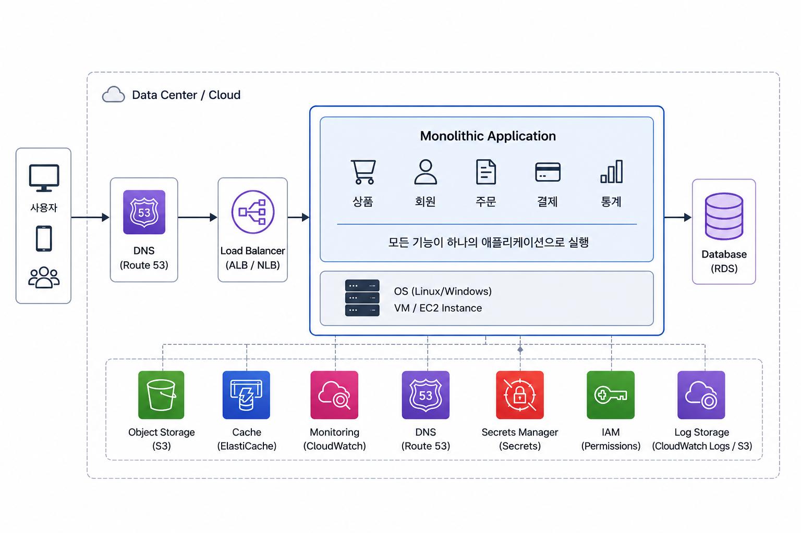

## 1. 인프라란 무엇일까?

인프라를 우리말로 하면 '**기반**'이라는 뜻으로 생활을 지탱하는 바탕이나 토대란 의미다. 인프라 구조 자체는 복잡하지만, 대부분 전문가에 의해 관리되기 때문에 사용자는 내부 구조를 이해하지 않고도 간단히 이용할 수 있다는 특징이 있다.

인터넷 검색 엔진을 생각해보자. 검색 키워드를 입력하고 검색 버튼을 누르면 많은 검색 결과를 얻을 수 있다. 이런 방대한 데이터를 어떻게 관리할까? 이것을 지탱하는 것이 IT 인프라다.

> [!note] 궁극의 아키텍처와 최적의 아키텍처는 존재하는 것일까?
>
> 그렇지 않다. 왜냐하면 아키텍처나 설계 요소에는 반드시 장점과 단점이 존재한다. 장점만 있다면 가장 좋은 것을 취하면 되지만, 단점은 가장 영향력이 적은 것으로 선택하는 것이 어렵기 때문에 반드시 선택해야 할 상황이 발생한다.
>
> 그 중 제약이 가장 많은 것이 시스템 도입 비용이다. 예를 들어, 100만 명이 사용하는 대규모 웹 서비스의 예산과 사내에서 10명이 사용하는 시스템의 예산은 차이가 크다. 하지만 이용자 입장에서는 규모와 상관없이 두 시스템 모두 중요할 수 있다. 시스템의 가장 중요한 장점은 살리고, 단점을 최소화하도록 설계하는 것이 중요하다.

## 2. 집약형과 분할형 아키텍처

집약형과 분할형 아키텍처의 핵심 차이는 **인프라 구성 요소를 한곳에 모아둘 것인지, 역할별로 나누어 배치할 것**인지에 있다.

**집약형은 여러 구성 요소를 하나의 서버나 제한된 인프라 환경에 모아 운영**한다. 예를 들어 하나의 서버 안에서 웹 서버, 애플리케이션 서버, 데이터베이스가 모두 실행되는 구조가 집약형에 가깝다.

반면 **분할형은 각 구성 요소를 역할별로 나누어 별도의 서버나 서비스로 운영**한다. 예를 들어 웹 서버는 별도 서버에 두고, 애플리케이션 서버는 여러 대로 확장하며, 데이터베이스는 전용 서버나 관리형 DB 서비스로 분리하는 방식이다.

간단히 정리하면 다음과 같다.

집약형 아키텍처
→ 여러 인프라 구성 요소를 하나의 서버 또는 제한된 환경에 모아 운영하는 방식

분할형 아키텍처
→ 인프라 구성 요소를 역할별로 나누어 별도의 서버, 서비스, 계층으로 운영하는 방식

집약형과 분할형은 어느 하나가 무조건 더 좋은 구조라기보다, 서비스 규모와 운영 목적에 따라 선택해야 하는 방식이다.

### 2.1 집약형 아키텍처



집약형 아키텍처는 웹 서버, 애플리케이션 서버, 데이터베이스, 파일 저장소와 같은 구성 요소를 하나의 서버나 제한된 인프라 환경에 모아 운영하는 방식이다.

가장 단순한 예시는 하나의 서버에서 모든 기능을 실행하는 구조이다.

```
사용자 
  ↓ 
하나의 서버 
├── Web Server 
├── Application Server 
├── Database 
└── File Storage
```

이 구조에서는 사용자의 요청을 처리하는 웹 서버, 실제 비즈니스 로직을 실행하는 애플리케이션, 데이터를 저장하는 데이터베이스가 모두 **하나의 서버 안에서 동작**한다.

장점 
- 구조가 단순하다. 
- 초기 구축이 쉽다. 
- 비용이 적게 든다. 
- 작은 서비스나 학습용 프로젝트에 적합하다. 

단점 
- 트래픽 증가에 대응하기 어렵다.
- 서버 장애 시 전체 서비스가 영향을 받는다.
- 구성 요소별 독립적인 확장이 어렵다.
- 운영 규모가 커질수록 관리가 어려워진다.

### 2.2 분할형 아키텍처

분할형 아키텍처는 **인프라 구성 요소를 역할에 따라 나누어 별도의 서버나 서비스로 운영**하는 방식이다.

집약형에서는 하나의 서버 안에 웹 서버, 애플리케이션, 데이터베이스가 함께 존재했다면, 분할형에서는 각각을 독립된 계층으로 분리한다.

```
사용자 
   ↓ 
Load Balancer 
   ↓ 
Web Server  
   ↓ 
Application Server 
   ↓ 
Database Server
```


장점 
- 구성 요소별 독립적인 확장이 가능하다.
- 장애 영향 범위를 줄일 수 있다. 
- 역할별로 운영과 모니터링을 분리할 수 있다.
- 트래픽 증가에 대응하기 좋다.
- 실서비스 운영 구조에 적합하다. 

단점 
- 초기 구성이 복잡하다. 
- 네트워크와 보안 설정이 늘어난다. 
- 운영 비용이 증가한다. 
- 배포와 모니터링 체계가 필요하다.

분할형 아키텍처는 트래픽이 증가하거나, 안정적인 운영이 필요하거나, 여러 구성 요소를 독립적으로 관리해야 하는 서비스에 적합하다.

## 3. 수직 분할형 아키텍처

분할형에서는 서버 분할 방식, 즉 **역할 분담**을 고려해야 한다. 각각의 서버가 전혀 다른 작업을 하는 것인지, 아니면 비슷한 작업을 하는 것인지에 대한 관점이다.

예를 들어 웹 화면을 보여주는 역할, 요청을 처리하는 역할, 데이터를 저장하는 역할을 하나의 서버에 모두 넣을 수도 있다. 하지만 서비스가 커지면 각 역할을 분리하는 것이 더 유리하다.

이러한 구조는 시스템을 이해하기 쉽게 만들고, 장애가 발생했을 때 원인을 추적하기 쉽게 해준다. 또한 트래픽이 증가했을 때 필요한 계층만 확장할 수 있다는 장점이 있다.

수직 분할형 아키텍처의 대표적인 형태로는 클라이언트-서버형 아키텍처와 3계층형 아키텍처가 있다.

### 3.1 클라이언트-서버형 아키텍처

클라이언트-서버형 아키텍처는 시스템을 크게 **클라이언트**와 **서버**로 나누는 구조이다. 클라이언트는 사용자가 직접 사용하는 영역이고, 서버는 클라이언트의 요청을 받아 처리하는 영역이다.

예를 들어 사용자가 브라우저에서 게시글 목록 페이지에 접속한다고 가정해보자.

브라우저는 서버에 게시글 목록을 요청한다. 서버는 요청을 처리한 뒤 게시글 데이터를 조회하고, 그 결과를 클라이언트에게 응답한다.

```
사용자 -> 브라우저 -> 서버 -> 브라우저에 응답
```
이 구조에서 클라이언트와 서버는 서로 다른 책임을 가진다.

클라이언트 (React)
- 사용자 화면을 제공한다.
- 사용자의 입력을 받는다.
- 서버에 요청을 보낸다.
- 서버의 응답을 화면에 표시한다.

서버 (Spring Boot)
- 클라이언트의 요청을 받는다.
- 비즈니스 로직을 처리한다.
- 필요한 데이터를 조회하거나 저장한다.
- 처리 결과를 클라이언트에게 응답한다.

클라이언트-서버형 아키텍처의 장점은 **구조가 단순**하다는 점이다. 클라이언트는 요청하고, 서버는 처리해서 응답한다. 이 흐름이 명확하기 때문에 웹 서비스의 기본 구조를 이해하기 좋다.

또한 **클라이언트와 서버의 역할을 분리**할 수 있다. 화면과 사용자 입력 처리는 클라이언트가 담당하고, 데이터 처리와 비즈니스 로직은 서버가 담당한다.

다만 전용 클라이언트 프로그램을 사용하는 구조에서는 기능이 변경될 때마다 클라이언트 소프트웨어를 함께 업데이트해야 할 수 있다. 클라이언트-서버형에서는 업무 애플리케이션 갱신 시마다 클라이언트 측 소프트웨어도 업데이트 해야 한다.

또한, 서버에 처리가 집중되면 **확장성에 한계**가 발생할 가능성이 있다. 이러한 단점을 개선하려고 한 것이 3계층이다.

### 3.2 3계층형 아키텍처


예를 들어 게시판 서비스를 3계층형 아키텍처로 구성하면 아래와 같다.

```
사용자
   ↓ 
브라우저 또는 React 
   ↓ 
Spring Boot 애플리케이션 서버 
   ↓ 
MySQL 또는 RDS
```

**클라이언트 계층은 사용자가 보는 화면을 담당**한다. 사용자는 브라우저나 모바일 앱을 통해 서비스를 이용한다. 클라이언트는 서버에 요청을 보내고, 서버의 응답을 화면에 표시한다.

**애플리케이션 계층은 실제 서비스 로직을 처리**한다. 예를 들어 게시글 작성, 게시글 수정, 댓글 등록, 로그인, 권한 확인 같은 기능이 이 계층에서 처리된다.

**데이터 계층은 데이터를 저장하고 조회**한다. 게시글, 회원, 댓글 같은 데이터는 데이터베이스에 저장된다. 애플리케이션 계층은 필요한 경우 데이터 계층에 접근해서 데이터를 가져오거나 저장한다.

이 구조의 가장 큰 장점은 각 **계층의 책임이 분리**된다는 점이다.

화면 처리, 비즈니스 로직, 데이터 저장이 분리되어 있기 때문에 특정 계층을 수정하더라도 다른 계층에 미치는 영향을 줄일 수 있다.

예를 들어 데이터베이스를 MySQL에서 PostgreSQL로 변경한다고 해서 클라이언트 화면 전체를 수정할 필요는 없다. 반대로 화면을 Thymeleaf에서 React로 변경하더라도 데이터베이스 구조가 반드시 바뀌는 것은 아니다.

또한 **계층별 확장이 가능**하다. 트래픽이 증가했을 때 애플리케이션 서버만 여러 대로 늘릴 수 있다.

```
사용자 
  ↓ 
Load Balancer 
  ↓ 
Application Server 1 
Application Server 2 
Application Server 3 
  ↓ 
Database Server
```

> [!note] [Load Balancer](https://aws.amazon.com/ko/what-is/load-balancing/)
> 로드 밸런싱(Load Balancing)은 **서버에 가해지는 네트워크 트래픽(부하)을 여러 대의 서버로 분산시켜 처리하는 기술**이다.
>
> 이를 통해 특정 서버에 과부하가 걸려 다운되는 것을 막고, 안정적인 서비스 제공과 빠른 응답 속도를 유지한다.

장점 
- 화면, 비즈니스 로직, 데이터 저장 역할이 분리된다. 
- 계층별로 독립적인 확장이 가능하다. 
- 유지보수와 장애 원인 파악이 쉬워진다. 
- 실무 웹 서비스 구조에 많이 사용된다. 
  
단점 
- 초기 구성이 집약형보다 복잡하다. 
- 계층 간 네트워크 설정이 필요하다. 
- 서버, DB, 보안 설정을 각각 관리해야 한다. 
- 모니터링과 장애 대응 체계가 필요하다.

결국 3계층형 아키텍처는 클라이언트-서버형 아키텍처를 더 세분화한 구조라고 볼 수 있다.

클라이언트와 서버만 나누는 것이 아니라, 서버 내부의 역할까지 애플리케이션 계층과 데이터 계층으로 분리한다. 이를 통해 시스템은 더 복잡해지지만, 확장성과 운영 안정성은 높아진다.

## 4. 수평 분할형 아키텍처

수평 분할형 아키텍처는 **같은 역할을 하는 서버나 시스템 구성 요소를 여러 개로 나누어 배치하는 구조**이다.

수직 분할형 아키텍처가 역할에 따라 계층을 나누는 방식이라면, 수평 분할형 아키텍처는 **같은 계층 안에서 서버의 개수를 늘려 처리량을 높이는 방식**이다.

예를 들어 하나의 애플리케이션 서버가 모든 요청을 처리하고 있다면, 트래픽이 증가했을 때 같은 역할을 하는 애플리케이션 서버를 여러 대로 늘릴 수 있다.

즉, 수평 분할형 아키텍처의 핵심은 역할을 나누는 것이 아니라 **같은 역할의 처리 주체를 여러 개로 늘리는 것**이다.

수평 분할형 아키텍처는 보통 트래픽 증가에 대응하기 위해 사용된다. 서버 한 대가 처리할 수 있는 요청에는 한계가 있기 때문에, 여러 서버가 요청을 나누어 처리하도록 구성하면 전체 처리량을 높일 수 있다.

이러한 방식은 흔히 **Scale Out**이라고도 한다.

수평 분할형 아키텍처는 다시 여러 형태로 나눌 수 있다. 대표적으로 단순 수평 분할형 아키텍처와 공유형 아키텍처가 있다.

> [!note] 스케일 업(Scale-Up)과 스케일 아웃(Scale-Out)
> 
> 스케일 업(Scale-Up): **기존 서버의 사양을 업그레이드**해 시스템을 확장하는 것을 말한다. CPU나 RAM 등을 추가하거나 고성능의 부품, 서버로 교환하는 방법이다. 즉, 서버 한 대의 성능을 높이는 방식이다.
>
> 스케일 아웃(Scale-Out): **서버를 여러 대 추가**하여 시스템을 확장하는 것을 말한다. 서버가 여러 대로 나뉘기 때문에 각 서버에 걸리는 부하를 균등하게 해주는 '로드밸런싱'이 필수적으로 동반되어야 한다. 즉, 서버 여러 대로 요청을 나누는 방식이다.

### 4.1 단순 수평 분할형 아키텍처

단순 수평 분할형 아키텍처는 같은 역할을 하는 서버를 여러 대로 늘려 요청을 분산하는 가장 기본적인 구조이다.

이 구조에서 사용자는 하나의 서비스에 접속하지만, 내부적으로 여러 서버가 요청을 나누어 처리한다. 사용자는 자신이 어떤 서버에 연결되었는지 알 필요가 없다.

단순 수평 분할형 아키텍처에서 각 서버는 같은 기능을 제공한다. 예를 들어 세 대의 웹 서버가 있다면, 세 서버 모두 같은 웹 애플리케이션을 실행한다.

장점
- 수평으로 서버를 늘리기 때문에 확장성이 향상된다.
- 분할한 시스템이 독립적으로 운영되므로 서로 영향을 주지 않는다.

단점
- 데이터를 일원화해서 볼 수 없다.
- 애플리케이션 업데이트는 양쪽을 동시에 해 주어야 한다.
- 처리량이 급등하게 분할돼 있지 않으면 서버별 처리량에 치우침이 생긴다.

### 4.2 공유형 아키텍처

공유형 아키텍처는 여러 서버가 공통된 자원을 함께 사용하는 구조이다.

단순 수평 분할형 아키텍처에서는 같은 역할의 서버를 여러 대로 늘릴 수 있지만, **각 서버가 독립적으로 데이터를 가지면 일관성 문제가 발생**할 수 있다. 공유형 아키텍처는 이 문제를 해결하기 위해 **여러 서버가 데이터베이스, 파일 저장소, 세션 저장소 같은 공통 자원을 함께 사용하도록 구성**한다.

```
사용자 
  ↓ 
Load Balancer 
  ↓ 
Application Server 1 
Application Server 2 
Application Server 3 
  ↓ 
Shared Database

Application Server 1 → Shared Database 접근 
Application Server 2 → Shared Database 접근 
Application Server 3 → Shared Database 접근
```

이 구조에서는 여러 애플리케이션 서버가 같은 데이터베이스를 바라본다. 어떤 애플리케이션 서버가 요청을 처리하더라도 동일한 데이터를 조회하거나 저장할 수 있다.

애플리케이션 서버를 여러 대로 나누었더라도 공통으로 사용하는 데이터베이스나 저장소가 장애를 일으키면 전체 서비스가 영향을 받을 수 있다. 이를 해결하기 위해서는 **공유 자원 자체도 안정적으로 구성**해야 한다. 해결 방안에는 데이터베이스 이중화, 읽기 전용 복제본 구성, 백업 및 복구 전략 마련, 공유 스토리지 고가용성 구성, 캐시 계층 추가 등이 있다.

장점 
- 여러 서버가 동일한 데이터를 사용할 수 있다. 
- 데이터 일관성을 유지하기 쉽다. 
- 애플리케이션 서버를 추가하거나 교체하기 쉽다. 
- 서버 로컬 상태에 덜 의존하는 구조를 만들 수 있다. 
  
단점 
- 공유 자원에 부하가 집중될 수 있다. 
- 공유 자원이 장애 지점이 될 수 있다. 
- 데이터베이스, 스토리지, 세션 저장소의 안정성이 중요해진다. 
- 공통 자원에 대한 확장 전략이 필요하다.

공유형 아키텍처의 핵심은 여러 서버가 각각 데이터를 따로 가지는 것이 아니라, 공통된 저장소나 자원을 함께 사용하도록 구성하는 것이다.

이를 통해 서버를 여러 대로 늘리더라도 데이터 일관성을 유지할 수 있고, 특정 서버에 의존하지 않는 구조를 만들 수 있다.

## 참고 자료

- [그림으로 공부하는 IT 인프라 구조](https://product.kyobobook.co.kr/detail/S000001942495)
- https://www.ibm.com/kr-ko/think/topics/scale-up-vs-scale-out
- https://dev-coco.tistory.com/143
- https://aws.amazon.com/ko/what-is/load-balancing/
