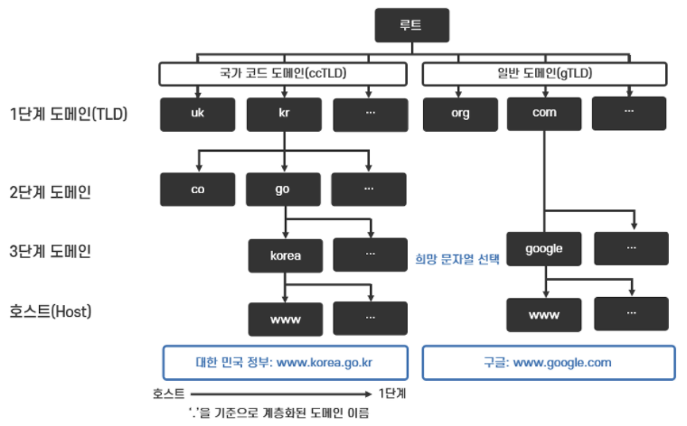
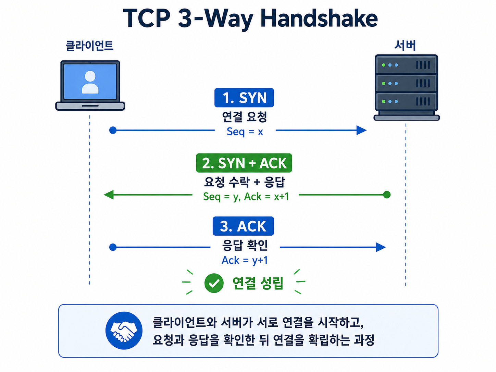
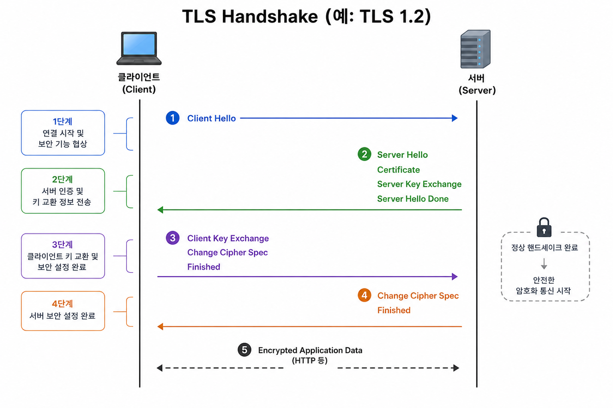
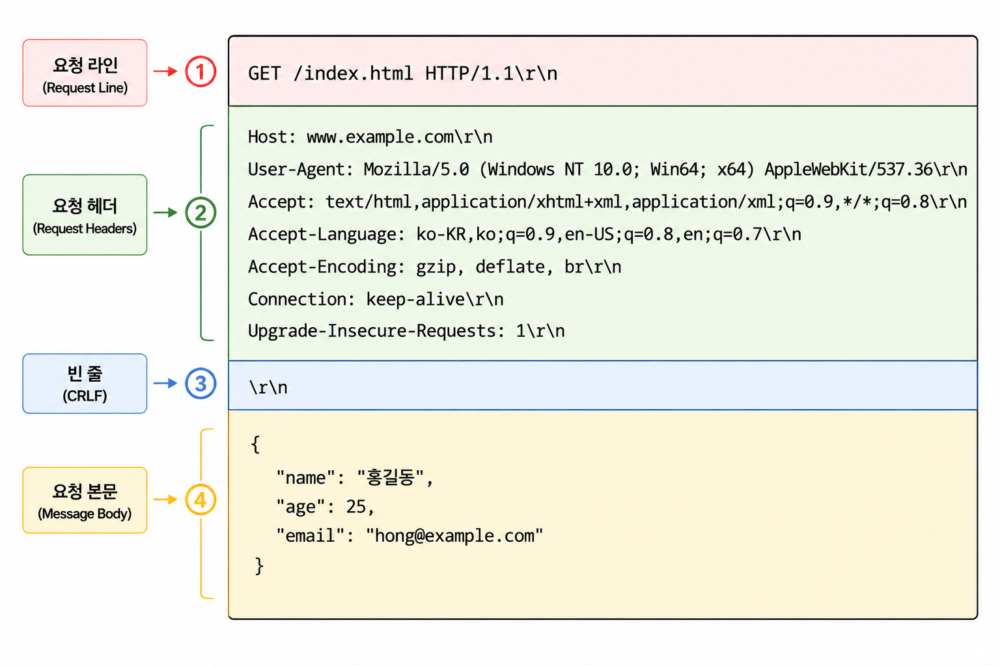
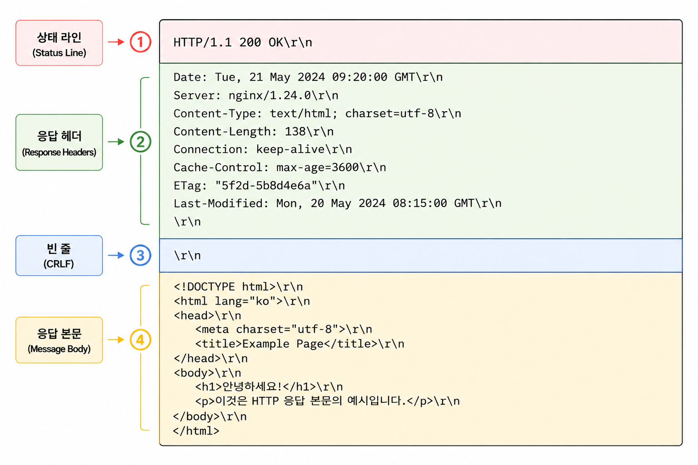
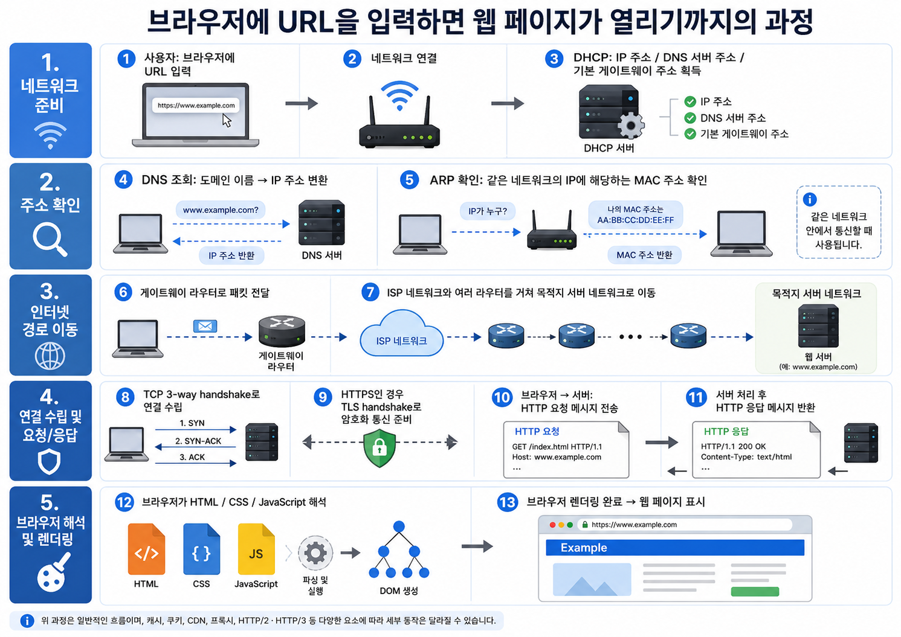

## 들어가기 전

브라우저에 `www.google.com`을 입력하면 단순히 구글 서버에 바로 접속하는 것처럼 보이지만, 실제로는 여러 네트워크 과정이 순서대로 일어난다.

1. 먼저 기기가 네트워크에 연결된다.
2. IP 주소를 할당받은 뒤, 도메인 이름을 IP 주소로 변환한다.
3. 목적지 서버까지 패킷이 이동하고, 서버와 연결을 맺은 뒤 HTTP 요청과 응답을 주고받는다.
4. 브라우저가 응답받은 HTML, CSS, JavaScript를 해석해 화면에 웹 페이지를 보여준다.

즉, `Wi-Fi 연결 → DHCP → ARP → DNS → 라우팅 → TCP 연결 → TLS 연결 → HTTP 요청/응답 → 브라우저 렌더링` 순서로 볼 수 있다.

## 1. Wi-Fi에 연결한다

인터넷을 사용하려면 먼저 기기가 네트워크에 연결되어야 한다. 노트북이나 스마트폰은 주변의 Wi-Fi 신호를 탐색하고, 사용자가 선택한 네트워크에 연결을 시도한다. 이때 중심이 되는 장비가 **AP**다. AP는 Access Point의 약자로, **무선 기기가 네트워크에 접속할 수 있도록 중계해주는 장치**다.

- AP는 자신의 네트워크 이름인 SSID(서비스 세트 식별자, Service Set Identifier)를 주변에 알린다.
- 사용자가 Wi-Fi 목록에서 특정 SSID를 선택하면, 기기는 해당 AP에 연결 요청을 보낸다.
- 연결이 완료되면 기기는 무선 네트워크에 접속한 상태가 된다.

다만 이 시점에서는 아직 인터넷 통신을 위한 모든 준비가 끝난 것은 아니다. 네트워크에 연결되었을 뿐, 기기가 사용할 IP 주소는 아직 정해지지 않았을 수 있다.

```shell
$ netsh wlan show interfaces

There is 1 interface on the system:

    Name                   : Wi-Fi
    Description            : Intel(R) Dual Band Wireless-AC 8265
    GUID                   : c00a3f21-e20d-4a64-9bf5-a9e1af2f5bf1
    Physical address       : 0c:d2:92:f6:bc:79
    Interface type         : Primary
    State                  : connected
    SSID                   : ojeong01_5G
    AP BSSID               : 70:5d:cc:34:a6:c0
    Band                   : 5 GHz
    Channel                : 149
    Connected Akm-cipher   : [ akm = 00-0f-ac:02, cipher =  00-0f-ac:04 ]
    Network type           : Infrastructure
    Radio type             : 802.11ac
    Authentication         : WPA2-Personal
    Cipher                 : CCMP
    Connection mode        : Auto Connect
    Receive rate (Mbps)    : 117
    Transmit rate (Mbps)   : 117
    Signal                 : 51%
    Rssi                   : -63
    Profile                : ojeong01_5G
    QoS MSCS Configured         : 0
    QoS Map Configured          : 0
    QoS Map Allowed by Policy   : 0
```

> [!note]
> AP가 주기적으로 비콘 프레임을 보내고, 단말이 이를 수신해 AP를 찾는 방식을 **패시브 스캐닝**(Passive scanning)이라고 한다. 반대로 단말이 직접 탐색 요청을 보내 AP를 찾는 방식은 **액티브 스캐닝**(Active scanning)이라고 한다.

## 2. DHCP로 IP 주소를 할당받는다

네트워크에서 데이터를 주고받으려면 각 기기는 **IP 주소**를 가져야 한다. IP 주소는 네트워크에서 장치를 식별하기 위한 논리적인 주소다. 하지만 기기가 처음 네트워크에 접속했을 때는 자신의 IP 주소를 알지 못한다. 이때 **IP 주소를 자동으로 할당해주는 프로토콜이 DHCP**다.

DHCP는 Dynamic Host Configuration Protocol의 약자다. 기기가 네트워크에 접속하면 DHCP 서버에게 IP 주소를 요청하고, DHCP 서버는 사용 가능한 **IP 주소와 함께 DNS 서버 주소, 기본 게이트웨이 주소, 서브넷 마스크 같은 정보를 제공**한다.


DHCP 과정은 `DISCOVER → OFFER → REQUEST → ACK` 순서로 진행된다.
- **1단계: DHCP DISCOVER**
  - 클라이언트가 DHCP 서버를 찾기 위해 네트워크 전체에 요청을 보낸다.
  - 아직 IP 주소가 없기 때문에 출발지 IP는 `0.0.0.0`을 사용한다.
  - 목적지 IP는 브로드캐스트 주소인 `255.255.255.255`를 사용한다.
  - 즉, **"내가 사용할 IP 주소를 줄 DHCP 서버가 있나요?"** 라고 묻는 단계다.
- **2단계: DHCP OFFER**
  - DHCP 서버가 클라이언트의 요청을 받는다.
  - 서버는 자신이 관리하는 IP 주소 목록 중 사용할 수 있는 IP 주소를 하나 제안한다.
  - 이때 주소와 함께 DNS 서버 주소, 기본 게이트웨이 주소, 서브넷 마스크 같은 정보가 함께 전달될 수 있다.
  - 즉, **"이 IP 주소를 사용해도 됩니다."** 라고 제안하는 단계다.
- **3단계: DHCP REQUEST**
  - 클라이언트는 DHCP 서버가 제안한 IP 주소를 사용하겠다고 요청한다.
  - 여러 DHCP 서버가 응답했을 수도 있기 때문에, 클라이언트는 선택한 서버에게 해당 IP 주소를 사용하겠다고 알린다.
  - 즉, **"제안받은 이 IP 주소를 사용하겠습니다."** 라고 요청하는 단계다.
- **4단계: DHCP ACK**
  - DHCP 서버가 클라이언트의 요청을 최종 승인한다.
  - 승인 이후 클라이언트는 할당받은 IP 주소를 실제로 사용할 수 있게 된다.
  - 이때부터 클라이언트는 네트워크에서 자신의 IP 주소를 가지고 통신할 수 있다.
  - 즉, **"승인합니다. 이제 이 IP 주소를 사용하세요."** 라고 확정하는 단계다.

이 과정을 마치면 기기는 자신의 IP 주소뿐만 아니라 DNS 서버 주소와 기본 게이트웨이 주소도 알게 된다. 이제 기기는 네트워크에서 자신을 식별할 수 있고, 외부 서버와 통신할 준비를 갖추게 된다.

```shell
$ ipconfig /all

Wireless LAN adapter Wi-Fi:

   Connection-specific DNS Suffix  . :
   Description . . . . . . . . . . . : Intel(R) Dual Band Wireless-AC 8265
   Physical Address. . . . . . . . . : 0C-D2-92-F6-BC-79
   DHCP Enabled. . . . . . . . . . . : Yes
   Autoconfiguration Enabled . . . . : Yes
   Link-local IPv6 Address . . . . . : fe80::d442:5e41:a42e:bd4b%13(Preferred)
   IPv4 Address. . . . . . . . . . . : 192.168.0.25(Preferred)
   Subnet Mask . . . . . . . . . . . : 255.255.255.0
   Lease Obtained. . . . . . . . . . : 2026▒▒ 6▒▒ 8▒▒ ▒▒▒▒▒▒ ▒▒▒▒ 2:00:29
   Lease Expires . . . . . . . . . . : 2026▒▒ 6▒▒ 8▒▒ ▒▒▒▒▒▒ ▒▒▒▒ 4:00:28
   Default Gateway . . . . . . . . . : 192.168.0.1
   DHCP Server . . . . . . . . . . . : 192.168.0.1
   DHCPv6 IAID . . . . . . . . . . . : 118280850
   DHCPv6 Client DUID. . . . . . . . : 00-01-00-01-21-BA-78-86-0C-D2-92-F6-BC-79
   DNS Servers . . . . . . . . . . . : 168.126.63.1
                                       168.126.63.2
   NetBIOS over Tcpip. . . . . . . . : Enabled
```

## 3. DNS 조회가 필요한 이유를 이해한다

사용자가 브라우저에 `www.google.com`을 입력하면 브라우저는 이 주소만으로 바로 서버에 접속할 수 없다. 사람은 도메인 이름을 이해하기 쉽지만, 컴퓨터가 실제 통신에 사용하는 것은 **IP 주소**다. 따라서 브라우저는 먼저 `www.google.com`에 해당하는 IP 주소를 알아내야 한다.

이 역할을 하는 시스템이 **DNS**다. DNS는 Domain Name System의 약자로, **도메인 이름을 IP 주소로 변환**해주는 시스템이다. 예를 들어 사용자가 `www.google.com`을 입력하면 DNS 조회를 통해 해당 도메인에 연결된 IP 주소를 찾는다.

즉, DNS는 사람이 기억하기 쉬운 이름과 컴퓨터가 통신에 사용하는 주소를 연결해주는 역할을 한다. 브라우저는 DNS를 통해 서버의 IP 주소를 얻은 뒤, 그 IP 주소를 향해 요청을 보낼 수 있다.

```shell
$ nslookup www.google.com

Non-authoritative answer:
Server:  kns.kornet.net
Address:  168.126.63.1

Name:    www.google.com
Addresses:  2001:4860:482d:7700::
          2001:4860:482b:7700::
          2001:4860:4829:7700::
          2001:4860:482c:7700::
          2001:4860:4826:7700::
          2001:4860:4828:7700::
          2001:4860:482a:7700::
          2001:4860:4827:7700::
          142.251.157.119
          142.251.150.119
          142.251.151.119
          142.251.152.119
          142.251.153.119
          142.251.154.119
          142.251.155.119
          142.251.156.119
```

- DNS 서버 이름: `kns.kornet.net`
- DNS 서버 IP 주소: `168.126.63.1`
- `nslookup`은 도메인 이름이 어떤 IP 주소로 변환되는지 확인하는 명령어다.

## 4. ARP로 MAC 주소를 찾는다

DNS 서버에 요청을 보내려면 DNS 서버의 IP 주소만 알면 될 것 같지만, 같은 로컬 네트워크 안에서 실제 프레임을 전달하려면 MAC 주소도 필요하다.

- IP 주소는 네트워크 계층에서 목적지를 찾기 위한 논리적인 주소다.
- MAC 주소는 같은 네트워크 안에서 장비를 식별하기 위한 물리적인 주소다.

기기는 DHCP 과정에서 DNS 서버의 IP 주소를 받았지만, 해당 DNS 서버의 MAC 주소는 모를 수 있다. 이때 사용하는 프로토콜이 ARP다. **ARP**는 Address Resolution Protocol의 약자로, **같은 네트워크 안에서 특정 IP 주소를 가진 장치의 MAC 주소를 알아내는 역할**을 한다.

다만 DNS 서버가 항상 같은 로컬 네트워크 안에 있는 것은 아니다. DNS 서버가 외부 네트워크에 있다면 클라이언트는 DNS 서버의 MAC 주소가 아니라 **기본 게이트웨이의 MAC 주소**를 알아낸다. 결국 ARP의 핵심은 “최종 목적지의 MAC 주소”를 찾는 것이 아니라, **현재 로컬 네트워크에서 다음 홉으로 프레임을 보낼 대상의 MAC 주소를 찾는 것**이다.

```shell
$ arp -a

Interface: 192.168.0.25 --- 0xd
  Internet Address      Physical Address      Type
  192.168.0.255         ff-ff-ff-ff-ff-ff     static
  224.0.0.22            01-00-5e-00-00-16     static
  224.0.0.251           01-00-5e-00-00-fb     static
  224.0.0.252           01-00-5e-00-00-fc     static
  239.255.255.250       01-00-5e-7f-ff-fa     static
  255.255.255.255       ff-ff-ff-ff-ff-ff     static

Interface: 172.31.128.1 --- 0x2e
  Internet Address      Physical Address      Type
  172.31.139.177        00-15-5d-2b-6f-5d     dynamic
  172.31.143.255        ff-ff-ff-ff-ff-ff     static
  224.0.0.2             01-00-5e-00-00-02     static
  224.0.0.22            01-00-5e-00-00-16     static
  224.0.0.251           01-00-5e-00-00-fb     static
  224.0.0.252           01-00-5e-00-00-fc     static
  239.255.255.250       01-00-5e-7f-ff-fa     static
```


> [!note] ARP 동작 과정
> 1. **목적지 IP 확인**: 클라이언트는 데이터를 보낼 목적지 IP 주소를 확인한다.
> 2. **ARP 요청 전송**: 클라이언트는 네트워크 전체에 ARP 요청을 브로드캐스트로 보낸다.
> 3. **네트워크 장치들이 요청 확인**: 같은 네트워크에 있는 모든 장치가 ARP 요청을 받는다.
> 4. **해당 장치가 ARP 응답 전송**: 요청한 IP 주소를 가진 장치가 자신의 MAC 주소를 응답한다.
> 5. **ARP 캐시에 저장**: 클라이언트는 응답받은 IP 주소와 MAC 주소의 매핑 정보를 ARP 캐시에 저장한다.

## 5. DNS로 목적지 서버의 IP 주소를 찾는다

이제 클라이언트는 DNS 서버에 `www.google.com`의 IP 주소를 물어볼 수 있다. 로컬 DNS 서버가 이미 해당 도메인의 IP 주소를 알고 있다면 바로 응답한다. 하지만 모르는 경우에는 **다른 DNS 서버들에게 계층적으로 질의해 최종 IP 주소를 찾는다.**



DNS는 계층 구조로 되어 있다.

- 루트 DNS 서버는 `.com`, `.net`, `.kr` 같은 최상위 도메인을 담당하는 TLD 서버의 위치를 알려준다.
- TLD DNS 서버는 `google.com`을 담당하는 권한 DNS 서버의 위치를 알려준다.
- 권한 DNS 서버는 `www.google.com`에 해당하는 실제 IP 주소를 응답한다.

이 과정을 통해 클라이언트는 도메인 이름에 해당하는 서버의 IP 주소를 알게 된다. 이제 브라우저는 `www.google.com`이라는 이름이 아니라, 실제 IP 주소를 목적지로 삼아 서버와 통신할 수 있다.

## 6. 패킷이 목적지 서버까지 이동한다

목적지 서버의 IP 주소를 알게 되면 클라이언트는 해당 서버로 **패킷**을 보낸다. 하지만 **목적지 서버가 같은 네트워크 안에 있는 경우는 드물다.** 대부분의 웹 서버는 외부 인터넷 어딘가에 있기 때문에 패킷은 여러 네트워크 장비를 거쳐 이동해야 한다.

- 패킷은 먼저 사용자의 기기에서 출발한다.
- 사용자의 기기는 Wi-Fi를 통해 패킷을 AP로 전달한다.
- 스위치와 게이트웨이 라우터를 거쳐 외부 네트워크(인터넷 방향)로 전달한다.
- 이후 패킷은 ISP 네트워크를 지난다.
- ISP 내부와 인터넷 구간의 여러 라우터를 지나면서 목적지 방향으로 이동한다.
- 마지막으로 패킷은 목적지 서버가 속한 네트워크에 도달한다.

여기서 **라우터**는 중요한 역할을 한다. 사용자 기기에서 보낸 **패킷에는 목적지 IP 주소**가 들어 있다. 라우터는 패킷을 받으면 이 목적지 IP 주소를 확인한다. 그리고 자신의 포워딩 테이블을 참고해 다음으로 어느 방향으로 패킷을 보내야 하는지 결정한다.

패킷은 출발지에서 목적지 서버까지 여러 라우터를 거치면서 이동한다.

```text
내 컴퓨터
→ 공유기/게이트웨이 라우터
→ ISP 라우터
→ 인터넷 백본 라우터
→ 목적지 서버 측 라우터
→ 목적지 서버
```

```shell
$ tracert www.google.com

Tracing route to www.google.com [2001:4860:4827:7700::]
over a maximum of 30 hops:

  1     2 ms     6 ms     4 ms  2001:e60:881e:c5a7:9d87:1a71:6a82:5112
  2     *        *        *     Request timed out.
  3    45 ms    22 ms    31 ms  2001:e60:e150:6001:0:1:1006:e
  4    34 ms    27 ms    30 ms  2001:e60:e150:5001:172:25:126:8a
  5    36 ms    23 ms    27 ms  2001:e60:e150:5001:10:59:32:cd
  6     *        *        *     Request timed out.
  7    58 ms    19 ms    31 ms  2001:e60:e150:5003:10:59:35:41
  8    57 ms    22 ms    19 ms  2001:e60:e150:5011:10:59:41:c
  9    35 ms    20 ms    38 ms  2001:e60:e150:5011:10:59:41:8a
 10    56 ms    32 ms    24 ms  2001:e60:e150:5012:10:59:42:c1
 11    23 ms    43 ms    22 ms  2001:e60:e150:5012:10:59:42:8a
 12     *       25 ms    25 ms  2001:e60:e150:5012:172:25:124:1
 13    60 ms    22 ms    24 ms  2001:e60:e0ff:0:110:69:17:9
 14   109 ms    27 ms    30 ms  2001:e60:e0ff:0:110:69:19:ee
 15    54 ms    22 ms    30 ms  2400:36::350:28
 16    25 ms    29 ms    40 ms  2400::100:112:174:45:d9
 17    39 ms    39 ms    28 ms  2400::100:112:174:84:a1
 18    75 ms    59 ms    54 ms  2001:4860:1:1::1726
 19    78 ms    53 ms    54 ms  2001:4860:4827:7700::

Trace complete.
```

위 결과는 내 컴퓨터에서 Google 서버까지 패킷이 지나간 경로를 보여준다. 각 줄은 패킷이 거쳐 간 라우터 또는 네트워크 장비를 의미하며, 여기서는 총 19개의 홉을 거쳐 목적지에 도달했다. 중간에 `Request timed out`이 보이는 것은 해당 장비가 ICMP 응답을 차단했거나 응답하지 않았기 때문일 수 있다.


> [!note] 포워딩 테이블(Forwarding Table)
> **라우팅 테이블을 참조하여 만들어지는 테이블**이다. 여러 경로 중 **비용이 작은 경로**를 선택하는 라우팅 알고리즘을 통해 결정된 경로를 저장해 둔 것이 포워딩 테이블이다.

> [!note] 패킷
> - 패킷은 더 큰 메시지를 작은 단위로 나눈 데이터 조각이다. 
> - 각 패킷에는 실제 데이터와 함께 출발지, 목적지 등 전송에 필요한 정보가 포함되어 있다.
> - 패킷은 라우터, 스위치 등 다양한 네트워크 장비를 거쳐 목적지로 전달된다.

## 7. TCP 3-way handshake로 연결을 맺는다

목적지 서버의 IP 주소를 알고 패킷을 보낼 수 있게 되었다고 해서 바로 HTTP 요청을 보내는 것은 아니다. HTTP는 일반적으로 TCP 위에서 동작하기 때문에, 먼저 클라이언트와 서버 사이에 TCP 연결을 만들어야 한다.



TCP 연결은 3-way handshake를 통해 만들어진다. 

1. 클라이언트가 서버에게 연결을 시작하자는 의미로 `SYN` 메시지를 보낸다.
2. 서버는 이를 받고 연결 요청을 확인했다는 `ACK`와, 자신도 연결을 시작하겠다는 `SYN`을 함께 보낸다.
3. 클라이언트가 서버의 응답을 확인했다는 `ACK`를 보내면 TCP 연결이 성립된다.

TCP는 데이터를 안정적으로 주고받기 위한 **연결 기반 프로토콜**이다. 데이터가 **순서대로 도착하도록 보장**하고, 손실된 데이터가 있으면 **재전송**할 수 있다. 따라서 HTTP 요청과 응답은 TCP 연결 위에서 신뢰성 있게 전달된다.

```shell
$ curl -vI https://www.google.com
  % Total    % Received % Xferd  Average Speed   Time    Time     Time  Current
                                 Dload  Upload   Total   Spent    Left  Speed
  0     0    0     0    0     0      0      0 --:--:-- --:--:-- --:--:--     0* Host www.google.com:443 was resolved.
* IPv6: 2001:4860:4828:7700::, 2001:4860:482c:7700::, 2001:4860:482a:7700::, 2001:4860:4826:7700::, 2001:4860:4827:7700::, 2001:4860:482d:7700::, 2001:4860:4829:7700::, 2001:4860:482b:7700::
* IPv4: 142.251.151.119, 142.251.154.119, 142.251.153.119, 142.251.156.119, 142.251.155.119, 142.251.152.119, 142.251.157.119, 142.251.150.119
*   Trying [2001:4860:4828:7700::]:443...
* Connected to www.google.com (2001:4860:4828:7700::) port 443
```

`Connected to www.google.com (2001:4860:4828:7700::) port 443`에서 `443`은 HTTPS 기본 포트 번호다.

## 8. TLS handshake로 HTTPS 통신을 준비한다

요즘 대부분의 웹사이트는 HTTP가 아니라 HTTPS를 사용한다. **HTTPS는 HTTP 메시지를 TLS로 암호화해서 전송하는 방식**이다. 즉, 사용자가 보내는 요청과 서버가 보내는 응답이 네트워크 중간에서 그대로 노출되지 않도록 보호한다.



TCP 연결이 만들어진 뒤에는 TLS handshake가 진행된다. 이 과정에서 클라이언트와 서버는 사용할 TLS 버전과 암호화 방식을 협상하고, 서버 인증서를 검증하며, 이후 통신에 사용할 세션 키를 만든다.

1. 클라이언트는 자신이 지원하는 TLS 버전과 암호화 방식을 서버에 보낸다.
2. 서버는 사용할 방식을 선택하고, 자신의 인증서를 클라이언트에게 전달한다.
3. 클라이언트는 인증서의 도메인, 유효 기간, 신뢰할 수 있는 인증기관 여부를 확인한다.
4. 이후 통신에 사용할 세션 키를 만들고, 이 키를 이용해 HTTP 메시지를 암호화해서 주고받는다.

```shell
$ openssl s_client -connect www.google.com:443 -servername www.google.com

Connecting to 2001:4860:4828:7700::
CONNECTED(...)

depth=2 C=US, O=Google Trust Services LLC, CN=GTS Root R1
verify return:1

depth=1 C=US, O=Google Trust Services, CN=WR2
verify return:1

depth=0 CN=www.google.com
verify return:1

---
Certificate chain

0 s:CN=www.google.com
  i:C=US, O=Google Trust Services, CN=WR2
  a:PKEY: id-ecPublicKey, 256 (bit); sigalg: RSA-SHA256
  v:NotBefore: May 18 18:38:10 2026 GMT
    NotAfter : Aug 10 18:38:09 2026 GMT

1 s:C=US, O=Google Trust Services, CN=WR2
  i:C=US, O=Google Trust Services LLC, CN=GTS Root R1
  a:PKEY: rsaEncryption, 2048 (bit); sigalg: RSA-SHA256
  v:NotBefore: Dec 13 09:00:00 2023 GMT
    NotAfter : Feb 20 14:00:00 2029 GMT

2 s:C=US, O=Google Trust Services LLC, CN=GTS Root R1
  i:C=BE, O=GlobalSign nv-sa, OU=Root CA, CN=GlobalSign Root CA
  a:PKEY: rsaEncryption, 4096 (bit); sigalg: RSA-SHA256
  v:NotBefore: Jun 19 00:00:42 2020 GMT
    NotAfter : Jan 28 00:00:42 2028 GMT

---
Server certificate

-----BEGIN CERTIFICATE-----
MIIEVTCCAz2gAwIBAgIRANzivO1ktGCREBHdGaucnfQwDQYJKoZIhvcNAQELBQAw
...
pRZN0cL5S2eQ
-----END CERTIFICATE-----

subject=CN=www.google.com
issuer=C=US, O=Google Trust Services, CN=WR2

---
No client certificate CA names sent

Peer signing digest: SHA256
Peer signature type: ECDSA
Server Temp Key: X25519, 253 bits

---
SSL handshake has read 4106 bytes and written 409 bytes

Verification: OK

---
New, TLSv1.3, Cipher is TLS_AES_256_GCM_SHA384

Server public key is 256 bit
This TLS version forbids renegotiation.

Compression: NONE
Expansion: NONE
No ALPN negotiated
Early data was not sent

Verify return code: 0 (ok)

---
```

`New, TLSv1.3, Cipher is TLS_AES_256_GCM_SHA384` 
- 실제 연결은 `TLSv1.3`으로 맺어졌다.
- 사용된 암호화 방식은 `TLS_AES_256_GCM_SHA384`다.
- 즉, Google 서버와 TLS 1.3 기반의 암호화 연결이 성공했다.


> [!note] [전송 계층 보안(TLS)](https://developer.mozilla.org/ko/docs/Glossary/TLS)
> TLS는 애플리케이션이 네트워크상에서 안전하게 통신하기 위해 사용하는 [프로토콜](https://developer.mozilla.org/ko/docs/Glossary/Protocol)이며, 웹 브라우징, 이메일, 메시징 등의 통신을 보호한다.
> 
> TLS는 암호화 프로토콜을 사용해 클라이언트와 서버 사이의 통신을 보호하고, 데이터의 기밀성과 무결성을 보장한다.

## 9. HTTP 요청을 전송한다

TCP 연결과 TLS 연결이 준비되면 브라우저는 실제 HTTP 요청을 보낸다. 예를 들어 `www.google.com`에 접속했다면 브라우저는 서버의 루트 경로 `/`에 해당하는 리소스를 요청한다.




HTTP 요청에는 **요청 메서드, 요청 경로, HTTP 버전, 헤더 정보** 등이 포함된다. `Host` 헤더에는 요청 대상 도메인이 들어가고, `User-Agent`에는 브라우저 정보가 들어갈 수 있다.

**HTTPS 환경에서는 이 HTTP 메시지가 그대로 네트워크에 전달되지 않는다.** HTTP 메시지는 TLS로 암호화되고, [TCP 세그먼트](https://ko.wikipedia.org/wiki/%EC%A0%84%EC%86%A1_%EC%A0%9C%EC%96%B4_%ED%94%84%EB%A1%9C%ED%86%A0%EC%BD%9C)와 IP 데이터그램, 링크 계층 프레임에 담겨 서버까지 전달된다.


## 10. 서버가 HTTP 응답을 생성한다

서버는 클라이언트의 HTTP 요청을 받으면 요청 내용을 해석한다. 요청 경로와 메서드를 확인하고, 클라이언트가 어떤 리소스를 원하는지 판단한다. 이후 요청에 맞는 데이터를 준비하고 HTTP 응답 메시지를 만든다.



HTTP 응답에는 **상태 코드, 응답 헤더, 응답 본문**이 포함된다. 상태 코드는 요청 처리 결과를 나타낸다.

## 11. 브라우저가 응답을 받아 렌더링한다

서버가 보낸 HTTP 응답은 여러 네트워크 장비를 거쳐 다시 클라이언트에게 도착한다. 브라우저는 응답을 읽고, 본문에 들어 있는 HTML, CSS, JavaScript 등을 해석한다.

먼저 브라우저는 HTML을 파싱해 DOM을 만든다. DOM은 HTML 문서 구조를 트리 형태로 표현한 객체 모델이다. 이어서 CSS를 파싱해 CSSOM을 만들고, DOM과 CSSOM을 결합해 실제 화면에 그릴 Render Tree를 구성한다.

그다음 브라우저는 각 요소의 크기와 위치를 계산하는 Layout 단계를 거치고, 텍스트, 색상, 이미지, 테두리 등을 픽셀로 그리는 Paint 단계를 수행한다. 이 과정을 거쳐 사용자는 최종적으로 웹 페이지를 화면에서 보게 된다.

## 정리



1. 브라우저에 URL을 입력하면 웹 페이지 접속 과정이 시작된다.
2. 먼저 사용자의 기기가 네트워크에 연결된다.
3. 기기는 **DHCP**를 통해 자신의 IP 주소, DNS 서버 주소, 기본 게이트웨이 주소를 얻는다.
4. 브라우저는 입력한 도메인 이름을 실제 IP 주소로 바꾸기 위해 **DNS 조회**를 수행한다.
5. 같은 네트워크 안의 장비와 통신해야 할 경우, **ARP를 사용해 IP 주소에 해당하는 MAC 주소를 확인**한다.
6. 도메인에 해당하는 IP 주소를 얻으면, **패킷은 게이트웨이 라우터를 거쳐 외부 네트워크**로 나간다.
7. 이후 패킷은 ISP 네트워크와 여러 라우터를 지나 목적지 서버가 속한 네트워크까지 이동한다.
8. 서버와 데이터를 주고받기 전에 **TCP 3-way handshake를 통해 연결**을 맺는다.
9. HTTPS를 사용하는 경우, TLS handshake를 통해 암호화 통신을 준비한다.
10. 연결이 준비되면 브라우저는 서버에게 **HTTP 요청 메시지**를 보낸다.
11. 서버는 요청을 처리한 뒤 **HTTP 응답 메시지**를 반환한다.
12. 브라우저는 **응답받은 HTML, CSS, JavaScript를 해석**한다.
13. 마지막으로 브라우저가 화면을 렌더링하면 사용자가 웹 페이지를 볼 수 있게 된다.

## 참고 자료

- https://parksb.github.io/article/36.html
- https://velog.io/@eunnbi/DNS%EC%99%80-%EC%9E%91%EB%8F%99-%EC%9B%90%EB%A6%AC
- https://www.cloudflare.com/ko-kr/learning/network-layer/how-does-the-internet-work/
- https://developer.mozilla.org/ko/docs/Glossary/TLS
