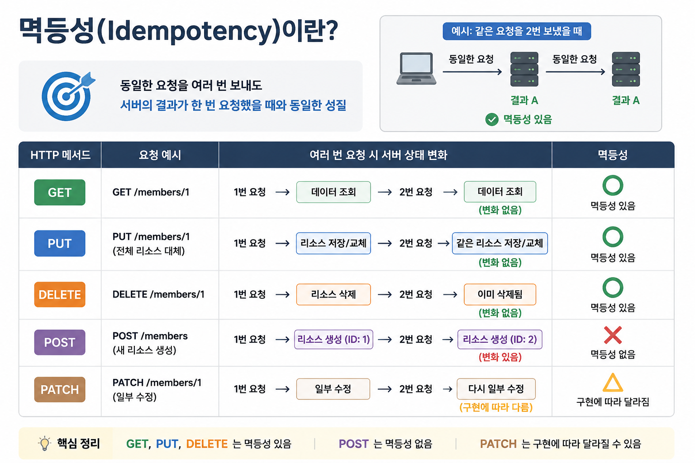

## 1. 들어가기 전
웹 애플리케이션을 개발하다 보면 프론트엔드와 백엔드가 데이터를 주고받기 위해 API를 사용한다. 특히 최근의 서비스는 하나의 웹 브라우저만 대상으로 하지 않는다. 웹, 모바일 웹, 태블릿, 외부 API 클라이언트 등 다양한 환경에서 같은 서버와 통신해야 한다.

이런 상황에서 API가 특정 화면이나 특정 클라이언트에만 맞춰져 있다면 유지보수가 어려워진다. 반대로 리소스 중심으로 API를 설계하면 여러 클라이언트가 같은 API를 더 일관된 방식으로 사용할 수 있다. RESTful API는 이런 상황에서 HTTP의 의미를 최대한 활용해 **클라이언트와 서버가 명확하게 소통하도록 돕는 설계 방식**이다.

예를 들어 클라이언트가 서버에게 회원 정보를 요청한다고 해보자.

```http
GET /members/1
```

이 요청은 비교적 직관적으로 읽힌다. `1번 회원 정보를 조회한다.`는 의미로 이해할 수 있기 때문이다.

```http
POST /members/1/delete
```

이 API도 의미를 완전히 이해하지 못하는 것은 아니지만, RESTful API 관점에서는 좋은 설계라고 보기 어렵다. 이유는 `delete`라는 행위가 표현되어 있기 대문이다. RESTful API에서는 **URI로 리소스를 표현**하고, **행위는 HTTP 메서드**로 표현하는 것을 권장한다.

위의 API는 `DELETE /members/1` 이 더 자연스럽다.

즉, RESTful API는 단순히 URL을 예쁘게 작성하는 규칙이 아니다. **클라이언트와 서버가 API를 통해 어떤 리소스를 대상으로 어떤 행위를 수행하는지 명확하게 소통하기 위한 설계 방식**이다.

## 2. REST란?

REST는 Representational State Transfer의 약자다. 직역하면 "표현된 상태의 전달" 정도로 이해할 수 있다.

우리가 API를 통해 주고받는 것은 서버 내부의 리소스 원본이 아니다. 예를 들어 서버에 회원 데이터가 저장되어 있다고 해보자. 클라이언트가 다음 요청을 보낸다.

```
GET /members/1
Accept: application/json
```

서버는 다음과 같이 응답을 반환할 수 있다.

```
HTTP/1.1 200 OK
Content-Type: application/json

{
  "id": 1,
  "name": "kim"
}
```

이때 클라이언트가 받은 JSON은 회원 리소스 그 자체가 아니다. 서버 내부 데이터베이스에 저장된 회원 리소스를 `application/json` 형식으로 표현한 결과다. 즉, **클라이언트는 리소스 원본을 받은 것이 아니라, 특정 시점의 리소스 상태를 JSON으로 표현한 결과**를 받은 것이다.

REST는 클라이언트와 서버가 리소스의 상태를 어떤 형식으로 표현해서 주고받을 것인지에 집중하는 아키텍처 스타일이다.

## 3. RESTful API의 핵심 규칙

RESTful API는 REST의 원칙을 HTTP API 설계에 적용한 API를 의미한다. 핵심은 크게 세 가지다.

1. 어떤 리소스인가?       → URI
2. 어떤 행위인가?         → HTTP Method
3. 어떻게 표현할 것인가?   → Representation

RESTful API에서 [URI](https://ko.wikipedia.org/wiki/%ED%86%B5%ED%95%A9_%EC%9E%90%EC%9B%90_%EC%8B%9D%EB%B3%84%EC%9E%90)는 **리소스를 식별하는 역할**을 한다. 따라서 URI에서는 행위가 아니라 리소스가 드러나야 한다.

주의할 점은 **URI에 동사를 넣지 않는 것**이다. 아래 URI들은 `show`, `create`, `delete`처럼 행위를 포함하고 있다. RESTful API에서는 행위를 URI가 아니라 HTTP 메서드로 표현하는 것이 좋다.

```
GET /members/show/1
POST /members/create
```

## 4. Collection과 Element

RESTful API에서 리소스는 크게 Collection과 Element 관점으로 나누어 생각할 수 있다. Collection은 리소스의 집합이고, Element는 그 집합에 속한 개별 리소스다.

```text
/members   → 회원 컬렉션
/members/1 → 회원 컬렉션에 속한 1번 회원 리소스
```

같은 URI라도 HTTP 메서드에 따라 의미가 달라진다.

| 구분 | URI | HTTP 메서드 | 의미 |
|---|---|---|---|
| Collection | `/members` | GET | 회원 목록 조회 |
| Collection | `/members` | POST | 새 회원 생성 |
| Element | `/members/1` | GET | 1번 회원 조회 |
| Element | `/members/1` | PUT | 1번 회원 전체 대체 |
| Element | `/members/1` | PATCH | 1번 회원 일부 수정 |
| Element | `/members/1` | DELETE | 1번 회원 삭제 |

## 5. PUT과 PATCH의 차이

HTTP 메서드 중에서 특히 헷갈리기 쉬운 것은 `PUT`과 `PATCH`다. 둘 다 수정과 관련된 메서드처럼 보이지만 의미가 다르다.


### 5.1 PUT
PUT 요청에서는 클라이언트가 리소스의 정확한 URI를 알고 있어야 된다. `/members`로 PUT 요청을 보내면 `/members/1`과 같은 **리소스가 생성되지 않는다.** PUT 메서드를 사용할 때는 `/members/1`와 같은 특정 리소스의 URI로 요청을 보내야 리소스가 생성된다. 그래서 PUT 메서드로 리소스를 생성하려면 클라이언트가 URI를 만드는 방법을 알고 있어야 된다.

그래서 PUT 메서드는 주로 리소스를 업데이트할 때 사용한다. 리소스 업데이트할 때는 이미 생성된 리소스의 정확한 URI를 알고 있고, 안전하게 멱등한 요청을 보내고 싶기 때문이다.

그러나 PUT 메서드는 **리소스 전체를 업데이트**해야 된다는 특징이 있다. 즉, 리소스 일부만 수정하고 싶어도 전체 필드 데이터를 요청 본문에 포함해야 한다.

> [!note] 클라이언트가 URI를 만드는 방법
> PUT은 클라이언트가 "어느 URI에 저장할지"를 직접 지정하는 방식이다.
> 
> 예를 들어, `PUT /members/1` 요청은  `/members/1` 위치에 리소스를 저장해줘. **이미 있으면 전체를 대체하고, 없으면 새로 만들어 달라는 의미**이다.

### 5.2 PATCH

PATCH도 리소스 업데이트할 때 사용한다. PUT 메서드와 같이 특정 리소스 URI를 정확히 알고 있어야 된다. 그러나 PUT은 서버에 있는 리소스를 완전히 대체하지만, PATCH는 **클라이언트의 요청**에 따라 **리소스를 수정하고 부분 업데이트**한다.

일반적으로 **PATCH 요청은 변경이 필요한 필드만 요청 본문으로 보내고, 변경하고 싶지 않은 필드는 요청 본문에서 생략**한다. 하지만 필요에 따라 다른 방법으로 PATCH 요청을 제공할 수 있다.

### 5.3 차이점

| 구분 | PUT | PATCH |
|---|---|---|
| 의미 | 리소스 전체 대체 | 리소스 일부 수정 |
| 요청 본문 | 전체 리소스 표현 | 변경할 일부 데이터 |
| 성격 | 교체에 가까움 | 부분 변경에 가까움 |
| 예시 | 회원 정보를 통째로 교체 | 회원 이름만 변경 |


## 6. 멱등성



멱등성이란 수학이나 전산학에서 어떤 대상에 **같은 연산을 여러 번 적용해도 결과가 달라지지 않는 성질**을 말한다. 즉, 단순히 HTTP 메서드에만 국한된 이야기는 아니고 이는 데이터베이스나 파일에 자원을 읽고 쓰는 등 컴퓨터가 수행하는 모든 연산에도 적용할 수 있는 개념이다.

예를 들어 `x => x * 1` 함수는 어떤 값에 1번을 적용하든 10,000번을 적용하든 항상 같은 값을 반환한다.

그러나 1을 곱하는 것이 아니라 1을 더하거나 빼는 함수라면 한 번 호출될 때마다 인자로 주어진 값을 계속 증가시키거나 감소시킬 것이므로 항상 같은 값을 반환하지 않는다. 이러한 성질의 연산이 바로 멱등성을 보장하지 않는 연산의 대표적인 예이다.

HTTP 메서드 또한 결국 어떠한 자원을 읽고 쓰고 수정하고 지우는 CRUD에 대한 의미를 가지기 때문에, 우리는 어떤 행위가 멱등성을 보장하는지 알고 있어야 한다.

| HTTP 메서드 | 멱등성 |
|---|---|
| GET | O |
| PUT | O |
| DELETE | O |
| POST | X |
| PATCH | 구현에 따라 달라질 수 있음 |

`GET` 메서드는 단지 리소스를 읽어 오는 행위를 의미하기에 아무리 여러 번 수행해도 결과가 변경되거나 하지는 않을 것이다. 마찬가지로 요청에 담긴 리소스로 기존 리소스를 그대로 대체해버리는 `PUT` 메서드 또한 여러 번 수행해도 요청에 담긴 리소스가 변하지 않는 이상 연산 결과가 동일할 것이다.

> 즉, 어떤 리소스를 읽어오거나 대체하는 연산은 멱등성을 보장한다고 이야기할 수 있다. 그렇다면 멱등성이 보장되지 않는 케이스는 어떤 것이 있을까?

`POST` 메서드의 경우 리소스를 새롭게 생성하는 행위를 의미하기 때문에 여러 번 수행하게 되면 매번 새로운 리소스가 생성될 것이다. 즉, 연산을 수행하는 결과가 매번 달라지는 것을 의미한다.

`PATCH` 메서드는 특별히 주의해야 한다. 예를 들어 다음 요청은 여러 번 호출해도 최종 상태가 같다.

```
PATCH /members/1 
Content-Type: application/json 
{ 
  "age": 31 
}
```

`age`를 31로 설정하는 요청이기 때문이다. 하지만 다음 요청은 여러 번 호출할 때마다 결과가 달라질 수 있다.

```
PATCH /members/1 
Content-Type: application/json 
{ 
  "increaseAge": 1 
}
```

이 요청은 호출할 때마다 나이를 1씩 증가시키는 의미로 구현될 수 있다. 이 경우 같은 요청을 여러 번 보내면 서버의 최종 상태가 계속 달라진다. 따라서 `PATCH`는 항상 멱등적이라고 말하기 어렵고, API 구현 방식에 따라 멱등성이 보장될 수도 있고 보장되지 않을 수도 있다.

[멱등성 활용 - Toss](https://docs.tosspayments.com/blog/what-is-idempotency#%EB%A9%B1%EB%93%B1%ED%95%9C-%EC%9A%94%EC%B2%AD%EC%9D%B8%EC%A7%80-%EC%95%8C-%EC%88%98-%EC%9E%88%EB%8A%94-%EB%B0%A9%EB%B2%95)

## 7. 정리

RESTful API는 단순히 URL을 깔끔하게 작성하는 방법이 아니다. 핵심은 클라이언트와 서버가 API를 통해 명확하게 소통할 수 있도록 리소스와 행위를 분리해서 표현하는 것이다.

- **REST**: 리소스의 표현된 상태를 주고받는 아키텍처 스타일
- **URI**: 어떤 리소스인지 표현
- **HTTP Method**: 그 리소스에 대해 어떤 행위를 할지 표현
- **Representation**: 리소스를 JSON, XML, HTML 등으로 표현한 결과
- **Header**: 표현 형식, 언어, 클라이언트 정보 등을 전달

### 7.1 RESTful API 설계

1. URI에는 리소스를 표현한다. 
2. URI에는 행위를 넣지 않는다. 
3. 행위는 HTTP 메서드로 표현한다. 
4. Collection과 Element를 구분해서 생각한다. 
5. GET, POST, PUT, PATCH, DELETE의 의미를 구분한다.
6. PUT은 전체 대체, PATCH는 부분 수정에 가깝다. 
7. 표현 형식, 언어, 플랫폼 차이는 Header 활용을 고려한다. 
8. 멱등성을 고려해서 API를 설계한다.
9. REST 원칙과 현실적인 사용성을 함께 고려한다.

## 참고 자료

- https://docs.tosspayments.com/blog/rest-api-post-put-patch
- https://docs.tosspayments.com/blog/what-is-idempotency
- https://evan-moon.github.io/2020/04/07/about-restful-api/
- https://www.w3.org/Protocols/rfc2616/rfc2616-sec9.html