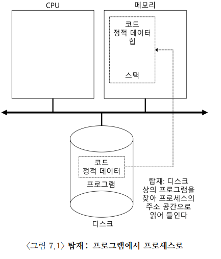
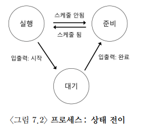
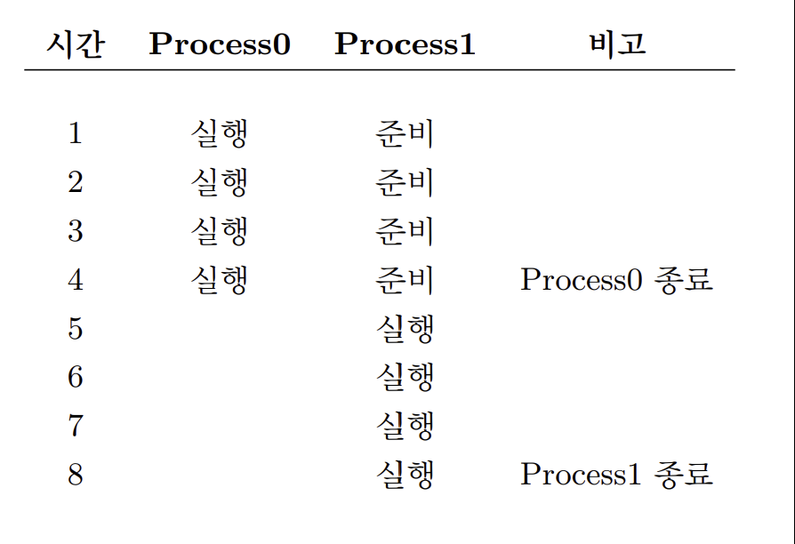

# 프로세스의 개념

프로세스는 **실행 중인 프로그램**을 의미하며, 프로그램 자체는 **디스크에 저장된 명령어와 데이터의 집합**이다. 운영체제는 이 명령어와 데이터를 실행하여 프로그램을 작동시킨다.

사용자는 여러 프로그램을 동시에 실행하기를 원한다. 예를 들어, 웹 브라우저, 이메일, 게임 등을 동시에 실행하는 것이다. 운영체제는 실제로 한정된 CPU를 가지고 있음에도 불구하고, **여러 개의 프로세스가 동시에 실행되는 것**처럼 만드는 기술

즉, CPU 가상화를 통해 이를 가능하게 한다.

운영체제는 시분할 방식을 사용하여 한 프로세스를 잠깐 실행한 뒤 다른 프로세스로 전환하고, 다시 또 다른 프로세스를 실행한다. 이 과정을 매우 빠르게 반복하기 때문에 사용자는 여러 프로그램이 동시에 실행되는 것처럼 느낀다.

> [!note] 시분할과 공간 분할
> **시분할**은 하나의 자원을 시간 단위로 나누어 여러 사용자나 프로그램이 번갈아 사용하게 하는 방식이다. 대표적인 예로 CPU가 있다. 
>
> **공간분할**은 자원의 공간 자체를 나누어 여러 사용자나 프로그램에게 할당하는 방식이다. 대표적인 예로 디스크가 있다.

<br>

# 프로세스의 구성 요소

프로세스를 이해하려면 **하드웨어 상태(machine state)** 를 이해해야 한다. 프로그램 실행 중에 하드웨어 상태를 읽거나 변경한다.

### 메모리

> 이때 가장 중요한 하드웨어 구성 요소는 무엇일까?

프로세스의 가장 중요한 구성 요소 중 하나는 **메모리**이다. 프로그램의 명령어는 메모리에 저장된다. 프로그램이 읽고 쓰는 데이터도 메모리에 저장된다. 프로세스가 실행되기 위해서는 자신이 접근할 수 있는 **메모리 공간**이 필요하다.

이 메모리 공간을 **주소 공간(address space)** 이라고 한다.

> [!note] 주소 공간(address space)
> 프로세스의 주소 공간에는 사용자 영역에 크게 코드 영역, 데이터 영역, 힙 영역, 스택 영역을 나뉘어 저장된다.
>
> **코드 영역(code segment)** 은 텍스트 영역이라고 부른다. 기계어로 이루어진 명령어가 저장된다.
> **데이터 영역(data segment)** 은 잠깐 사용하고 없어질 데이터가 아닌 프로그램이 실행되는 동안 유지할 데이터가 저장되는 공간이다.
> **힙 영역(heap segment)** 은 프로그램 실행 중에 크기가 변하는 동적 데이터를 저장하는 메모리 공간이다.
> **스택 영역(stack segment)** 은 데이터를 일시적으로 저장하는 공간으로 함수 호출 정보, 지역 변수, 리턴 주소 저장 등이 있다.
> 
> 프로세스가 실행된다는 것은 결국 이 메모리 공간에 있는 명령어와 데이터를 CPU가 사용한다는 의미이다.

### 레지스터

레지스터도 프로세스의 하드웨어 상태를 구성하는 요소 중 하나이다.

레지스터는 CPU 내부에 있는 매우 빠른 저장 공간이다. 프로그램이 실행될 때 CPU는 메모리의 값만 사용하는 것이 아니라, 필요한 값을 레지스터에 올려두고 연산한다. **프로세스의 실행 상태를 저장하려면 레지스터 값도 함께 저장**해야 한다.

예를 들어 운영체제가 Process A를 멈추고 Process B를 실행한다고 할 때, Process A가 사용하던 레지스터 값을 저장하지 않으면, 나중에 Process A를 다시 실행할 때 이전 상태를 복원할 수 없다.

그래서 레지스터는 프로세스의 하드웨어 상태를 구성하는 중요한 요소이다.

### 프로그램 카운터

프로그램 카운터는 **현재 실행 중인 명령어의 위치를 나타내는 레지스터**이다. 보통 **PC(program counter)** 라고 부르며, **명령어 포인터(instruction pointer, IP)** 라고도 부른다.

프로그램은 여러 명령어로 이루어져 있고, CPU는 이 명령어들을 순서대로 실행한다. 프로그램 카운터는 **다음에 실행할 명령어가 어디에 있는지를 알려준다.**

운영체제가 프로세스를 중단했다가 다시 실행하려면, 이 프로그램 카운터 값을 반드시 저장해야 한다. 그래야 프로세스가 처음부터 실행하지 않고, 이전에 멈춘 지점부터 이어서 실행될 수 있다.

### 스택 포인터와 프레임 포인터

스택 포인터(stack pointer)와 프레임 포인터(frame pointer)는 함수 호출과 관련된 스택을 관리하는 데 사용된다.

프로그램이 함수를 호출하면 스택에는 함수의 지역 변수, 함수 인자, 리턴 주소, 이전 함수 호출 정보가 저장된다.

이 정보들이 있어야 함수 호출이 끝난 뒤 원래 위치로 돌아가거나, 지역 변수와 인자에 올바르게 접근할 수 있다.

### 열린 파일 목록

프로세스는 실행 중에 파일이나 입출력 장치에 접근할 수 있다. 예를 들어 파일 읽기, 파일 쓰기, 터미널 입력 받기 같은 작업을 할 수 있다.

운영체제는 각 프로세스가 현재 어떤 파일을 열고 있는지 관리해야 한다. 


> [!important] 정책과 구현의 분리 (Separation of Policy and Mechanism)
> 운영체제(OS)의 유연성과 모듈화를 극대화하는 핵심 설계 패러다임이다.
> 
> **구현 (Mechanism)** 은 "어떻게(How)"로 기능을 실제로 수행하는 기술적 수단이다. 예를 들어 운영체제는 어떻게 문맥 교환을 하는가? 등이 해당된다. 
> 
> **정책(Policy)** 은 "어느것(What)"이라는 질문에 대한 답으로 자원을 배분하는 판단 기준과 규칙이다. 예를 들어 지금 당장 어느 프로세스를 실행시켜야 하는가? 등이 해당된다.
>
> 둘을 분리하면 정책을 변경할 때 기법의 변경을 고민하지 않아도 된다. 따라서 유지보수와 시스템 확장이 매우 유리해진다.

# 프로세스 API

운영체제는 프로세스를 관리하기 위해 여러 API를 제공한다. 

구체적인 API 이름은 운영체제마다 다를 수 있지만, 현대 운영체제들은 공통적으로 같은 기능을 제공한다.

- 생성(Create): 운영체제는 새로운 프로세스를 생성할 수 있는 방법을 제공해야 한다. 쉘에 명령어를 입력하거나, 프로그램의 아이콘을 클릭하면 새로운 프로세스를 생성한다.
- 제거(Destroy): 운영체제는 프로세스를 강제로 제거할 수 있는 인터페이스를 제공해야 한다. 대부분의 프로세스는 실행되고 할 일을 다하면 스스로 종료하지만 필요 없는 프로세스는 중단 시켜야는 경우도 있다.
- 대기(Wait): 어떤 프로세스의 실행 중지를 기다릴 필요가 있기 때문에 여러 종류의 대기 인터페이스가 제공된다.
- 각종 제어(Miscellaneous Control): 여러 가지 제어 기능을 제공한다. 예를 들어 프로세스를 일시정지하거나 재개하는 기능을 제공한다.
- 상태(State): 프로세스 상태 정보를 얻어내는 인터페이스도 제공된다. 상태 정보에는 얼마 동안 실행되었는지 또는 프로세스가 어떤 상태에 있는지 등이 포함된다.

# 프로세스 생성 과정

프로그램이 어떻게 프로세스로 바뀌는지도 중요하다. 사용자가 프로그램을 실행하면 운영체제는 내부적으로 여러 단계를 거쳐 프로세스를 준비한다.



프로그램은 실행 파일 형태로 디스크나 SSD에 저장되어 있다. 운영체제는 프로그램을 실행하기 위해 먼저 프로그램 코드와 정적 데이터를 메모리에 올린다. 이를 **탑재** 또는 **로딩**이라고 한다.

예전 운영체제는 프로그램 실행 전에 필요한 코드와 데이터를 모두 메모리에 올렸다. 하지만 현대 운영체제는 프로그램 실행 중 필요한 부분만 나중에 메모리에 올리기도 한다. 이 동작은 이후 메모리 가상화에서 다루는 **페이징(paging)** 과 **스와핑(swapping)** 개념과 연결된다.

> [!important]
> 어떤 프로그램이든 실행시키기 전에 운영체제는 프로그램의 중요 부분을 디스크에서 메모리로 탑재해야 한다는 것만 기억하자.

코드와 정적 데이터가 메모리에 올라간 뒤, 운영체제는 **실행 시간 스택**(run-time stack)을 위한 메모리를 할당한다. 스택은 함수 호출에 필요한 정보를 저장하는 공간이다. 스택에는 지역 변수, 함수 인자, 리턴 주소가 저장된다.

운영체제는 프로그램이 동적으로 메모리를 사용할 수 있도록 **힙(heap)** 영역도 준비한다. 힙은 실행 중에 필요한 데이터를 동적으로 저장하는 공간이다.

C에서는 `malloc()`으로 메모리를 요청하고, `free()`로 반환한다. 힙이 연결 리스트, 해시 테이블, 트리처럼 가변적인 자료구조를 위해 사용된다. 

Java에서는 `new` 키워드로 객체를 생성하면 JVM이 힙 영역에 객체를 생성한다.

```java
User user = new User("jihoon");
Post post = new Post("운영체제 정리");
```

프로세스가 실행되면 기본적인 **입출력 환경도 준비**된다. Unix 시스템
에서 각 프로세스는 기본적으로 표준 입력 (**STDIN**), 표준 출력 (**STDOUT**), 표준 에러(**STDERR**) 장치에 해당하는 세 개의 **파일 디스크럽터**(file descriptor)를 갖는다. 이 디스크럽터들을 사용하여 프로그램은 터미널로부터 입력을 읽고 화면에 출력을 프린트하는 작업을 쉽게 할 수 있다.

코드와 데이터가 메모리에 올라가고, 스택과 힙이 준비되고, 입출력 초기화까지 끝나면 운영체제는 프로그램을 실행할 준비를 마친다. 마지막으로 운영체제는 **프로그램의 시작점으로 이동**한다. C 프로그램에서는 보통 `main()` 함수가 시작점이다. 즉 `main()` 에서부터 프로그램을 시작하는 마지막 작업만이 남는다. 운영체제는 CPU를 새로 생성된 프로세스에게 넘기게 되고 프로그램 실행이 시작된다.

> [!note]
> Java 프로그램도 개발자가 작성한 관점에서는 `main()` 메서드가 시작점이다.
>
> ```java
> public static void main(String[] args) {
>     // 프로그램 시작 지점
> }
> ```

# 프로세스 상태

프로세스는 항상 실행 중인 상태로만 존재하지 않는다. 운영체제는 여러 프로세스를 관리하기 위해 프로세스의 상태를 구분한다.

- 실행(Running): 실행 상태에서 프로세스는 프로세서에서 실행 중인다. 즉, 프로세스는 명령어를 실행하고 있다.
- 준비(Ready): 준비 상태에서 프로세스는 실행할 준비가 되어 있지만 운영체제가 다른 프로세스를 실행하고 있는 등의 이유로 대기 중이다.
- 대기(Blocked): 프로세스가 다른 사건을 기다리는 동안 프로세세의 수행을 중단시키는 연산이다. 예를 들어, 프로세스가 디스크에 대한 입출력 요청을 하였을 때 프로세스는 입출력이 완료될 때까지 대기 상태가 되고, 다른 프로세스가 실행 상태가 될 수 있다.



실행 상태에서 준비 상태로의 전이는 프로세스가 나중에 다시 스케줄이 될 수 있는 상태가 되었다는 것을 의미한다. 프로세스의 요청으로 대기 상태가 되면 이벤트가 발생했을 때까지 대기 상태로 유지된다. 이벤트가 발생하면 다시 준비 상태로 전이되고 운영체제의 결정에 따라 다시 실행될 수 있다.



첫 번재 프로세스가 어느 정도 실행한 후에 입출력을 요청한다. 프로세스는 대기 상태가 되고 다른 프로세스에게 실행 기회를 준다.


1. Process()은 입출력을 요청하고 요청한 작업이 완료되기를 기다린다.
2. 프로세스는 디스크를 읽거나 네트워크로부터 패킷을 기다릴 때 대기 상태로 전이한다.
3. 운영체제는 Process()이 CPU를 사용하지 않는다는 것을 감지하고, Process1을 실행시킨다.
4. Process1이 실행되는 동안 입출력이 완료되고 Process()은 준비 상태로 다시 전이된다.
5. Process()은 종료되고, Process()이 실행되어 종료된다.

위 순서처럼 시스템은 Process()이 입출력을 요청할 때 Process1의 실행여부를 결정한다. 이러한 결정이 좋은 결정이었는지는 확실하지 않다. 운영체제는 스케줄러를 통해 이러한 결정을 내린다.

>[!note] 자료구조 - 프로세스 리스트
> 프로세스 리스트는 자료 구조 중 하나로, 시스템에서 실행 중인 프로그램을 관리한다. 프로세스의 관리를 위한 정보를 저장하는 자료 구조를 **프로세스 제어 블록(Process Control Block, PCB)** 이라 부른다.

# 자료 구조

운영체제도 일종의 프로그램이다. 다른 프로그램들과 같이 다양한 정보를 유지하기 위한 자료 구조를 가지고 있다. (프로세스 리스트)

운영체제는 대기(Blocked) 상태인 프로세스도 파악해야 한다. 입출력 요청이 완료되면 운영체제는 적절한 프로세스를 깨워 준비(Ready) 상태로 다시 전이시킬 수 있어야 한다.

운영체제는 **레지스터 문맥(register context)** 이라는 자료 구조에 해당 프로세스의 레지스터 값을 저장한다.

프로세스가 실행 중일 때 CPU의 레지스터에는 현재 실행 위치, 연산 중인 값, 스택 위치와 같은 실행 상태 정보가 들어 있다. 그런데 운영체제가 다른 프로세스를 실행하기 위해 현재 프로세스를 멈추면, 이 값들이 사라져서는 안 된다.

따라서 운영체제는 현재 프로세스의 레지스터 값들을 저장해 두고, 나중에 이 프로세스가 다시 CPU를 할당받으면 저장된 레지스터 값들을 복원한다.

이 과정을 통해 프로세스는 처음부터 다시 실행되는 것이 아니라, 이전에 중단되었던 지점부터 실행을 재개할 수 있게 된다.

프로세스의 상태로는 실행, 준비, 대기 외에도 몇 가지가 더 있다. 어떤 시스템에서는 프로세스가 실행 중일 때 **초기(initial)** 상태를 별도로 둔다. 또 프로세스가 종료되었지만 메모리 상에 아직 남아있는 **최종(final)** 상태가 있는데, 유닉스 계열 시스템에서는 이를 **좀비(zombie) 상태**라고 부른다.

최종(final) 상태는 프로세스가 성공적으로 실행했는지를 다른 프로세스가 검사하는 데 유용하다. 

# 참고 자료

- https://pages.cs.wisc.edu/~remzi/OSTEP/Korean/04-cpu-intro.pdf  
- https://os2024.jeju.ai/week02/cpu-intro.html