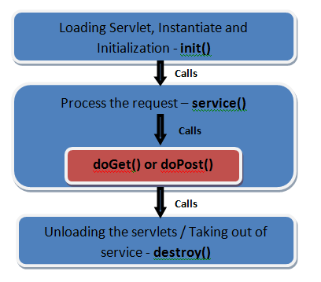

## 1. 들어가기 전

**웹 애플리케이션은 클라이언트와 서버가 HTTP를 통해 요청과 응답을 주고받는 구조로 동작**한다. 사용자가 브라우저에서 URL을 입력하거나 버튼을 클릭하면 클라이언트는 서버로 HTTP 요청을 보낸다. 서버는 요청을 해석한 뒤 필요한 작업을 수행하고, 그 결과를 HTTP 응답으로 돌려준다.

이때 **Java에서 HTTP 요청과 응답을 처리**하기 위해 등장한 표준 기술이 **서블릿(Servlet)** 이다.

서블릿은 Java로 작성하는 서버 측 웹 컴포넌트다. 즉, 클라이언트가 보낸 HTTP 요청을 Java 코드에서 다룰 수 있게 해주는 기술이다.


예를 들어 `/hello?username=world` 요청이 들어오면, 서블릿은 `username=world`라는 요청 파라미터를 꺼내고 응답 body에 원하는 문자열을 작성할 수 있다.


```java
@WebServlet(name = "helloServlet", urlPatterns = "/hello")
public class HelloServlet extends HttpServlet {

    @Override
    protected void service(HttpServletRequest request, HttpServletResponse response)
            throws ServletException, IOException {

        System.out.println("HelloServlet.service");
        System.out.println("request = " + request);
        System.out.println("response = " + response);

        String username = request.getParameter("username");
        System.out.println("username = " + username);

        response.setContentType("text/plain");
        response.setCharacterEncoding("UTF-8");
        response.getWriter().write("hello " + username);
    }
}
```

실행 결과는 다음과 같다.

```text
HelloServlet.service
request = org.apache.catalina.connector.RequestFacade@5e4e72
response = org.apache.catalina.connector.ResponseFacade@37d112b6
username = world
```

위 코드에서 핵심 객체는 두 가지다.

* `HttpServletRequest`: HTTP 요청 정보를 담고 있는 객체
* `HttpServletResponse`: HTTP 응답을 만들기 위한 객체

`request.getParameter("username")`으로 요청 파라미터를 읽고, `response.getWriter().write()`로 응답 body에 데이터를 쓴다. 즉, 서블릿은 HTTP 요청과 응답을 Java 객체 중심으로 다룰 수 있게 해준다.

Spring Boot에서 `@WebServlet`을 사용해 직접 서블릿을 등록하려면 `@ServletComponentScan`을 추가해야 한다.

```java
@ServletComponentScan // 서블릿 자동 등록
@SpringBootApplication
public class ServletApplication {

    public static void main(String[] args) {
        SpringApplication.run(ServletApplication.class, args);
    }
}
```

일반적인 Spring MVC 개발에서는 직접 서블릿을 만들 일이 많지는 않다. 하지만 Spring MVC의 핵심인 `DispatcherServlet`도 결국 서블릿 기반으로 동작한다. 따라서 서블릿을 이해하면 Spring MVC가 HTTP 요청을 어떻게 받아 Controller까지 전달하는지 더 쉽게 이해할 수 있다.

## 2. 서블릿 컨테이너와 생명주기

서블릿은 개발자가 직접 `new HelloServlet()`처럼 생성해서 사용하는 객체가 아니다. 서블릿은 **서블릿 컨테이너(Servlet Container)** 가 생성하고 관리한다.

대표적인 서블릿 컨테이너로는 Tomcat이 있다. Tomcat 같은 WAS는 애플리케이션이 실행될 때 서블릿을 등록하고, 클라이언트 요청이 들어오면 요청 URL에 맞는 서블릿을 찾아 호출한다.


위 이미지의 흐름은 다음과 같다.

```text
Client
    → HTTP 요청
    → WAS / Servlet Container
    → Servlet
    → HttpServletRequest
    → HttpServletResponse
    → HTTP 응답
```

서블릿 컨테이너의 주요 역할은 다음과 같다.

* 서블릿 객체 생성
* 서블릿 초기화
* 요청 URL에 맞는 서블릿 호출
* 요청과 응답 객체 생성
* 멀티스레드 기반 요청 처리
* 서블릿 종료 시 자원 정리



서블릿 컨테이너는 서블릿의 생명주기도 관리한다. 대표적인 생명주기 메서드는 `init()`, `service()`, `destroy()`다.


```java
@WebServlet(name = "lifeCycleServlet", urlPatterns = "/lifecycle")
public class LifeCycleServlet extends HttpServlet {

    @Override
    public void init() throws ServletException {
        System.out.println("서블릿 초기화");
    }

    @Override
    protected void service(HttpServletRequest request, HttpServletResponse response)
            throws ServletException, IOException {

        System.out.println("요청 처리");
        response.setContentType("text/plain");
        response.setCharacterEncoding("UTF-8");
        response.getWriter().write("ok");
    }

    @Override
    public void destroy() {
        System.out.println("서블릿 종료");
    }
}
```

| **메서드**     | **호출 시점**     | **역할**     |
| :---------- | :------------ | :--------- |
| `init()`    | 서블릿이 처음 생성될 때 | 초기화 작업     |
| `service()` | 요청이 들어올 때마다   | 실제 요청 처리   |
| `destroy()` | 서블릿이 종료될 때    | 종료 전 자원 정리 |

여기서 중요한 점은 서블릿 객체가 요청마다 매번 새로 생성되는 것이 아니라는 점이다. 일반적으로 서블릿 컨테이너는 **서블릿 객체를 하나 생성해두고 여러 요청에서 재사용**한다.

그래서 서블릿 인스턴스 필드에 요청별 데이터를 저장하면 [동시성 문제가 발생](https://docs.oracle.com/javaee/7/tutorial/servlets003.htm)할 수 있다.

```java
@WebServlet("/hello")
public class HelloServlet extends HttpServlet {

    private String name; // 인스턴스 필드

    @Override
    protected void service(HttpServletRequest request, HttpServletResponse response)
            throws IOException {

        name = request.getParameter("name");

        response.getWriter().write("hello " + name);
    }
}
```

위 코드는 위험하다. 여러 사용자가 동시에 요청을 보내면 하나의 서블릿 객체를 여러 스레드가 함께 사용할 수 있다. 이때 인스턴스 필드 `name` 값이 다른 요청에 의해 덮어써질 수 있다.

따라서 요청마다 달라지는 데이터는 인스턴스 필드가 아니라 지역 변수를 사용해야 한다.

```java
@WebServlet("/hello")
public class HelloServlet extends HttpServlet {

    @Override
    protected void service(HttpServletRequest request, HttpServletResponse response)
            throws IOException {

        String name = request.getParameter("name");

        response.getWriter().write("hello " + name);
    }
}
```

<details>
    <summary>멀티스레드 환경</summary>
<div markdown="1">

예를 들어 사용자가 동시에 3명 접속했다고 가정해보자.

```text
사용자 A 요청 ── Thread-1 ┐
사용자 B 요청 ── Thread-2 ├── 하나의 HelloServlet 객체 사용
사용자 C 요청 ── Thread-3 ┘
```

서블릿 객체는 하나인데, 요청 처리는 여러 스레드가 동시에 수행할 수 있다.

```java
@WebServlet("/hello")
public class HelloServlet extends HttpServlet {

    private String name1; // 여러 스레드가 공유할 수 있는 필드

    @Override
    protected void service(HttpServletRequest request, HttpServletResponse response) {

        String name2 = request.getParameter("name");
        // 요청마다 다른 스레드가 이 메서드를 실행할 수 있음
    }
}
```

`service()` 메서드는 여러 스레드에서 동시에 실행될 수 있고, `name2`는 지역 변수라서 각 요청 스레드마다 따로 가진다.

하지만 `name1`은 서블릿 객체의 필드라서 여러 스레드가 공유한다. 그러므로 요청별 데이터를 인스턴스 필드에 저장하면 위험하다.

</div>
</details>

정리하면 다음과 같다.

* 서블릿 객체는 보통 하나만 생성되어 재사용된다.
* 여러 요청은 여러 스레드에서 동시에 처리될 수 있다.
* 인스턴스 필드는 여러 요청이 공유할 수 있으므로 주의해야 한다.
* 요청별 데이터는 지역 변수로 처리하는 것이 안전하다.

## 3. 요청과 응답 처리

서블릿에서 가장 자주 사용하는 객체는 `HttpServletRequest`와 `HttpServletResponse`다.

[HttpServletRequest](https://tomcat.apache.org/tomcat-11.0-doc/servletapi/jakarta/servlet/http/HttpServletRequest.html)는 클라이언트가 보낸 요청 정보를 조회하는 객체이고, [HttpServletResponse](https://tomcat.apache.org/tomcat-11.0-doc/servletapi/jakarta/servlet/http/HttpServletResponse.html)는 서버가 클라이언트에게 보낼 HTTP 응답을 작성하는 객체다.

### 3.1 HttpServletRequest

`HttpServletRequest`로는 다음과 같은 HTTP 요청 메시지를 편리하게 조회할 수 있다.

```text
POST /save HTTP/1.1
Host: localhost:8080
Content-Type: application/x-www-form-urlencoded

username=kim&age=20
```

* HTTP 메서드: `POST`
* 요청 URI: `/save`
* 요청 헤더: Host: `localhost:8080`, `Content-Type: application/x-www-form-urlencoded`
* 요청 파라미터: `username=kim`, `age=20`
* 요청 body: `username=kim&age=20`


```java
@WebServlet(name = "requestServlet", urlPatterns = "/request")
public class RequestServlet extends HttpServlet {

    @Override
    protected void service(HttpServletRequest request, HttpServletResponse response)
            throws IOException {

        String method = request.getMethod();
        String requestURI = request.getRequestURI();
        String queryString = request.getQueryString();
        String userAgent = request.getHeader("User-Agent");
        String username = request.getParameter("username");

        response.setContentType("text/plain");
        response.setCharacterEncoding("UTF-8");

        response.getWriter().write("method = " + method + "\n");
        response.getWriter().write("requestURI = " + requestURI + "\n");
        response.getWriter().write("queryString = " + queryString + "\n");
        response.getWriter().write("userAgent = " + userAgent + "\n");
        response.getWriter().write("username = " + username + "\n");
    }
}
```

요청 파라미터는 보통 GET 쿼리 파라미터나 HTML Form 전송 데이터처럼 key-value 형식으로 전달되는 데이터를 의미한다.

```text
GET /request?username=hello&age=20 HTTP/1.1
Host: localhost:8080
```

이 경우 다음과 같이 값을 꺼낼 수 있다.

```java
String username = request.getParameter("username");
String age = request.getParameter("age");
```

POST HTML Form도 `application/x-www-form-urlencoded` 형식으로 전송되면 요청 파라미터로 조회할 수 있다.

```text
POST /request HTTP/1.1
Content-Type: application/x-www-form-urlencoded

username=hello&age=20
```

반면 JSON처럼 HTTP 메시지 body에 직접 담긴 데이터는 `getParameter()`로 조회하는 방식과 다르다. 이때는 `request.getInputStream()`을 사용해 body를 직접 읽을 수 있다.

```java
@WebServlet(name = "requestBodyStringServlet", urlPatterns = "/request-body-string")
public class RequestBodyStringServlet extends HttpServlet {

    @Override
    protected void service(HttpServletRequest request, HttpServletResponse response)
            throws ServletException, IOException {

        ServletInputStream inputStream = request.getInputStream();

        String messageBody = StreamUtils.copyToString(
                inputStream,
                StandardCharsets.UTF_8
        );

        System.out.println("messageBody = " + messageBody);

        response.getWriter().write("ok");
    }
}
```

### 3.2 HttpServletResponse

`HttpServletResponse`는 서버가 클라이언트에게 보낼 HTTP 응답을 만들 때 사용한다.

```text
HTTP/1.1 200 OK
Cache-Control: no-cache
Content-Type: application/json;charset=UTF-8

{
    "message": "hello servlet"
}
```

* 응답 상태 코드 설정: `HTTP/1.1 200 OK`
* 응답 헤더 설정: `Cache-Control: no-cache`
* Content-Type 설정: `Content-Type: application/json;`
* 문자 인코딩 설정: `charset=UTF-8`
* 응답 body 작성: `"message": "hello servlet"`


```java
@WebServlet(name = "responseServlet", urlPatterns = "/response")
public class ResponseServlet extends HttpServlet {

    @Override
    protected void service(HttpServletRequest request, HttpServletResponse response)
            throws IOException {

        response.setStatus(HttpServletResponse.SC_OK);
        response.setHeader("Cache-Control", "no-cache");

        response.setContentType("application/json");
        response.setCharacterEncoding("UTF-8");

        response.getWriter().write("""
                {
                    "message": "hello servlet"
                }
                """);
    }
}
```


요청과 응답 처리를 정리하면 다음과 같다.

| 객체                    | 역할                     |
| :-------------------- | :--------------------- |
| `HttpServletRequest`  | HTTP 요청 정보 조회          |
| `HttpServletResponse` | HTTP 응답 생성             |
| `getParameter()`      | 쿼리 파라미터 또는 Form 데이터 조회 |
| `getInputStream()`    | HTTP 요청 body 직접 읽기     |
| `getWriter()`         | HTTP 응답 body 작성        |

**서블릿을 사용하면 HTTP 요청과 응답을 매우 직접적으로 다룰 수 있다.** 이 직접성은 서블릿의 장점이다. 하지만 요청 데이터 조회, 타입 변환, JSON 파싱, 응답 생성, View 이동 등을 개발자가 직접 처리해야 하므로 코드가 반복되고 복잡해지기 쉽다.

## 4. 서블릿의 한계와 MVC 구조

서블릿은 HTTP 요청과 응답을 직접 다룰 수 있게 해주지만, 애플리케이션 규모가 커지면 한계가 드러난다.

가장 큰 문제는 하나의 서블릿 안에 **너무 많은 역할**이 섞이기 쉽다는 점이다.

```java
@WebServlet(name = "memberSaveServlet", urlPatterns = "/members/save")
public class MemberSaveServlet extends HttpServlet {

    private final MemberRepository memberRepository = MemberRepository.getInstance();

    @Override
    protected void service(HttpServletRequest request, HttpServletResponse response)
            throws ServletException, IOException {

        String username = request.getParameter("username");
        int age = Integer.parseInt(request.getParameter("age"));

        Member member = new Member(username, age);
        memberRepository.save(member);

        request.setAttribute("member", member);

        String viewPath = "/WEB-INF/views/save-result.jsp";
        RequestDispatcher dispatcher = request.getRequestDispatcher(viewPath);

        dispatcher.forward(request, response);
    }
}
```

이 코드에는 여러 책임이 섞여 있다.

* 요청 데이터를 꺼내는 코드
* 문자열 파라미터를 숫자로 변환하는 코드
* 비즈니스 로직을 호출하는 코드
* Model 역할로 request에 데이터를 담는 코드
* View로 이동하는 코드

특히 View로 이동하는 코드는 여러 서블릿에서 반복되기 쉽다.

```java
String viewPath = "/WEB-INF/views/save-result.jsp";
RequestDispatcher dispatcher = request.getRequestDispatcher(viewPath);
dispatcher.forward(request, response);
```

이런 중복과 책임 혼합을 줄이기 위해 MVC 패턴이 사용된다. MVC는 역할을 `Model`, `View`, `Controller`로 나누는 구조다.

**컨트롤러**: HTTP 요청을 받아 파라미터를 검증하고, 필요한 비즈니스 로직을 호출한다. 그리고 뷰에 전달할 결과 데이터를 조회해서 모델에 담는다.  

**모델**: 뷰에 출력할 데이터를 담아둔다. 뷰가 필요한 데이터를 모두 모델에 담아서 전달해주는 덕분에 뷰는 비즈니스 로직이나 데이터 접근을 몰라도 되고, 화면을 렌더링하는 일에 집중할 수 있다.  


**뷰**: 모델에 담겨 있는 데이터를 사용해서 화면을 그리는 일에 집중한다. 여기서 HTML을 생성하는 부분을 말한다.  

하지만 단순히 Controller를 여러 개 만든다고 해서 문제가 완전히 해결되지는 않는다. 모든 Controller가 공통 처리를 반복하면 여전히 중복이 발생한다. 그래서 **프론트 컨트롤러** 패턴이 사용된다.


프론트 컨트롤러는 **모든 요청을 먼저 받아 공통 처리를 수행하고, 요청에 맞는 Controller를 찾아 호출**한다.

Spring MVC의 핵심인 `DispatcherServlet`도 바로 이 프론트 컨트롤러 패턴으로 구현되어 있다. 즉, Spring MVC는 서블릿과 완전히 별개의 기술이 아니다.

따라서 서블릿을 이해하면 Spring MVC의 `DispatcherServlet`이 왜 필요한지, 그리고 요청이 Controller까지 어떻게 전달되는지 더 자연스럽게 이해할 수 있다. 다음 글에서는 이 흐름을 Spring MVC의 `DispatcherServlet` 구조와 연결해서 살펴보자.

## 5. 정리

**서블릿**은 Java에서 HTTP 요청과 응답을 처리하기 위한 표준 기술이다. 클라이언트의 요청은 Tomcat 같은 서블릿 컨테이너를 거쳐 서블릿에 전달되고, 서블릿은 `HttpServletRequest`로 요청 정보를 읽고 `HttpServletResponse`로 응답을 작성한다. 서블릿 컨테이너는 서블릿의 생성, 초기화, 요청 처리, 종료까지 생명주기를 관리한다.

서블릿은 HTTP를 직접 다룰 수 있다는 장점이 있지만 다음과 같은 한계도 있다.

* 요청 처리 코드가 반복되기 쉽다.
* 비즈니스 로직과 View 이동 코드가 섞이기 쉽다.
* 요청 파라미터 변환과 검증을 직접 처리해야 한다.
* 공통 처리를 여러 서블릿에 반복해서 작성하기 쉽다.

이 한계를 줄이기 위해 MVC 패턴과 프론트 컨트롤러 패턴이 사용된다. 그리고 Spring MVC의 `DispatcherServlet`은 이러한 프론트 컨트롤러 구조를 기반으로 동작한다.

## 6. 참고 자료

* https://jakarta.ee/specifications/servlet/
* https://jakarta.ee/learn/docs/jakartaee-tutorial/current/web/servlets/servlets.html
* https://docs.oracle.com/javaee/7/tutorial/servlets.htm
* https://docs.oracle.com/javaee/7/tutorial/servlets003.htm
* https://tomcat.apache.org/tomcat-11.0-doc/servletapi/jakarta/servlet/http/HttpServlet.html
* https://tomcat.apache.org/tomcat-11.0-doc/servletapi/jakarta/servlet/http/HttpServletRequest.html
* https://tomcat.apache.org/tomcat-11.0-doc/servletapi/jakarta/servlet/http/HttpServletResponse.html
* https://tomcat.apache.org/tomcat-11.0-doc/servletapi/jakarta/servlet/RequestDispatcher.html
* https://docs.spring.io/spring-framework/reference/web/webmvc/mvc-servlet.html
* https://docs.spring.io/spring-boot/api/java/org/springframework/boot/web/server/servlet/context/ServletComponentScan.html
* https://www.openmaru.io/was-java-servlet%EC%84%9C%EB%B8%94%EB%A6%BF-%EB%8F%99%EC%9E%91-%EB%B0%A9%EC%8B%9D-%ED%95%9C%EB%88%88%EC%97%90-%EC%95%8C%EC%95%84%EB%B3%B4%EA%B8%B0/
* https://mangkyu.tistory.com/14
* https://mangkyu.tistory.com/18
* https://wildeveloperetrain.tistory.com/372
* https://www.youtube.com/watch?v=calGCwG_B4Y
* [인프런 - 스프링 MVC 1편 - 백엔드 웹 개발 핵심 기술(김영한님 강의)](https://www.inflearn.com/course/%EC%8A%A4%ED%94%84%EB%A7%81-mvc-1/dashboard?cid=326674)
