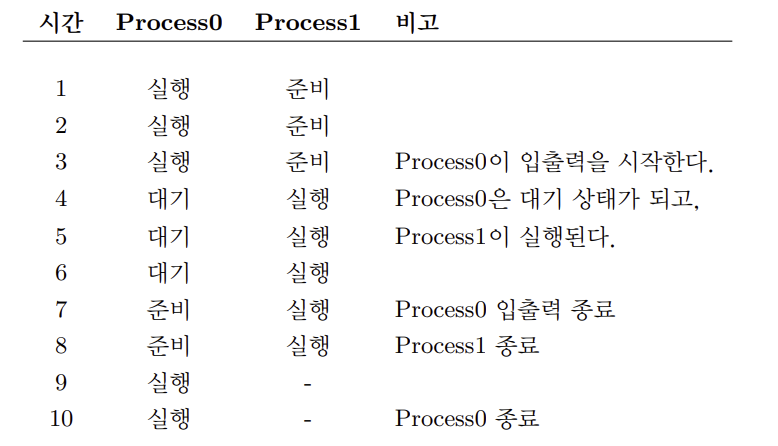

<!--
작성 규칙
- title: 상세 페이지의 유일한 h1입니다.
- description: 검색 결과와 OG 메타에 사용할 문제/결과 중심 요약을 작성합니다.
- date: 최초 작성일, updated는 마지막 수정일입니다.
- lastVerified: 내용과 링크를 실제로 다시 확인한 날짜입니다. 확인하지 않았다면 삭제합니다.
- category: 글의 큰 소속 하나만 선택합니다. Board, OS, Java, Git 등이 현재 사용 중입니다.
- tags: 기술, 주제, 글 성격을 나타내는 태그를 3~7개 정도 작성합니다.
- book: src/data/books.json에 직접 등록한 Book id입니다. Book에 포함하지 않을 글이면 필드를 삭제하거나 빈 값으로 둡니다.
- series: src/data/series.json에 등록된 Series id입니다. 연재 글이 아니면 삭제합니다.
- chapter: Book 또는 Series 내부 읽기 순서입니다. 둘 다 없으면 삭제합니다.
- Book 제목은 src/data/books.json의 title, Series 제목은 src/data/series.json의 title을 수정합니다.
- category, book, series는 서로 독립적이며 서로 다른 category의 글도 같은 Book에 넣을 수 있습니다.
- Book은 category나 tags를 기준으로 자동 생성되지 않습니다.
- 등록되지 않은 book id를 작성하면 content schema 검증에서 오류가 발생합니다.
- heroImage: public 기준 절대 경로를 사용합니다. 전용 이미지가 없으면 /og-image.svg를 사용합니다.
- draft: 작성 중에는 true, 발행할 때 false로 변경하거나 필드를 삭제합니다.
- 본문에서 # heading을 사용하지 않습니다. 본문 heading은 반드시 ##부터 시작합니다.
- Markdown 이미지는  형식으로 작성합니다.
- 캡션이 필요한 이미지는 title에 "caption: 보충 설명"을 작성합니다. figure와 figcaption으로 렌더링됩니다.
- 다크 모드에서 원본 색을 유지해야 하는 이미지는 alt나 title에 {no-dark-filter}를 붙입니다. 렌더링 시 표시는 제거됩니다.
- 이미지 lightbox 확대 보기에서 제외할 작은 아이콘이나 배지는 alt나 title에 {no-lightbox}를 붙입니다. 렌더링 시 표시는 제거됩니다.
- 본문 이미지는 데스크톱에서 최대 760px, 모바일에서 화면 너비에 맞춰 자동 축소됩니다.
- 코드 블록에는 title="파일명", showLineNumbers, {2,4-5} 줄강조를 선택적으로 붙일 수 있습니다.
- Markdown 표 바로 앞의 <!-- table-caption: 설명 --> 주석은 접근 가능한 표 캡션으로 렌더링됩니다.
- 장식 목적이 아니라면 alt를 비워 두지 않습니다.
-->

> 페이지의 `h1`은 글 제목이 담당하므로 본문은 `##`부터 시작합니다.

## 들어가기 전

이 글을 작성하게 된 배경과 목표를 적습니다.

## 링크 예시

일반 링크, 자동 링크, 참조형 링크는 아래 예시를 복사해 사용합니다. 내부 글 목록은 사이트의 루트 상대 경로로 연결합니다.

```md
[표시할 텍스트](https://example.com)
<https://example.com>
[공식 문서][official-docs]
[블로그 전체 글](/blog/)

[official-docs]: https://example.com
```

링크를 카드 형태로 강조하려면 현재 블로그의 link mention 문법을 사용합니다.

```md
::link-mention{url="https://example.com" title="공식 문서" description="링크 내용을 한 문장으로 설명합니다."}
```

## 테이블 예시

<!-- table-caption: 기본 항목 설명 -->
| 항목 | 설명 |
| --- | --- |
| 예시 1 | 첫 번째 내용 |
| 예시 2 | 두 번째 내용 |

열마다 정렬을 지정해야 할 때는 아래 문법을 사용합니다.

| 왼쪽 정렬 | 가운데 정렬 | 오른쪽 정렬 |
| :--- | :---: | ---: |
| 내용 | 내용 | 내용 |

## 문제 상황

어떤 문제가 있었고 사용자나 시스템에 어떤 영향을 주었는지 설명합니다.

## 원인 분석

로그, 코드, 실행 결과, 설계 관점에서 원인을 분석합니다.

## 해결 방법

적용한 해결 방법과 선택 이유를 단계적으로 정리합니다.

## 코드 변경

핵심 코드, 설정, 구조 변경을 설명합니다.

```java title="PostService.java" showLineNumbers {2}
public Post findPost(Long id) {
    return postRepository.findById(id).orElseThrow();
}
```

<!-- table-caption: 변경 전후 비교 -->
| 구분 | 내용 |
| --- | --- |
| 변경 전 | 문제나 한계 |
| 변경 후 | 개선된 동작 |

## 검증 결과

실행한 명령, 테스트, 화면 확인 결과를 정리합니다.

## 이미지 예시

아래처럼 이미지의 내용이나 목적을 설명하는 alt 텍스트를 작성합니다.

```md


```

## 배운 점

이번 작업에서 배운 점과 다음 개선 방향을 정리합니다.
